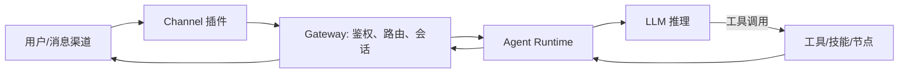
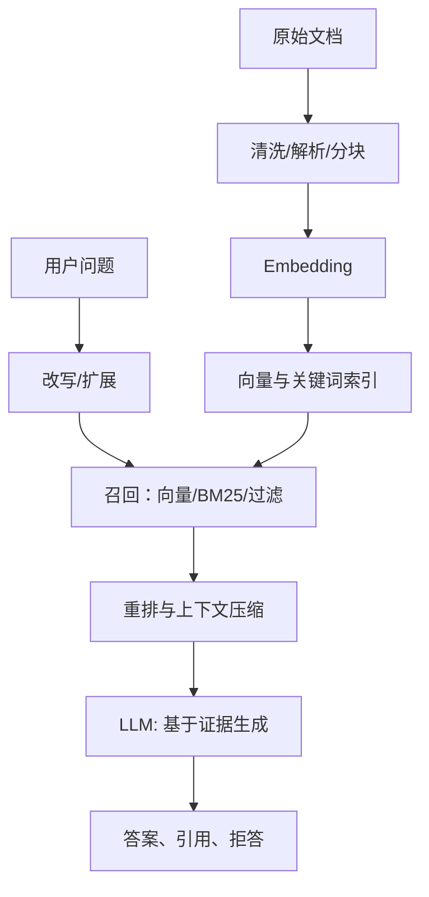
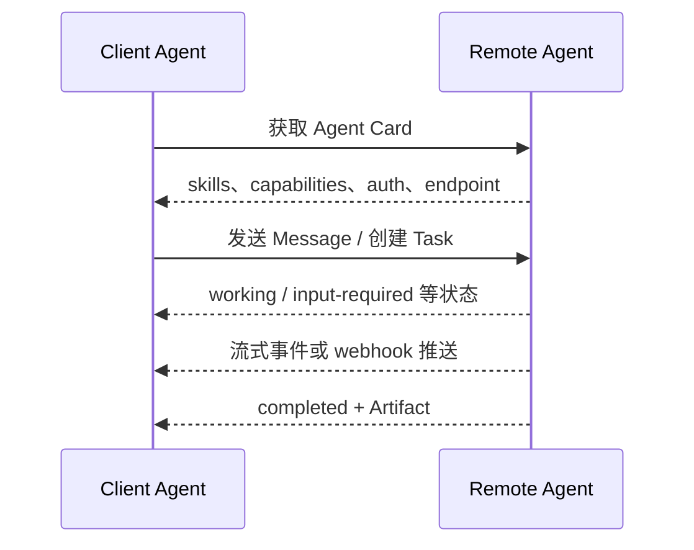

# AI 应用开发面试题

日期：2026-07-12  
标签：#面试 #AI应用开发 #RAG #A2A #Agent

> 说明：协议与框架迭代很快。本文以 A2A 1.0.x、OpenClaw 与 Google ADK 当前公开文档为准；面试时可补一句“具体字段与 SDK 以所用版本为准”。

## 1. 最近 OpenClaw 这么火，你知道它的原理吗？

### 一句话答案

OpenClaw 本质是一个自托管的 Agent Gateway：把 WhatsApp、Telegram、Slack 等消息渠道统一接入，通过会话、上下文、模型与工具调用闭环，让 AI 从“聊天”变为可持续执行任务的个人助理。

### 面试口语版

它不是一个新模型，而是一层 Agent 运行时和接入网关。消息先由 Channel 插件进入 Gateway，Gateway 做身份校验、路由和会话管理，再把历史上下文、系统指令和可用工具交给 Agent。模型根据 ReAct 或 tool-calling 决定是否调用文件、Shell、浏览器、定时任务等工具；工具结果回填上下文后继续推理，最终把结果发回原渠道。它火在把多渠道、持久会话、工具、记忆和自动化装成了开箱即用的自托管系统。

### 原理拆解

- **Channel 层**：适配不同 IM 的收发、Webhook/长连接、用户身份。
- **Gateway 层**：单一事实源，维护连接、会话、路由、配置与访问控制。
- **Agent 层**：组织 prompt、短期上下文和记忆，循环执行“推理—行动—观察”。
- **能力层**：工具、Skills、插件、cron/webhook；模型只提出意图，执行器真正落地动作。

### 关键细节与追问

- 生产上要做工具最小权限、`allowFrom` 白名单、命令确认、密钥隔离和审计；不要把“模型能调用 Shell”当成默认安全。
- 记忆应区分会话上下文、长期偏好和可检索知识，且要有过期与删除机制。
- 追问：多渠道如何隔离上下文？长任务如何异步通知？工具失败怎么重试与幂等？Prompt 注入如何防护？

## 2. 什么是 RAG？RAG 的主要流程是什么？

### 一句话答案

RAG（Retrieval-Augmented Generation，检索增强生成）是在生成前从外部知识库检索相关证据，并把证据连同问题交给大模型作答的架构，用来降低幻觉并让回答可基于私有、可更新的数据。

### 面试口语版

RAG 把“知识”从模型参数中部分外置。离线侧先采集文档、清洗、分块、向量化并建立索引；在线侧对用户问题做改写或扩展，召回候选分块，经过重排和上下文压缩后，将高质量证据连同问题放入提示词，让模型只基于证据回答并给出引用。它不能保证绝对正确，效果取决于数据、检索、上下文构建和生成约束的共同质量。

### 原理拆解

### 关键细节与追问

- 离线链路关注文档版本、权限元数据、chunk 与原文可追溯关系。
- 在线链路关注 Recall、延迟、token 预算、引用与“无证据则拒答”。
- 追问：RAG 与微调如何选？召回不到怎么办？为什么不能只用向量检索？

## 3. 什么是 RAG 中的 Rerank？具体需要怎么做？

### 一句话答案

Rerank 是对初召回的少量候选文档按“问题—文档”的相关性再次精排，用更贵但更准的模型提高 Top-K 证据质量。

### 面试口语版

向量检索擅长快速从百万级库里粗筛，但 embedding 是分别编码 query 和 document 的，细粒度匹配不够好。工程上我会先用混合召回拿 50 到 200 个候选，再用 cross-encoder 或 LLM reranker 对每个 query-document 对打分，选前 3 到 10 个进入上下文。要加权限过滤、去重和 token 长度控制，并监控重排前后的 Recall@K、MRR/NDCG 和端到端延迟。

### 具体做法

1. 召回候选：向量、BM25 或两者融合，`topN=50~200`。
2. 过滤：租户/ACL、时间、文档类型、重复 chunk；**过滤尽量前置**。
3. 重排：cross-encoder 输入 `query + chunk`，得到相关性分数；可按标题、正文、元数据拼接。
4. 截断与组装：取 `topK=3~10`，同文档相邻块合并，保留出处。
5. 降级：reranker 超时则使用初排；对热点 query 缓存结果。

### 关键细节与追问

- 双塔 embedding 是“各自编码、近似检索”；cross-encoder 是“成对交互、精确但慢”。
- 不要把 rerank 当召回器：它只会在候选集内排序，召回缺失无法补救。
- 追问：何时用 LLM rerank？如何避免位置偏置？如何做线上 A/B？

## 4. A2A 协议有哪五大设计原则？

### 一句话答案

A2A 的经典五项原则是：拥抱 Agent 能力、基于现有标准、默认安全、支持长任务、模态无关；目的是让不同框架和厂商的 Agent 能以低耦合方式协作。

### 原理拆解

| 原则 | 含义 | 工程落点 |
| --- | --- | --- |
| 拥抱 Agent 能力 | 不把 Agent 简化成普通 API；要表达任务、技能、产物与状态 | Agent Card、Task、Artifact |
| 基于现有标准 | 复用 HTTP、JSON-RPC、gRPC、OAuth/OIDC 等生态 | 易接入、易观测、可演进 |
| 默认安全 | 跨边界调用必须认证、授权、最小权限 | TLS、token、ACL、审计 |
| 支持长任务 | 任务可能分钟级甚至更久，不能只同步阻塞 | 状态机、流式事件、Webhook/轮询 |
| 模态无关 | 不只传文本，也支持文件、结构化数据与富媒体 | Part/Artifact 的统一数据模型 |

### 关键细节与追问

- 这些是协议设计取向，不等同于每个实现都天然安全；授权范围与工具权限仍由实现方负责。
- 追问：Agent Card 暴露什么？为什么要有 artifact？任务取消和恢复怎么做？

## 5. 什么是混合检索？在基于大模型的应用开发中，混合检索主要解决什么问题？

### 一句话答案

混合检索是把稀疏关键词检索（如 BM25）与稠密向量检索组合，再做融合或重排；它同时解决精确字面匹配与语义同义匹配，提高复杂企业知识库的召回稳定性。

### 面试口语版

BM25 对产品型号、错误码、人名、版本号这类精确词非常强，但不理解同义表达；向量检索理解语义，却可能漏掉罕见实体或被相似语义干扰。混合检索先并行召回，再用 RRF、加权归一化或学习排序融合，最后 rerank。它解决的核心不是“模型不够聪明”，而是单一检索信号存在盲区。

### 关键细节与追问

- 常见融合：RRF 对分数尺度不敏感；加权融合需要归一化和调参；高质量方案再加 rerank。
- 例：查“ERR-1049 怎么处理”应给 BM25 较高权重；问“如何降低订单超时”向量信号更关键。
- 追问：为什么不能直接相加分数？元数据过滤在哪里做？融合指标如何调？

## 6. 什么是 Google ADK？

### 一句话答案

Google ADK（Agent Development Kit）是开源 Agent 开发框架，用于构建、调试、评估、编排和部署可生产化的 AI Agent；它支持多语言与多 Agent/图工作流，并不等同于某一个 Gemini 模型。

### 面试口语版

ADK 把 Agent 抽象为模型、指令、工具、会话和运行器，并提供顺序、并行、循环、委派等编排能力。简单场景可以用一个 LLM Agent 加函数工具，复杂场景可以把确定性业务流程做成图，把开放推理留给模型；再接入评测、可观测性和部署能力。选 ADK 的重点不是“Google 出品”，而是它是否匹配团队语言栈、模型提供商、部署环境和治理要求。

### 关键细节与追问

- 当前官方支持 Python、TypeScript、Go、Java、Kotlin；不同版本的 API 与能力需以官方文档为准。
- Agent 的工具调用必须经业务层做参数校验、权限检查、幂等与审计。
- 追问：Agent 与 workflow 的边界是什么？如何做 session/memory？怎么接 A2A 与 MCP？

## 7. RAG 的完整流程是怎么样的？

### 一句话答案

完整 RAG 要分离线建库与在线问答：采集解析、清洗分块、嵌入建索引、查询理解、召回融合、重排压缩、受控生成、引用与评估闭环。

### 原理拆解

- **离线**：采集文档 → OCR/版面解析 → 去重、清洗、切块 → 补标题/权限/时间等元数据 → embedding → 建立向量、倒排与元数据索引 → 版本发布。
- **在线**：鉴权 → 查询识别/改写/自查询 → ACL 过滤 → 混合召回 → rerank → 去重合并/压缩 → 生成带引用答案 → 安全过滤、日志与反馈。
- **闭环**：沉淀 bad case，定位是数据、召回、重排、提示词还是模型问题，回归评测后再发布。

### 关键细节与追问

- 完整不代表每一步都用：小库可先从“高质量分块 + 混合召回 + 引用”起步。
- 避免把整个文档塞给模型；这会提高成本、稀释证据并降低可解释性。
- 追问：索引更新如何做到增量？文档删除如何生效？权限变化如何防泄漏？

## 8. A2A 协议的工作原理是怎样的？

### 一句话答案

A2A 用 Agent Card 让客户端发现远端 Agent 的技能和认证方式，再以标准消息创建、推进和获取 Task；任务通过状态、消息与 Artifact 交换信息，支持同步、流式与异步回调。

### 原理拆解

- **Agent Card**：公开身份、技能、端点、能力、认证要求；通常位于 well-known 路径。
- **Message/Part**：输入输出载体，可含文本、文件、结构化数据。
- **Task**：长生命周期工作单元，有 working、input-required、completed、failed、canceled 等状态。
- **Artifact**：任务产物，例如报告、文件或结构化结果；与中间聊天消息不同。

### 关键细节与追问

- A2A 规范的是 Agent 间协作语义，并不要求互相暴露内部 prompt、记忆或工具实现。
- 追问：什么时候用 streaming，什么时候 webhook？Task ID 如何幂等？如何传递用户授权？

## 9. 在 RAG 应用中为了优化检索精度，其中的数据清洗和预处理怎么做？

### 一句话答案

数据清洗的目标是让“可检索 chunk”语义完整、噪声少、带对的元数据与权限；它通常比换一个向量模型更先决定 RAG 上限。

### 原理拆解

1. **解析保结构**：按 PDF/网页/表格/代码选择解析器，保留标题层级、表格、图片说明和页码，别把多栏 PDF 读乱。
2. **去噪去重**：移除导航、页眉页脚、广告、乱码、空段；精确去重加 SimHash/MinHash 近重复检测。
3. **规范化**：统一编码、日期、单位、术语别名；纠正 OCR 常见错字，保留原文可回溯。
4. **语义分块**：按标题/段落/句子边界切，设置适当 overlap；表格、代码、FAQ 等按结构专门处理。
5. **补齐元数据**：`doc_id`、chunk 位置、标题、来源、更新时间、语言、标签、ACL、版本与失效时间。
6. **质量门禁**：抽样人工复核，过滤过短、重复、无主语、权限未知的块；建立可回归的 query-set。

### 关键细节与追问

- 最危险的问题是 ACL 丢失：检索正确也可能越权泄漏。
- 对表格应保存行列上下文或转为自然语言描述；不能简单按字符截断。
- 追问：扫描 PDF 怎么处理？chunk 质量如何量化？增量更新如何防止脏数据？

## 10. A2A 协议的工作流程是怎样的？

### 一句话答案

A2A 的典型流程是“发现—认证—发起任务—状态推进/补充输入—接收产物—审计收尾”，核心是把一次 Agent 委派显式建模为可观察、可恢复的 Task。

### 面试口语版

调用方先读取 Agent Card，确认对方能处理什么技能、支持哪些传输方式以及需要什么认证；随后携带身份和上下文发送消息。如果任务很短可同步得到结果；长任务则先返回 Task，服务端通过流式事件、轮询或 push notification 报告进度。任务遇到缺失信息会进入 `input-required`，调用方补充后继续；完成后读取 Artifact，失败或取消也必须有明确状态和可诊断错误。

### 关键细节与追问

- 调用方应设置超时、重试和幂等键；不要因网络重试重复创建外部订单。
- 服务端应区分“协议调用成功”和“业务任务完成”，两者不是同一件事。
- 追问：如何设计 Task 状态机？callback 失败怎么办？如何避免 Agent 间递归委派？

## 11. 什么是查询扩展？为什么在 RAG 应用中需要查询扩展？

### 一句话答案

查询扩展是在检索前把用户的短句、别称或隐含意图扩成多个更可检索的表达，用来缓解用户语言与文档语言不一致造成的召回缺失。

### 原理拆解

- **同义词/词典扩展**：如“报销”扩为“费用报销、差旅报销”；可控且适合领域术语。
- **LLM 改写**：保留语义生成更清晰的检索 query；需限制不能臆造条件。
- **Multi-query**：从不同角度生成 3~5 个查询，合并召回结果。
- **HyDE**：先生成假设答案再检索相近文档；对抽象问题有帮助，但会引入模型偏差。

### 关键细节与追问

- 扩展提高 Recall，往往会拉低 Precision、增加延迟与成本，所以应配合 rerank 与开关实验。
- 对精确错误码、SKU、姓名等实体，盲目扩展可能损害效果，应保留原 query 的高权重通路。
- 追问：如何防止扩展幻觉？如何判断值得扩展？如何缓存？

## 12. A2A 协议 与 MCP 协议的关系是怎样的？

### 一句话答案

MCP 解决“模型/Agent 如何标准化使用外部工具和资源”，A2A 解决“一个 Agent 如何发现并协作另一个独立 Agent”；二者是互补关系，不是替代关系。

| 维度 | MCP | A2A |
| --- | --- | --- |
| 连接对象 | Agent/模型 ↔ 工具、资源、提示模板 | Agent ↔ Agent |
| 对方抽象 | 能力提供者 | 可自主协作的任务执行者 |
| 核心对象 | tools、resources、prompts | Agent Card、Task、Message、Artifact |
| 长任务 | 由工具实现约定 | 协议原生关注状态、流和推送 |
| 典型场景 | Agent 调 GitHub、数据库、搜索 | 研究 Agent 委派给报价/法务 Agent |

### 高分补充

一个常见组合是：对外暴露 A2A 的“旅行规划 Agent”，其内部通过 MCP 调航班、酒店、地图工具。A2A 不应被拿来替代本地工具调用；MCP 也不适合单独表达跨组织 Agent 的任务生命周期和产物协作。

### 追问方向

- MCP Server 是否天然安全？如何做工具授权？A2A 的 Agent Card 是否应公开全部能力？

## 13. 什么是自查询？为什么在 RAG 中需要自查询？

### 一句话答案

自查询（Self-Query）是用 LLM 从自然语言问题中抽取“语义检索词 + 结构化元数据过滤条件”，让检索既懂意思又懂约束。

### 面试口语版

比如“找 2025 年后发布、Java 相关、只看内部 P1 文档的限流方案”，普通向量检索容易把年份、语言和权限都当普通文本。自查询会把它解析成语义 query“限流方案”，并生成 `publish_time >= 2025`、`language=Java`、`level=P1` 等 filter，然后在向量库执行带过滤的检索。它很适合元数据完善的知识库。

### 关键细节与追问

- LLM 输出必须受 JSON Schema/DSL 约束，并校验字段、操作符和值；不能直接拼 SQL。
- ACL 不是由 LLM 决定的用户可选 filter，必须由服务端强制注入。
- 追问：元数据缺失怎么办？自查询失败如何降级？过滤前置还是后置？

## 14. 什么提示压缩？为什么在 RAG 中需要提示压缩？

### 一句话答案

提示压缩是把过长、冗余或弱相关的检索上下文压缩为与当前问题最相关的证据，以适配上下文窗口、降低成本，并减轻“中间信息被忽略”。

### 原理拆解

- **抽取式压缩**：按句子/段落相关性保留原文，事实保真且容易引用。
- **生成式压缩**：LLM 总结候选文档，token 更少但有改写或遗漏风险。
- **结构化压缩**：从文档抽取字段、时间线、表格行；适合规则与产品参数。
- **重排后压缩**：先选对文档再压缩，通常优于先压缩全部候选。

### 关键细节与追问

- 压缩不是删得越多越好：要保留否定条件、时间、数字、例外和来源。
- 最好把“压缩后的答案证据”与原 chunk ID 映射，支持引用和回溯。
- 追问：如何衡量压缩损失？什么时候直接增加上下文窗口？

## 15. 如何进行 RAG 调优后的效果评估？请给出真实应用场景中采用的效果评估标准与方法

### 一句话答案

RAG 评估要拆成检索、生成、系统和业务四层，用离线带标注集做回归，用线上 A/B 与用户行为验证；只看“模型回答像不像”是不够的。

### 原理拆解

| 层级 | 指标/方法 | 企业知识库客服示例 |
| --- | --- | --- |
| 检索 | Recall@K、MRR、NDCG、命中文档率 | 标准答案所在 chunk 是否进 Top-5 |
| 生成 | 正确性、忠实性/引用一致性、完整性、拒答正确率 | 回答是否只依据制度原文，是否给对引用 |
| 系统 | p50/p95 延迟、token、错误率、超时率 | p95 小于 3 秒，成本在预算内 |
| 业务 | 自助解决率、转人工率、CSAT、风险投诉率 | 报销问答转人工下降且越权为零 |

### 实战方法

1. 建立覆盖高频、长尾、无答案、冲突版本、权限隔离的金标 query 集；每条标注相关文档和期望答案要点。
2. 每次改动做离线回归，按问题类型切片，而不只看总体平均分。
3. 用人工评审或 LLM-as-judge 辅助，但对高风险样本做人工复核；judge 需要校准一致性。
4. 线上灰度/A-B：比较任务成功率、人工转接和负反馈，同时监控 P95 与成本。
5. 记录 query、检索列表、最终上下文、答案与引用，bad case 可完整复盘。

### 关键细节与追问

- 生成“正确”而引用错误仍是不合格；无答案问题的正确拒答同样重要。
- 追问：没有金标数据怎么办？LLM judge 有什么偏差？如何避免优化指标却伤害用户体验？

## 16. 什么是 RAG 中的分块？为什么需要分块？

### 一句话答案

分块（chunking）是把长文档切成可独立嵌入、检索和放进上下文的小语义单元；它让检索粒度、向量语义和 token 预算可控。

### 原理拆解

整篇文档一个向量会混合多个主题，容易“整体相关、局部无用”；逐句切又缺上下文。合理 chunk 应围绕一个相对完整的论点或步骤，带标题与来源，检索后可以单独回答问题，也能与相邻块合并。

### 关键细节与追问

- chunk size 没有万能值：中文技术文档常从数百 token 级别起试，结合文档类型和模型窗口评估。
- overlap 可防止边界信息断裂，但过大导致索引膨胀和重复上下文。
- 追问：为什么 chunk 太小会降低效果？标题要不要写进 embedding？怎么处理表格？

## 17. 在 RAG 中，常见的分块策略有哪些？分别有什么区别？

| 策略 | 做法 | 优点 | 风险/适用场景 |
| --- | --- | --- | --- |
| 固定长度 | 按字符/token 切，带 overlap | 简单、稳定、吞吐高 | 容易截断语义；适合无结构纯文本基线 |
| 递归分隔符 | 优先按标题/段落/句子切，不够再细分 | 通用且保持自然边界 | 层级/分隔符需按语言调 |
| 语义分块 | 根据相邻句 embedding 相似度或主题转折切 | 主题完整性较好 | 计算高、边界不稳定 |
| 文档结构分块 | 按 Markdown/HTML/PDF 标题、章节、表格、代码块 | 可解释、适合知识文档 | 依赖高质量解析 |
| 父子分块 | 小块检索，大块/父文档供生成 | 兼顾精确召回与上下文 | 需维护父子映射 |
| 滑动窗口 | 固定窗口连续滑动 | 不易漏边界信息 | 大量重叠、成本高 |

### 面试高分补充

我的默认策略是“结构优先 + 长度兜底 + 父子映射”：用标题和段落保语义；过长再按句子切；检索小块、回填其父段落或邻居块。然后按文档类型分别评估，代码、FAQ、表格不使用同一套规则。

## 18. 在 RAG 中的 Embedding 嵌入是什么？

### 一句话答案

Embedding 是把文本、图片等内容编码成高维稠密向量，使语义相近的内容在向量空间距离更近；RAG 用它做近似最近邻检索。

### 原理拆解

离线时把每个 chunk 编码为向量并写入向量索引；在线时把 query 用**同一模型、同一预处理规范**编码，按 cosine similarity、dot product 或 L2 距离找近邻。Embedding 负责“候选召回”，不等同于最终事实判断，所以常需关键词检索和 rerank 配合。

### 关键细节与追问

- 文档和查询必须使用兼容的 embedding 空间；换模型通常要全量重建索引。
- 归一化、距离度量、向量维度和 ANN 索引参数会影响效果与性能。
- 追问：向量相似为何不代表答案正确？余弦与内积如何选择？多语言怎么处理？

## 19. 在 RAG 中，你知道有哪些 Embedding Model 嵌入模型？

### 一句话答案

常见 embedding 模型包括商用 API 模型、开源通用检索模型、中文/多语模型和多模态模型；选型要看任务与评测，而不是只看榜单。

### 常见类别

- **商用 API**：OpenAI `text-embedding-*`、Cohere Embed、Google Gemini Embedding 等，接入快、效果稳定，但有成本、网络与数据合规考量。
- **开源通用/检索模型**：BGE 系列、E5 系列、GTE、Jina Embeddings、Nomic Embed 等，便于本地部署和领域微调。
- **中文与多语检索**：BGE-M3、multilingual-e5 等，适合中英混合、跨语言检索；需实测中文术语表现。
- **多模态模型**：如面向图文文档的视觉/多模态 embedding，用于图片、扫描件和图表检索；常与文本 OCR 索引并用。

### 关键细节与追问

- 模型名称、维度、最大输入与许可协议变化较快，落地时以当前模型卡、价格和许可证为准。
- 追问：BGE 的 query instruction 有何作用？是否要量化？何时微调 embedding？

## 20. 在 RAG 中，你如何选择 Embedding Model 嵌入模型，需要考虑哪些因素？

### 一句话答案

选择 embedding 模型应以业务 query 集上的检索指标和部署约束为准，综合语言与领域、效果、延迟成本、数据合规、向量维度和可运维性；先建立基线，再用评测决定。

### 选型清单

| 维度 | 要问的问题 |
| --- | --- |
| 语料匹配 | 中文、英文还是多语？是否有代码、表格、短 query、领域术语？ |
| 离线效果 | 在金标集上的 Recall@K、MRR/NDCG 是否足够？长尾和实体 query 是否稳定？ |
| 在线性能 | 查询 QPS、p95、批量吞吐、最大 token、模型冷启动如何？ |
| 成本与规模 | embedding 单价/推理卡成本、向量维度、索引内存和重建时间能否接受？ |
| 合规安全 | 数据能否出域？是否要求私有化？许可证是否允许商用？ |
| 生态运维 | 是否支持 SDK、批处理、版本固定、监控、灰度和回滚？ |

### 实战方法

先选 2~4 个候选模型，以相同分块、同一向量库和同一 query 集做离线对比；再把最优的 1~2 个放入小流量 A/B，观察检索命中、最终任务成功、p95 与成本。若换 embedding 模型，使用双索引灰度或重建后原子切换，避免新旧向量混在同一空间。

### 追问方向

- 为什么维度更高不一定更好？为什么不能用生成模型 hidden state 随便当 embedding？领域微调需要哪些正负样本？

## 复习清单

- [ ] 能在 90 秒内讲清 RAG 的离线、在线与评估闭环。
- [ ] 能解释 BM25、向量召回、混合检索、rerank 的边界。
- [ ] 能用一个“企业制度问答”案例说明清洗、权限过滤、引用和拒答。
- [ ] 能区分 MCP 的“调用工具”与 A2A 的“协作 Agent”。
- [ ] 能讲清 Agent 系统必须具备的权限、审计、幂等、超时和降级设计。

## 参考资料

- [OpenClaw 官方文档](https://docs.openclaw.ai/)
- [A2A Protocol 官方规范](https://a2a-protocol.org/latest/specification)
- [Google ADK 官方文档](https://adk.dev/)
