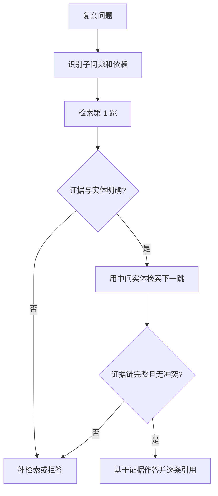

# RAG 系统中如何处理多跳问答（Multi-hop QA）？

日期：2026-09-27  
标签：#面试 #AI应用开发 #RAG #多跳问答  
难度：困难  
原题：[牛面题目详情](https://niumianoffer.com/nm_practice/questions/q_1762135135229773373?activeIndex=0&from=bank_1762132162559495793)

## 一句话答案

多跳问答要找齐相互依赖的证据：把复杂问题拆成子问题，按依赖顺序检索并验证每一跳，再基于完整证据链作答和引用；证据不足时继续检索或拒答。

## 面试口语版（约 60 秒）

普通 RAG 用原问题检索一次，适合答案直接出现在某段文档中的场景。多跳问题则要把分散的事实连起来。例如问“项目 A 的负责人属于哪个部门”，第一跳先找负责人是谁，第二跳再用这个人名查所属部门。实现时，我会先识别问题中的依赖关系，再逐跳检索并保留每条证据的文档 ID、位置和版本；每一跳校验实体是否一致，避免把同名的人或过期记录串起来。最后只基于已验证的证据作答并附引用。评估时除答案正确率，还要看整条证据链是否都被召回，以及额外检索带来的延迟和成本。

## 原理拆解

**为什么一次检索容易失效？** 第二跳的检索词可能还不存在于原问题中，要先读到第一跳的答案才能构造下一次查询。[IRCoT 论文](https://aclanthology.org/2023.acl-long.557/)将检索与中间推理步骤交替进行，展示了“已获得的信息决定下一步检索内容”的思路。这是一种实现路径，并非每道多跳题都必须使用链式思维提示。

以下是**虚构的内部知识库**示例：

| 步骤 | 子问题或结论 | 所需证据 |
| --- | --- | --- |
| 原问题 | 项目 A 的负责人属于哪个部门？ | 需要两条事实 |
| 第 1 跳 | 项目 A 的负责人是谁？→ 张敏 | 项目负责人记录 |
| 第 2 跳 | 张敏属于哪个部门？→ 搜索平台组 | 人员部门记录，且确认为同一人 |
| 最终回答 | 项目 A 的负责人张敏属于搜索平台组 | 同时引用两条记录 |

子问题可以预先规划，也可以边检索边生成。若子问题互不依赖，可并行检索；上例的第二跳依赖第一跳的人名，必须顺序执行。知识图谱可按实体和关系遍历；纯文本知识库则可用迭代检索。两者都要保留原始出处，不能把模型生成的中间结论当成外部证据。


*示意图使用虚构数据；DOC-01 与 DOC-02 表示两份必须同时引用的来源。*

## Mermaid 图解



图中的证据校验需要结合来源、时效、权限、实体对齐与内容一致性；模型本身不能保证事实真实。

## 伪代码：带证据链的迭代检索

```text
function answer_multihop(question, user_scope, max_hops, budget):
    plan = decompose_into_dependent_subquestions(question)
    evidence_chain = []
    known_facts = {}

    for subquestion in topological_order(plan):
        if len(evidence_chain) >= max_hops or budget.exhausted():
            return abstain("预算内未形成完整证据链")

        query = fill_dependencies(subquestion, known_facts)
        candidates = retrieve(query, filter=user_scope)
        ranked = rerank(query, candidates)
        fact, source = extract_fact_with_source(ranked)

        if source is None or not entity_matches(fact, known_facts):
            return abstain("某一跳缺少可验证证据")
        if conflicts_with_existing(fact, evidence_chain):
            return abstain("证据冲突，需要补检索或人工核验")

        evidence_chain.append(source.document_id_and_span)
        known_facts.update(fact)

    if not covers_all_required_hops(plan, evidence_chain):
        return abstain("证据链不完整")
    return generate_grounded_answer(question, known_facts, evidence_chain)
```

这是用于解释控制流程的伪代码。实际系统还需处理检索超时、重试、跨文档版本一致性，以及一个实体对应多条候选记录的情况。

## 关键细节与工程取舍

- **证据完整性**：命中其中一段不代表问题已回答；应检查每个必要跳数的 supporting facts。[HotpotQA 论文](https://aclanthology.org/D18-1259/)介绍了句级 supporting facts，可用于评估。
- **实体消歧**：同名人、别名、历史名称可能让第二跳接错实体。优先使用稳定实体 ID、文档元数据或明确的上下文约束。
- **权限与时效**：每跳检索都带租户或用户权限过滤；记录文档版本和生效时间，避免引用无权访问或过期证据。
- **错误传播**：前一跳答错会改变后续查询。对低置信或冲突事实保留多个候选，必要时补检索；超过预算则拒答。
- **成本与延迟**：逐跳调用检索器和模型会增加时延。可以先做单跳基线，只对识别出的复杂问题启用多跳；限制最大跳数、候选数和 token 预算。[EfficientRAG 论文](https://aclanthology.org/2024.emnlp-main.199/)研究了减少逐轮大模型调用的迭代检索方案。

## 如何评估

1. 为每个问题标注最终答案、每一跳的子问题、所需证据和文档版本。
2. **检索**：统计每跳证据召回率，以及“所有必要证据都被召回”的完整链召回率；单个 Top-K 命中会掩盖缺失的跳数。
3. **生成**：检查答案正确性、引用是否真正支持结论、证据不足时的拒答是否合理。
4. **系统**：记录平均与尾部延迟、检索和模型调用次数、token 消耗，并与单跳 RAG 基线比较。

## 面试官追问

1. 什么问题需要多跳，什么问题一次检索就够？
2. 子问题是预先拆好，还是根据上一跳结果动态生成？
3. 第一跳召回两个同名实体，第二跳如何避免串错？
4. 只召回一半证据时，为什么不能让模型补全另一半？
5. 多跳检索比单跳准确，但延迟超标，你会从哪里优化？

## 常见错误说法

- “多检索几次就等于多跳。”——关键是后续查询依赖前面的证据，最终还要检查完整证据链。
- “模型写出了推理过程，证据就齐了。”——推理文本不是外部证据；每个事实仍需对应来源。
- “有一条引用就够了。”——结论跨越两条事实时，两条都需要可追溯的出处。

## 参考论文、数据集与社区项目

以下链接于 2026-09-27 核对；代码 API 和项目维护状态以后以仓库文档为准。

| 资料 | 用来学什么 |
| --- | --- |
| [IRCoT 论文](https://aclanthology.org/2023.acl-long.557/) / [官方代码](https://github.com/StonyBrookNLP/ircot) | 检索与中间推理交替；看每跳如何构造查询 |
| [EfficientRAG 论文](https://aclanthology.org/2024.emnlp-main.199/) / [官方代码](https://github.com/NIL-zhuang/EfficientRAG-official) | 迭代检索中的成本与效率设计 |
| [HotpotQA 论文](https://aclanthology.org/D18-1259/) / [数据集主页](https://hotpotqa.github.io/) | 多跳问题与 supporting facts 的标注和评测 |
| [LlamaIndex SubQuestionQueryEngine 源码](https://github.com/run-llama/llama_index/blob/main/llama-index-core/llama_index/core/query_engine/sub_question_query_engine.py) | 观察子问题生成、分发和答案合成的框架抽象；具体依赖顺序仍需按场景设计 |

## 学习清单

- [ ] 不看笔记，用 60 秒讲清“先找负责人，再找部门”的两跳流程。
- [ ] 手写一个两跳样例，给两条证据都标注来源与版本。
- [ ] 解释为什么完整链召回率比单段命中更能暴露多跳失败。
- [ ] 比较预规划、动态迭代和图谱遍历各适合什么数据。
- [ ] 用一个证据缺失或同名实体的反例说明何时拒答。
