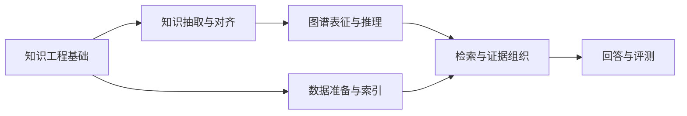

# AI 知识工程与 RAG 面试学习体系

日期：2026-09-27  
标签：#面试 #AI应用开发 #RAG #知识工程

本目录按「知识构建 → 索引与检索 → 证据组织 → 回答与评测」组织面试题。现有 32 篇短答来自[牛面 AI 知识工程与 RAG 题库](https://niumianoffer.com/nm_practice/questions?bank_id=bank_1762132162559495793&activeIndex=0)，各题详情见原题来源页；笔记是学习式改写。后续根据你的具体提问逐题补全原理、示意图、伪代码、工程取舍与可核验的参考资料。

快速入口：[多跳问答完整示例](/posts/AI%E5%BA%94%E7%94%A8%E5%BC%80%E5%8F%91/AI%E7%9F%A5%E8%AF%86%E5%B7%A5%E7%A8%8B%E4%B8%8ERAG/01-rag-multihop-qa/) · [参考社区项目](/posts/AI%E5%BA%94%E7%94%A8%E5%BC%80%E5%8F%91/AI%E7%9F%A5%E8%AF%86%E5%B7%A5%E7%A8%8B%E4%B8%8ERAG/%E5%8F%82%E8%80%83%E7%A4%BE%E5%8C%BA%E9%A1%B9%E7%9B%AE/) · [题目模板](/posts/AI%E5%BA%94%E7%94%A8%E5%BC%80%E5%8F%91/AI%E7%9F%A5%E8%AF%86%E5%B7%A5%E7%A8%8B%E4%B8%8ERAG/%E9%A2%98%E7%9B%AE%E6%A8%A1%E6%9D%BF/) · [AI 应用开发面试题总览](/posts/AI%E5%BA%94%E7%94%A8%E5%BC%80%E5%8F%91/AI%E5%BA%94%E7%94%A8%E5%BC%80%E5%8F%91%E9%9D%A2%E8%AF%95%E9%A2%98/)

## 学习路径

初学者可先看 17、06、15、19、29、21、11、18，建立端到端框架；再按下面的主题深入。题号沿用原题库，主题分组不改变原文件名。

## 一、知识工程基础

- **17.** [知识工程和知识图谱有什么区别？知识工程的完整流程是什么？](/posts/AI%E5%BA%94%E7%94%A8%E5%BC%80%E5%8F%91/AI%E7%9F%A5%E8%AF%86%E5%B7%A5%E7%A8%8B%E4%B8%8ERAG/17-knowledge-engineering-vs-kg/) · 中等
- **06.** [什么是知识图谱？实体、关系、属性分别是什么？](/posts/AI%E5%BA%94%E7%94%A8%E5%BC%80%E5%8F%91/AI%E7%9F%A5%E8%AF%86%E5%B7%A5%E7%A8%8B%E4%B8%8ERAG/06-knowledge-graph-basics/) · 简单
- **12.** [知识融合（Knowledge Fusion）是什么？多个知识源怎么整合？](/posts/AI%E5%BA%94%E7%94%A8%E5%BC%80%E5%8F%91/AI%E7%9F%A5%E8%AF%86%E5%B7%A5%E7%A8%8B%E4%B8%8ERAG/12-knowledge-fusion/) · 中等
- **28.** [多语言知识库怎么构建？知识的跨语言对齐怎么做？](/posts/AI%E5%BA%94%E7%94%A8%E5%BC%80%E5%8F%91/AI%E7%9F%A5%E8%AF%86%E5%B7%A5%E7%A8%8B%E4%B8%8ERAG/28-multilingual-knowledge-base/) · 困难

## 二、知识抽取与实体对齐

- **23.** [命名实体识别（NER）怎么做？BIO标注是什么？](/posts/AI%E5%BA%94%E7%94%A8%E5%BC%80%E5%8F%91/AI%E7%9F%A5%E8%AF%86%E5%B7%A5%E7%A8%8B%E4%B8%8ERAG/23-ner-bio/) · 简单
- **09.** [基于CRF的NER和基于BERT的NER有什么区别？](/posts/AI%E5%BA%94%E7%94%A8%E5%BC%80%E5%8F%91/AI%E7%9F%A5%E8%AF%86%E5%B7%A5%E7%A8%8B%E4%B8%8ERAG/09-crf-vs-bert-ner/) · 中等
- **27.** [关系抽取（Relation Extraction）是什么？怎么识别实体之间的关系？](/posts/AI%E5%BA%94%E7%94%A8%E5%BC%80%E5%8F%91/AI%E7%9F%A5%E8%AF%86%E5%B7%A5%E7%A8%8B%E4%B8%8ERAG/27-relation-extraction/) · 中等
- **24.** [事件抽取（Event Extraction）是什么？触发词、论元、角色怎么识别？](/posts/AI%E5%BA%94%E7%94%A8%E5%BC%80%E5%8F%91/AI%E7%9F%A5%E8%AF%86%E5%B7%A5%E7%A8%8B%E4%B8%8ERAG/24-event-extraction/) · 中等
- **10.** [远程监督（Distant Supervision）是什么？怎么自动生成训练数据？](/posts/AI%E5%BA%94%E7%94%A8%E5%BC%80%E5%8F%91/AI%E7%9F%A5%E8%AF%86%E5%B7%A5%E7%A8%8B%E4%B8%8ERAG/10-distant-supervision/) · 中等
- **32.** [Pipeline方式和联合抽取（Joint Extraction）有什么区别？](/posts/AI%E5%BA%94%E7%94%A8%E5%BC%80%E5%8F%91/AI%E7%9F%A5%E8%AF%86%E5%B7%A5%E7%A8%8B%E4%B8%8ERAG/32-pipeline-vs-joint-extraction/) · 中等
- **31.** [实体链接（Entity Linking）是什么？怎么把文本里的提及映射到知识库？](/posts/AI%E5%BA%94%E7%94%A8%E5%BC%80%E5%8F%91/AI%E7%9F%A5%E8%AF%86%E5%B7%A5%E7%A8%8B%E4%B8%8ERAG/31-entity-linking/) · 中等
- **20.** [实体消歧（Entity Disambiguation）怎么做？苹果是水果还是公司？](/posts/AI%E5%BA%94%E7%94%A8%E5%BC%80%E5%8F%91/AI%E7%9F%A5%E8%AF%86%E5%B7%A5%E7%A8%8B%E4%B8%8ERAG/20-entity-disambiguation/) · 中等

## 三、图谱表征、补全与推理

- **14.** [TransE、DistMult、ComplEx这些知识图谱嵌入方法有什么区别？](/posts/AI%E5%BA%94%E7%94%A8%E5%BC%80%E5%8F%91/AI%E7%9F%A5%E8%AF%86%E5%B7%A5%E7%A8%8B%E4%B8%8ERAG/14-transe-distmult-complex/) · 中等
- **08.** [知识图谱补全（Knowledge Graph Completion）怎么做？怎么预测缺失的关系？](/posts/AI%E5%BA%94%E7%94%A8%E5%BC%80%E5%8F%91/AI%E7%9F%A5%E8%AF%86%E5%B7%A5%E7%A8%8B%E4%B8%8ERAG/08-knowledge-graph-completion/) · 中等
- **30.** [图谱推理（Knowledge Graph Reasoning）是什么？怎么做多跳推理？](/posts/AI%E5%BA%94%E7%94%A8%E5%BC%80%E5%8F%91/AI%E7%9F%A5%E8%AF%86%E5%B7%A5%E7%A8%8B%E4%B8%8ERAG/30-knowledge-graph-reasoning/) · 中等
- **05.** [知识图谱怎么和大模型结合？检索增强生成（RAG）怎么用图谱？](/posts/AI%E5%BA%94%E7%94%A8%E5%BC%80%E5%8F%91/AI%E7%9F%A5%E8%AF%86%E5%B7%A5%E7%A8%8B%E4%B8%8ERAG/05-knowledge-graph-llm-rag/) · 中等
- **13.** [什么是GraphRAG？知识图谱如何增强RAG系统？](/posts/AI%E5%BA%94%E7%94%A8%E5%BC%80%E5%8F%91/AI%E7%9F%A5%E8%AF%86%E5%B7%A5%E7%A8%8B%E4%B8%8ERAG/13-graphrag/) · 中等

## 四、RAG 数据准备与索引

- **15.** [RAG系统中文档切分的策略有哪些？如何选择合适的chunk size？](/posts/AI%E5%BA%94%E7%94%A8%E5%BC%80%E5%8F%91/AI%E7%9F%A5%E8%AF%86%E5%B7%A5%E7%A8%8B%E4%B8%8ERAG/15-rag-chunking-size/) · 中等
- **26.** [什么是Semantic Chunking？与固定长度切分有什么区别？](/posts/AI%E5%BA%94%E7%94%A8%E5%BC%80%E5%8F%91/AI%E7%9F%A5%E8%AF%86%E5%B7%A5%E7%A8%8B%E4%B8%8ERAG/26-semantic-chunking/) · 中等
- **04.** [增量更新场景下，RAG的向量库如何维护？如何处理文档删除和修改？](/posts/AI%E5%BA%94%E7%94%A8%E5%BC%80%E5%8F%91/AI%E7%9F%A5%E8%AF%86%E5%B7%A5%E7%A8%8B%E4%B8%8ERAG/04-rag-vector-incremental-updates/) · 中等
- **19.** [如何选择合适的Embedding模型？开源模型vs闭源API的权衡？](/posts/AI%E5%BA%94%E7%94%A8%E5%BC%80%E5%8F%91/AI%E7%9F%A5%E8%AF%86%E5%B7%A5%E7%A8%8B%E4%B8%8ERAG/19-embedding-model-selection/) · 中等
- **03.** [RAG系统如何支持多模态检索？图文检索如何实现？](/posts/AI%E5%BA%94%E7%94%A8%E5%BC%80%E5%8F%91/AI%E7%9F%A5%E8%AF%86%E5%B7%A5%E7%A8%8B%E4%B8%8ERAG/03-multimodal-rag/) · 中等

## 五、检索与证据组织

- **29.** [什么是混合检索（Hybrid Search）？稀疏检索和稠密检索如何结合？](/posts/AI%E5%BA%94%E7%94%A8%E5%BC%80%E5%8F%91/AI%E7%9F%A5%E8%AF%86%E5%B7%A5%E7%A8%8B%E4%B8%8ERAG/29-hybrid-search/) · 中等
- **25.** [什么是Hypothetical Document Embeddings（HyDE）？如何提升检索效果？](/posts/AI%E5%BA%94%E7%94%A8%E5%BC%80%E5%8F%91/AI%E7%9F%A5%E8%AF%86%E5%B7%A5%E7%A8%8B%E4%B8%8ERAG/25-hyde-retrieval/) · 中等
- **21.** [RAG中的重排序（Reranking）如何工作？有哪些重排序模型？](/posts/AI%E5%BA%94%E7%94%A8%E5%BC%80%E5%8F%91/AI%E7%9F%A5%E8%AF%86%E5%B7%A5%E7%A8%8B%E4%B8%8ERAG/21-rag-reranking/) · 中等
- **16.** [上下文压缩（Context Compression）技术有哪些？如何减少token消耗？](/posts/AI%E5%BA%94%E7%94%A8%E5%BC%80%E5%8F%91/AI%E7%9F%A5%E8%AF%86%E5%B7%A5%E7%A8%8B%E4%B8%8ERAG/16-context-compression/) · 中等
- **01.** [RAG系统中如何处理多跳问答（Multi-hop QA）？](/posts/AI%E5%BA%94%E7%94%A8%E5%BC%80%E5%8F%91/AI%E7%9F%A5%E8%AF%86%E5%B7%A5%E7%A8%8B%E4%B8%8ERAG/01-rag-multihop-qa/) · 困难
- **02.** [什么是Self-RAG？如何让模型自主判断是否需要检索？](/posts/AI%E5%BA%94%E7%94%A8%E5%BC%80%E5%8F%91/AI%E7%9F%A5%E8%AF%86%E5%B7%A5%E7%A8%8B%E4%B8%8ERAG/02-self-rag/) · 中等

## 六、回答、对话与评测

- **11.** [RAG中的幻觉问题如何缓解？引用溯源（Citation）如何实现？](/posts/AI%E5%BA%94%E7%94%A8%E5%BC%80%E5%8F%91/AI%E7%9F%A5%E8%AF%86%E5%B7%A5%E7%A8%8B%E4%B8%8ERAG/11-rag-hallucination-citation/) · 中等
- **07.** [DST怎么处理多轮对话？历史轮次的信息怎么利用？](/posts/AI%E5%BA%94%E7%94%A8%E5%BC%80%E5%8F%91/AI%E7%9F%A5%E8%AF%86%E5%B7%A5%E7%A8%8B%E4%B8%8ERAG/07-dialogue-state-tracking/) · 中等
- **18.** [RAG系统的评测指标有哪些？如何评估检索质量和生成质量？](/posts/AI%E5%BA%94%E7%94%A8%E5%BC%80%E5%8F%91/AI%E7%9F%A5%E8%AF%86%E5%B7%A5%E7%A8%8B%E4%B8%8ERAG/18-rag-evaluation/) · 中等
- **22.** [如何构建RAG系统的Ground Truth数据集？标注方法有哪些？](/posts/AI%E5%BA%94%E7%94%A8%E5%BC%80%E5%8F%91/AI%E7%9F%A5%E8%AF%86%E5%B7%A5%E7%A8%8B%E4%B8%8ERAG/22-rag-ground-truth/) · 中等

## 后续提问如何落成笔记

1. **定位题目**：你直接问概念、方案、对比或项目场景；若已有对应文件，就在原文件中扩写。若是新题，以简短英文 slug 新建 Markdown 文件，并在本页对应主题补上链接。
2. **先给可说出口的答案**：以[题目模板](/posts/AI%E5%BA%94%E7%94%A8%E5%BC%80%E5%8F%91/AI%E7%9F%A5%E8%AF%86%E5%B7%A5%E7%A8%8B%E4%B8%8ERAG/%E9%A2%98%E7%9B%AE%E6%A8%A1%E6%9D%BF/)为骨架，先写一句话结论与 30–90 秒口语版，再展开机制、取舍、易错点和递进追问。每篇只保留与题目真正相关的小节。
3. **用图和伪代码解释关键路径**：有明确流程或关系时画简洁 Mermaid 图；有可操作算法时写清输入、输出、失败分支的伪代码。避免只画装饰图或用无法运行的占位图充数。
4. **核验参考资料**：优先引用论文、官方文档、标准或项目原仓库；社区项目写清它演示了什么、版本或提交、查阅日期。区分原题来源、原理依据和可学习的实现示例；未经核实的资料不要编造。
5. **完成自测**：检查术语和版本，核对 Markdown 相对链接与 Mermaid 语法，尝试脱稿回答，并把仍答不出的追问留到学习清单。
