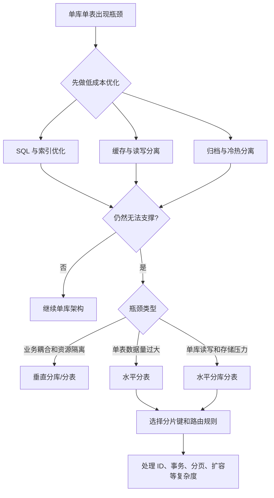

# 什么是分库分表？何时需要进行分库分表？

日期：2026-07-05
标签：#面试 #八股 #MySQL #分库分表 #架构

## 一句话答案

分库分表是把单库单表的数据按规则拆到多个库或多张表中，用来缓解单库容量、单表数据量、读写压力和可用性瓶颈；通常在垂直优化、索引优化、缓存、读写分离都无法支撑业务增长时才考虑。

## 面试口语版

分库分表本质上是数据库层面的水平扩展。分库是把数据拆到多个数据库实例里，降低单库连接数、CPU、IO 和存储压力；分表是把一张大表拆成多张小表，降低单表数据量和索引高度，提升查询、写入和维护效率。

一般不是一开始就做分库分表，因为它会引入跨库 Join、分布式事务、全局唯一 ID、分页排序、扩容迁移、运维复杂度等问题。更合理的时机是：单表数据量非常大、索引和 SQL 优化后仍然慢，单库写入或连接数达到瓶颈，数据增长趋势明确，并且读写分离、缓存、归档、冷热分离等手段已经不够用了，这时候再根据业务维度选择合适的拆分策略。

## 原理拆解

分库分表可以从两个维度理解：

| 类型 | 含义 | 解决的问题 | 示例 |
| --- | --- | --- | --- |
| 垂直分库 | 按业务模块拆库 | 降低业务耦合，隔离资源 | 用户库、订单库、商品库 |
| 垂直分表 | 按字段冷热或大小拆表 | 降低单行宽度，提高查询效率 | 用户基础表、用户详情表 |
| 水平分库 | 同一业务数据按规则拆到多个库 | 降低单库压力 | order_0 库、order_1 库 |
| 水平分表 | 同一张表按规则拆成多张表 | 降低单表数据量 | order_000、order_001 |

常见拆分规则：

1. **按范围拆分**：例如按时间、ID 范围拆。优点是容易理解和归档，缺点是容易产生热点。
2. **按哈希拆分**：例如 `user_id % 16`。优点是数据分布均匀，缺点是扩容迁移复杂。
3. **按业务字段拆分**：例如租户 ID、用户 ID、订单 ID。核心是让高频查询尽量命中单个分片。

分库分表要优先围绕查询入口设计。例如订单系统如果大部分查询是“查某个用户的订单”，就常用 `user_id` 做分片键；如果核心入口是“按订单号查订单”，就要保证订单号能反推出分片位置，或者维护路由映射。

## Mermaid 图解

## 关键细节

1. **不要过早分库分表**  
   分库分表不是性能银弹，它是用复杂度换容量和吞吐。能用索引、SQL 优化、缓存、读写分离、数据归档解决的问题，不要急着拆。

2. **核心难点是分片键选择**  
   分片键选错会导致大量跨分片查询。好的分片键应该满足高频查询命中、数据分布均匀、扩展相对可控。

3. **分库分表后 Join 会变难**  
   原来数据库内部完成的 Join，可能要改成应用层组装、冗余字段、宽表、异步同步或搜索引擎辅助。

4. **分布式事务成本会上升**  
   跨库事务会带来性能和一致性问题。实践中常用最终一致性、消息事务、补偿机制、TCC 或 Saga 等方案。

5. **全局唯一 ID 需要重新设计**  
   自增主键在多库多表下容易冲突，常见方案有雪花算法、号段模式、数据库序列、Redis 自增等。

6. **扩容迁移要提前考虑**  
   取模分片简单，但从 16 张表扩到 32 张表会涉及大量数据迁移。可以考虑一致性哈希、预分片、双写迁移等方案。

7. **常见经验阈值只能参考**  
   例如“单表千万级考虑分表”只是经验，不是硬标准。真正判断要看 QPS、写入量、索引大小、查询模式、机器配置、增长速度和业务 SLA。

## 面试官追问

1. 分库和分表分别解决什么问题？
2. 垂直拆分和水平拆分有什么区别？
3. 分片键如何选择？如果选错会发生什么？
4. 分库分表后如何处理跨库 Join？
5. 分库分表后如何生成全局唯一 ID？
6. 如果线上已经按 `user_id % 16` 分表，后续要扩到 32 张表，你怎么做？

## 常见错误说法

| 错误说法 | 问题 | 更好的说法 |
| --- | --- | --- |
| 数据量大就要分库分表 | 过于绝对，忽略查询模式和优化空间 | 数据量、读写压力、增长趋势和优化手段都要综合判断 |
| 分库分表一定提升性能 | 忽略跨分片查询和分布式事务成本 | 命中单分片时通常更好，跨分片场景可能更慢 |
| 分表就是把表复制多份 | 概念错误 | 分表是按规则把不同数据行或字段拆到不同表 |
| 随便用 ID 取模就行 | 忽略业务查询入口和扩容问题 | 分片键要匹配核心查询路径，并提前考虑扩容迁移 |

## 不会时怎么答

如果一时想不完整，可以先这样说：

> 分库分表是数据库水平扩展手段，用来解决单库单表在容量、读写、连接数、索引维护上的瓶颈。但它会带来跨库查询、事务、ID、扩容等复杂度，所以一般要先做索引、SQL、缓存、读写分离和归档优化，确认瓶颈仍然存在后再拆。拆的时候最关键的是选好分片键，让高频查询尽量落到单个分片。

## 学习清单

- 理清垂直分库、垂直分表、水平分库、水平分表的区别。
- 能说出 3 种分片规则：范围、哈希、业务字段。
- 准备一个订单表按 `user_id` 分片的例子。
- 复习分库分表带来的 5 个问题：Join、事务、ID、分页、扩容。
- 对比读写分离、缓存、归档、冷热分离和分库分表的适用边界。
