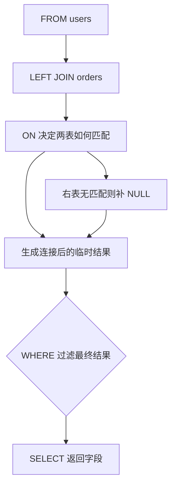

# 内连接与外连接有什么区别？ON 和 WHERE 条件在连接查询中有什么不同？

日期：2026-07-05
标签：#面试 #八股 #MySQL #SQL #JOIN

## 一句话答案

内连接只返回两张表中能匹配上的记录；外连接会保留某一侧或两侧未匹配的记录，并用 `NULL` 补齐另一侧字段。`ON` 主要用于定义表之间如何匹配，`WHERE` 用于在连接结果生成后再过滤数据；在外连接中，把右表过滤条件放在 `WHERE` 里，可能会把外连接“过滤成”内连接效果。

## 面试口语版

内连接就是取交集，只有两边满足连接条件的数据才会返回。外连接是在匹配的基础上，还会保留没有匹配上的数据，比如 `LEFT JOIN` 会保留左表全部记录，右表匹配不上时右表字段补 `NULL`。

`ON` 和 `WHERE` 的区别要结合 SQL 的逻辑执行顺序看。`ON` 是连接阶段的匹配条件，用来决定两张表哪些行能配对；`WHERE` 是连接结果出来以后再过滤最终结果。对于 `INNER JOIN` 来说，很多时候条件写在 `ON` 或 `WHERE` 结果可能一样；但对于 `LEFT JOIN` 这类外连接就不一样了。如果你把右表条件写到 `WHERE`，例如 `WHERE b.status = 1`，那些右表没匹配上的行里 `b.status` 是 `NULL`，会被过滤掉，最后就失去了保留左表全量数据的效果。

## 原理拆解

### 连接类型区别

| 类型 | 返回结果 | 未匹配数据是否保留 | 典型场景 |
| --- | --- | --- | --- |
| `INNER JOIN` | 两表满足连接条件的记录 | 不保留 | 查有订单的用户 |
| `LEFT JOIN` | 左表全部记录 + 右表匹配记录 | 保留左表未匹配记录 | 查所有用户及其订单 |
| `RIGHT JOIN` | 右表全部记录 + 左表匹配记录 | 保留右表未匹配记录 | 可读性通常不如改写为 `LEFT JOIN` |
| `FULL JOIN` | 左右两表全部记录 | 两侧都保留 | MySQL 不直接支持，可用 `UNION` 模拟 |

### ON 与 WHERE 的逻辑区别

可以把连接查询理解成两个阶段：

1. **连接阶段**：根据 `ON` 条件决定两张表怎么匹配。
2. **过滤阶段**：根据 `WHERE` 条件过滤连接后的结果集。

示例表：

```sql
-- users
-- id | name
-- 1  | Alice
-- 2  | Bob

-- orders
-- id | user_id | status
-- 10 | 1       | PAID
-- 11 | 1       | CANCELED
```

写法一：右表状态条件放在 `ON` 中。

```sql
SELECT u.id, u.name, o.id AS order_id, o.status
FROM users u
LEFT JOIN orders o
  ON u.id = o.user_id AND o.status = 'PAID';
```

结果含义：保留所有用户，只匹配已支付订单。Bob 没有订单也会保留，只是订单字段为 `NULL`。

写法二：右表状态条件放在 `WHERE` 中。

```sql
SELECT u.id, u.name, o.id AS order_id, o.status
FROM users u
LEFT JOIN orders o
  ON u.id = o.user_id
WHERE o.status = 'PAID';
```

结果含义：先保留所有用户并连接订单，再过滤 `o.status = 'PAID'`。Bob 的订单字段是 `NULL`，不满足 `WHERE` 条件，所以会被过滤掉，效果接近只查有已支付订单的用户。

## Mermaid 图解



## 关键细节

1. **内连接更像取交集**  
   `INNER JOIN` 只返回满足连接条件的数据，两边任意一边匹配不上都不会出现在结果里。

2. **外连接会保留主表数据**  
   `LEFT JOIN` 的“主表”是左表，右表没有匹配时补 `NULL`；这就是外连接和内连接最核心的区别。

3. **`ON` 是匹配条件，不只是过滤条件**  
   在外连接中，`ON` 条件失败并不一定意味着整行消失，可能只是右表匹配失败并补 `NULL`。

4. **`WHERE` 会过滤最终结果**  
   对 `LEFT JOIN` 来说，如果 `WHERE` 中写了右表字段条件，未匹配行的右表字段为 `NULL`，通常会被过滤掉。

5. **内连接中 `ON` 和 `WHERE` 常常可互换，但不建议混乱写**  
   对 `INNER JOIN`，连接条件和过滤条件放哪里，优化器通常能处理出等价结果。但可读性上建议：表关联条件写 `ON`，业务过滤条件写 `WHERE`。

6. **判断是否被“隐式改成内连接”**  
   看到 `LEFT JOIN` 后面跟着 `WHERE right_table.column = ...`，就要警惕：这往往会过滤掉右表为 `NULL` 的行。

## 面试官追问

1. `LEFT JOIN`、`RIGHT JOIN`、`INNER JOIN` 分别返回什么数据？
2. 为什么 `LEFT JOIN` 后面 `WHERE b.id IS NOT NULL` 会变成类似内连接？
3. 右表过滤条件应该放在 `ON` 还是 `WHERE`？
4. MySQL 支持 `FULL OUTER JOIN` 吗？如果不支持怎么模拟？
5. `COUNT(*)`、`COUNT(右表字段)` 在 `LEFT JOIN` 结果里有什么区别？
6. 多表连接时如何判断哪个条件应该写在 `ON`，哪个写在 `WHERE`？

## 常见错误说法

| 错误说法 | 问题 | 更好的说法 |
| --- | --- | --- |
| `ON` 和 `WHERE` 没区别 | 对外连接是错的 | 内连接中很多场景等价，外连接中会影响保留未匹配行 |
| 外连接一定比内连接慢 | 过于绝对 | 性能取决于数据量、索引、过滤条件、执行计划 |
| `LEFT JOIN` 一定返回左表所有行 | 忽略了 `WHERE` 过滤 | `LEFT JOIN` 连接阶段保留左表，但最终结果仍会被 `WHERE` 过滤 |
| 右连接和左连接完全不同 | 本质方向不同，语义可转换 | `RIGHT JOIN` 通常可通过交换表顺序改成更易读的 `LEFT JOIN` |

## 不会时怎么答

可以先抓住这个核心：

> 内连接只返回两边匹配的数据，外连接会额外保留某一侧未匹配的数据。`ON` 是连接时判断两张表怎么匹配，`WHERE` 是连接结果生成后再过滤。尤其在 `LEFT JOIN` 中，如果把右表过滤条件写到 `WHERE`，右表没匹配上的 `NULL` 行会被过滤掉，可能导致外连接变成类似内连接的效果。

## 学习清单

- 用两张小表手写 `INNER JOIN`、`LEFT JOIN` 的结果。
- 重点练习：右表条件放 `ON` 与放 `WHERE` 的结果差异。
- 记住 SQL 逻辑顺序：`FROM/JOIN` -> `ON` -> 外连接补 `NULL` -> `WHERE` -> `SELECT`。
- 复习 `NULL` 与比较运算：`NULL = 'PAID'` 不为 true。
- 练习 `LEFT JOIN ... WHERE right_table.id IS NULL` 查找未匹配数据的反连接写法。
