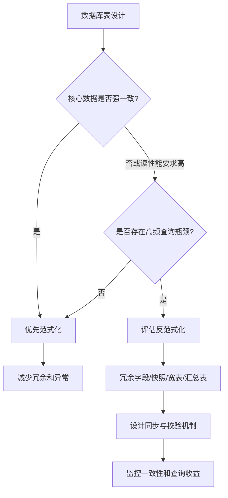

# 数据库三大范式是什么？实际项目中如何平衡范式化和反范式化？

日期：2026-07-05
标签：#面试 #八股 #MySQL #数据库设计 #范式

## 一句话答案

三大范式分别要求字段原子性、非主键字段完全依赖主键、非主键字段不能传递依赖主键；实际项目中通常先用范式化保证数据一致性和可维护性，再针对高频查询、性能瓶颈和报表场景做可控的反范式冗余。

## 面试口语版

数据库三大范式主要是为了解决数据冗余、更新异常、插入异常和删除异常。第一范式要求字段不可再分，比如手机号不要用一个字段存多个号码；第二范式要求非主键字段必须完全依赖整个主键，主要针对联合主键场景，避免只依赖联合主键的一部分；第三范式要求非主键字段不能依赖另一个非主键字段，也就是不能产生传递依赖。

但实际项目不会一味追求范式化。范式化表结构清晰、一致性好，但是查询可能需要多表 Join，复杂查询和高并发读场景会有成本。所以一般做法是：核心交易数据、强一致数据优先范式化；在读多写少、性能压力大、报表统计、列表展示等场景，可以适当反范式化，比如冗余用户名、订单快照、商品价格快照、统计字段。关键是冗余要有明确收益，并且要设计同步和一致性策略。

## 原理拆解

### 三大范式

| 范式 | 核心要求 | 解决的问题 | 例子 |
| --- | --- | --- | --- |
| 第一范式 1NF | 字段具有原子性，不可再分 | 避免一个字段存多个值，难以查询和维护 | 不要用 `phones = '138,139'` 存多个手机号 |
| 第二范式 2NF | 非主键字段完全依赖主键 | 避免联合主键下的部分依赖 | 订单明细表中商品名只依赖商品 ID，不依赖整个订单明细主键 |
| 第三范式 3NF | 非主键字段不能传递依赖主键 | 避免非主键字段之间互相依赖 | 用户表中存 `dept_id`，部门名应放部门表 |

### 典型异常

不符合范式容易带来这些问题：

1. **更新异常**：同一个字段冗余在多处，修改时容易漏改。
2. **插入异常**：想插入某类信息时，被迫依赖另一类信息存在。
3. **删除异常**：删除一条业务记录时，把仍然有价值的基础信息也删掉。
4. **数据不一致**：同一事实在多处存储，最终出现多个版本。

### 反范式化是什么

反范式化不是乱设计，而是在明确性能收益的前提下，故意引入一定冗余，减少 Join、减少查询链路、提升读性能或保留历史快照。

常见反范式场景：

| 场景 | 反范式做法 | 原因 |
| --- | --- | --- |
| 订单展示 | 订单表冗余用户名、手机号片段、地址快照 | 下单后需要保留当时信息，且减少 Join |
| 商品订单 | 订单明细冗余商品名、成交价 | 商品改名或调价不应影响历史订单 |
| 统计计数 | 文章表冗余评论数、点赞数 | 避免每次实时聚合 |
| 列表查询 | 冗余展示字段到主表或宽表 | 高频列表页减少多表 Join |
| 报表分析 | 建汇总表、宽表、数据集市 | 面向查询吞吐和分析效率 |

## Mermaid 图解

## 关键细节

1. **范式化的核心价值是减少冗余和保证一致性**  
   表越范式化，数据事实越集中，更新时越不容易出现多个版本。

2. **第二范式重点看联合主键**  
   如果表是单字段主键，通常不太容易违反第二范式；如果是联合主键，要警惕某个字段只依赖联合主键的一部分。

3. **第三范式重点看传递依赖**  
   例如 `user_id -> dept_id -> dept_name`，如果用户表直接存 `dept_name`，部门名变化时会带来冗余更新问题。

4. **反范式化不是不规范，而是有意识地冗余**  
   面试时要强调：反范式一定要有业务理由和性能证据，不能只是为了省事。

5. **冗余字段必须有一致性方案**  
   常见方案包括事务内同步、异步消息同步、定时校验补偿、以某张表为主表重建冗余数据。

6. **快照类冗余是业务正确性，不只是性能优化**  
   比如订单中的商品名、成交价、收货地址，保存的是下单时刻的事实，不应该随着商品或用户资料修改而变化。

7. **不要为了完全范式化牺牲核心查询性能**  
   高频读场景如果每次都 Join 多张大表，可能拖垮接口延迟。此时宽表、缓存、搜索引擎、汇总表都可以作为选择。

## 面试官追问

1. 第一范式、第二范式、第三范式分别解决什么问题？
2. 什么是部分依赖？什么是传递依赖？
3. 为什么订单表里常常要冗余商品名称和成交价格？
4. 反范式化会带来什么问题？如何保证数据一致性？
5. 范式化和反范式化哪个更好？
6. 如果列表页需要展示用户信息、订单信息、商品信息，你会怎么设计表？

## 常见错误说法

| 错误说法 | 问题 | 更好的说法 |
| --- | --- | --- |
| 范式越高越好 | 忽略性能和业务场景 | 核心数据优先范式化，高频查询可适当反范式 |
| 反范式就是表设计不规范 | 误解反范式 | 反范式是有意识冗余，用复杂度换查询性能或业务快照 |
| 冗余字段一定不能有 | 过于绝对 | 冗余字段可以存在，但要有同步和校验机制 |
| 三范式就是不要重复字段 | 说法太粗 | 三范式分别关注原子性、完全依赖、无传递依赖 |

## 不会时怎么答

可以先这样回答：

> 三大范式主要是为了减少冗余和异常。第一范式要求字段原子，第二范式要求非主键字段完全依赖主键，第三范式要求非主键字段不能传递依赖主键。实际项目里我会先保证核心数据范式化，避免一致性问题；但对于读多写少、高频列表、订单快照和报表统计，会适当反范式化，通过冗余字段、宽表或汇总表减少 Join，同时配合同步、校验和补偿机制保证一致性。

## 学习清单

- 用自己的话解释 1NF、2NF、3NF，每个准备一个例子。
- 重点理解：部分依赖和传递依赖。
- 准备一个订单系统里的反范式例子：商品名、成交价、地址快照。
- 思考冗余字段的同步方案：事务同步、消息同步、定时校验。
- 练习回答“范式化和反范式化哪个更好”这类开放题，重点讲场景和权衡。
