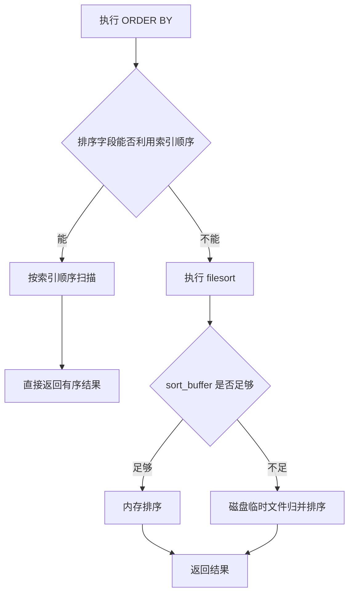

# MySQL 中的数据排序是怎么实现的？

日期：2026-07-05
难度：简单
标签：#面试 #八股 #MySQL #数据库 #排序

## 一句话答案

MySQL 排序主要有两种方式：能利用索引顺序时直接按索引返回；不能利用索引时会执行 `filesort`，在内存排序缓冲区中排序，数据量过大时可能借助磁盘临时文件。

## 面试口语版

MySQL 处理 `ORDER BY` 时，最理想的是走索引排序，比如索引本身已经按 `a,b` 有序，查询又按相同方向排序，就可以边扫描边返回，不需要额外排序。如果不能利用索引，就会走 `filesort`。`filesort` 不是一定在磁盘上排序，它表示 MySQL 自己做额外排序；数据量小可能在内存里完成，超过排序缓冲区时才会使用磁盘临时文件。

## 原理拆解

常见排序路径：

| 方式 | 特点 | 典型场景 |
| --- | --- | --- |
| 索引排序 | 不需要额外排序，性能通常更好 | `ORDER BY` 字段匹配索引最左前缀 |
| filesort | MySQL 额外排序，不一定落盘 | 排序字段无合适索引 |
| 临时表 + filesort | 成本更高 | 排序、分组、Join 后结果较复杂 |

## 关键细节

- `EXPLAIN` 中出现 `Using filesort` 表示发生额外排序。
- `filesort` 不等于文件排序，只是 MySQL 内部排序算法名。
- 联合索引排序要满足最左前缀和排序方向要求。
- `WHERE a = ? ORDER BY b` 可以利用 `(a,b)` 联合索引。
- `ORDER BY` 与 `LIMIT` 结合时，如果能用索引，可以避免全量排序。
- 对大结果集排序要警惕内存、磁盘临时文件和响应时间。

## 面试官追问

1. 什么情况下 `ORDER BY` 可以利用索引？
2. `Using filesort` 一定很慢吗？
3. `ORDER BY a, b` 如何设计联合索引？
4. 为什么深分页排序会很慢？
5. 如何优化排序查询？

## 常见错误说法

| 错误说法 | 问题 | 更好的说法 |
| --- | --- | --- |
| MySQL 排序都在磁盘上完成 | 误解 filesort | 小数据量可能在内存完成 |
| 有索引就一定不会 filesort | 忽略索引顺序匹配 | 需要匹配过滤、排序字段和方向 |
| filesort 一定不能接受 | 过于绝对 | 小数据、低频查询可以接受 |

## 学习清单

- 用 `EXPLAIN` 观察 `Using filesort`。
- 练习 `(a,b)` 索引下 `WHERE a=? ORDER BY b`。
- 对比 `ORDER BY create_time LIMIT 10` 有无索引的执行差异。

