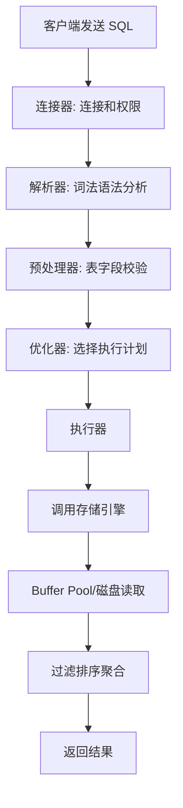
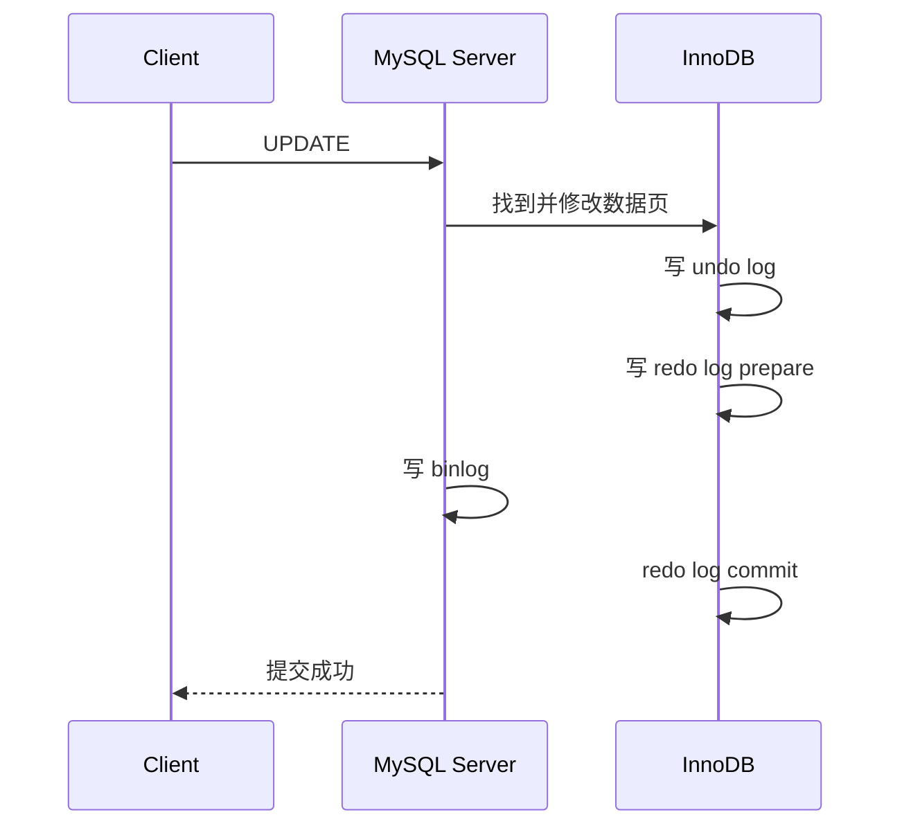

# 详细描述一条 SQL 语句在 MySQL 中的执行过程

日期：2026-07-05
难度：中等
标签：#面试 #八股 #MySQL #数据库 #SQL执行过程 #VIP

## 一句话答案

一条 SQL 在 MySQL 中大致会经过连接器、解析器、预处理器、优化器、执行器，再调用存储引擎读取或修改数据；如果是更新语句，还会涉及 undo log、redo log、binlog 和事务提交过程。

## 面试口语版

以查询语句为例，客户端先和 MySQL 建立连接并完成权限校验；然后解析器做词法、语法分析，把 SQL 变成语法树；预处理器检查表、字段是否存在；优化器根据统计信息和索引选择执行计划，比如选择哪个索引、表连接顺序；最后执行器按照执行计划调用 InnoDB 这类存储引擎接口读取数据，经过过滤、排序、聚合后返回给客户端。

如果是 `UPDATE`，除了查找和修改数据，还要记录 undo log 用于回滚和 MVCC，记录 redo log 保证崩溃恢复，记录 binlog 用于主从复制和恢复，提交时通过 redo log 和 binlog 的两阶段提交保证一致性。

## 原理拆解

更新语句还会经历：

## 关键细节

- Server 层负责 SQL 解析、优化、执行协调；存储引擎层负责数据存取。
- 优化器选择的是它认为成本最低的执行计划，不一定总是最符合直觉。
- `EXPLAIN` 可以查看执行计划，`EXPLAIN ANALYZE` 可看实际执行信息。
- 查询缓存已在 MySQL 8.0 移除，面试时不要把它当作现代执行链路核心。
- 更新语句涉及事务日志，查询语句通常重点关注执行计划和索引。

## 面试官追问

1. 解析器和优化器分别做什么？
2. Server 层和存储引擎层如何分工？
3. 为什么优化器可能选错索引？
4. `UPDATE` 为什么需要 redo log 和 binlog 两阶段提交？
5. `EXPLAIN` 重点看哪些字段？

## 常见错误说法

| 错误说法 | 问题 | 更好的说法 |
| --- | --- | --- |
| SQL 直接去磁盘查数据 | 忽略 Server 层和 Buffer Pool | SQL 会经过解析、优化、执行，再由引擎访问数据 |
| 优化器一定选最优索引 | 过于绝对 | 优化器基于统计信息估算成本，可能误判 |
| redo log 和 binlog 作用一样 | 概念混淆 | redo 用于崩溃恢复，binlog 用于归档和复制 |

## 学习清单

- 能画出 SQL 查询链路。
- 用 `EXPLAIN` 分析一条查询。
- 复习 redo log、undo log、binlog 在更新语句中的位置。

