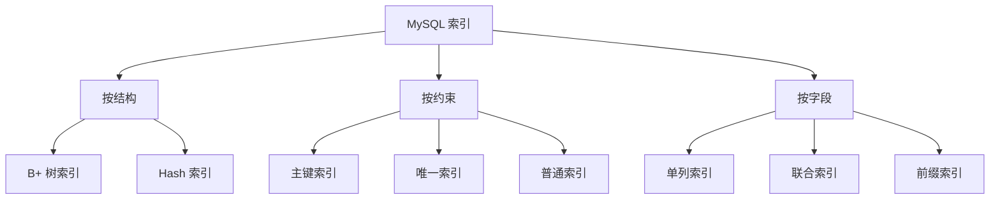

# MySQL 的索引类型有哪些？

日期：2026-07-05
难度：简单
标签：#面试 #八股 #MySQL #数据库 #索引 #VIP

## 一句话答案

MySQL 常见索引可以按数据结构、功能和字段组合来分：B+ 树索引、哈希索引、全文索引、空间索引；主键索引、唯一索引、普通索引；单列索引、联合索引、前缀索引等。

## 面试口语版

InnoDB 中最常用的是 B+ 树索引，主键索引的叶子节点存整行数据，也叫聚簇索引；二级索引叶子节点存主键值。按约束看，有主键索引、唯一索引、普通索引；按字段数量看，有单列索引和联合索引；按特殊能力看，有全文索引用于文本检索，空间索引用于地理空间数据。Memory 引擎还支持哈希索引，但 InnoDB 日常优化主要围绕 B+ 树索引。

## 原理拆解

| 分类维度 | 类型 | 说明 |
| --- | --- | --- |
| 数据结构 | B+ 树索引 | InnoDB 默认主力索引，适合范围查询和排序 |
| 数据结构 | Hash 索引 | 等值查询快，不适合范围和排序，多见于 Memory |
| 功能约束 | 主键索引 | 唯一且非空，InnoDB 聚簇索引 |
| 功能约束 | 唯一索引 | 保证字段值唯一，可有 NULL 规则差异 |
| 功能约束 | 普通索引 | 只提升查询效率，不保证唯一 |
| 字段组合 | 联合索引 | 多列组成，遵循最左前缀 |
| 字段组合 | 前缀索引 | 对字符串前 N 个字符建索引 |
| 特殊能力 | 全文索引 | 文本检索 |
| 特殊能力 | 空间索引 | GIS 空间数据 |

## Mermaid 图解

## 关键细节

- InnoDB 表必须有聚簇索引；没有主键会选择唯一非空索引，否则生成隐藏 row_id。
- 二级索引叶子节点保存主键值，所以通过二级索引查整行可能回表。
- 联合索引不是多个单列索引的简单叠加，要遵循最左前缀原则。
- 前缀索引可以降低索引大小，但可能降低区分度，且不一定支持完整排序。

## 面试官追问

1. InnoDB 主键索引和二级索引有什么区别？
2. 联合索引为什么有最左前缀原则？
3. 哈希索引为什么不适合范围查询？
4. 唯一索引和普通索引在写入上有什么差异？
5. 什么场景适合前缀索引？

## 常见错误说法

| 错误说法 | 问题 | 更好的说法 |
| --- | --- | --- |
| MySQL 索引都是 B+ 树 | 过于绝对 | InnoDB 主要是 B+ 树，也有全文、空间等索引 |
| 联合索引等于多个单列索引 | 概念错误 | 联合索引按多列组合排序，有最左前缀约束 |
| 主键索引和唯一索引完全一样 | 忽略聚簇特性 | InnoDB 主键索引叶子节点存整行数据 |

## 学习清单

- 记住 B+ 树、Hash、全文、空间四类结构/能力。
- 区分主键索引、唯一索引、普通索引。
- 结合回表理解聚簇索引和二级索引。

