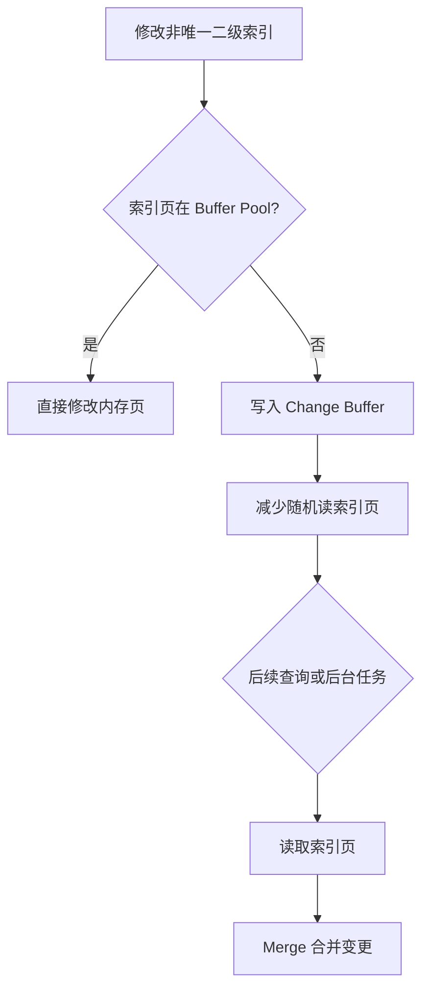

# MySQL 的 Change Buffer 是什么？它有什么作用？

日期：2026-07-05
难度：中等
标签：#面试 #八股 #MySQL #InnoDB #ChangeBuffer

## 一句话答案

Change Buffer 是 InnoDB 用来缓存非唯一二级索引变更的一种机制，当目标索引页不在 Buffer Pool 中时，先把变更记录到 Change Buffer，后续读取或后台任务再合并到真正的索引页，从而减少随机磁盘 IO。

## 面试口语版

InnoDB 更新二级索引时，如果对应索引页不在内存里，直接读盘再修改会产生随机 IO。Change Buffer 的思路是先不立刻把索引页读进来，而是把这次插入、删除标记或更新缓存起来。等以后查询正好读到这个索引页，或者后台 merge 线程触发时，再把 Change Buffer 里的变更合并进去。它主要适合写多读少、非唯一二级索引的场景。

## 原理拆解

为什么只适合非唯一二级索引：

- 唯一索引更新时必须检查唯一性，往往需要读取目标索引页确认是否冲突。
- 非唯一索引不需要立即判断唯一冲突，可以延迟合并。

## 关键细节

- Change Buffer 缓存的是二级索引页的变更，不是数据行本身。
- 它可以减少随机读，提高写入性能，但未来 merge 仍然要付出成本。
- 写多读少更受益；写后马上读，可能把合并成本转移到查询阶段。
- 唯一索引通常不能有效使用 Change Buffer。
- Change Buffer 本身也需要持久化，崩溃后可通过 redo log 恢复。

## 面试官追问

1. Change Buffer 和 Buffer Pool 有什么区别？
2. 为什么唯一索引不适合 Change Buffer？
3. Change Buffer 适合什么业务场景？
4. Change Buffer 的 merge 什么时候发生？
5. 它是否会影响查询性能？

## 常见错误说法

| 错误说法 | 问题 | 更好的说法 |
| --- | --- | --- |
| Change Buffer 缓存整行数据 | 概念错误 | 它缓存二级索引页的变更 |
| 所有索引都能用 Change Buffer | 忽略唯一性检查 | 主要用于非唯一二级索引 |
| Change Buffer 让写入成本消失 | 过于绝对 | 它延迟并合并随机 IO，最终仍需 merge |

## 学习清单

- 先理解 Buffer Pool，再理解 Change Buffer。
- 结合非唯一二级索引写入流程复述。
- 记住关键词：非唯一、二级索引、延迟合并、减少随机 IO。

