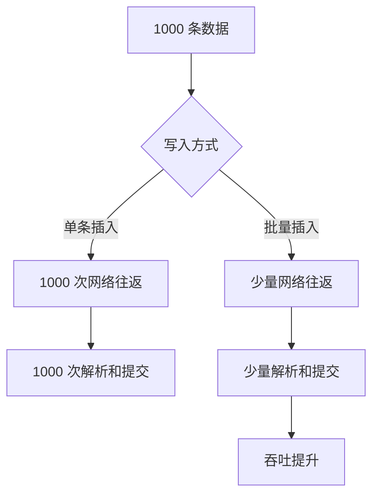

# 什么是批量数据入库？相比单条插入有什么优势？

日期：2026-07-05
难度：简单
标签：#面试 #八股 #后端 #数据库 #批量写入

## 一句话答案

批量数据入库是把多条数据合并成一次或少量几次数据库写入操作；相比单条插入，它能减少网络往返、SQL 解析、事务提交和磁盘刷写成本，整体吞吐更高。

## 面试口语版

单条插入是每条数据都执行一次 SQL，网络请求、连接交互、SQL 解析、事务提交都会重复发生。批量入库通常用 `INSERT INTO ... VALUES (...), (...), (...)`，或者批处理 API、`LOAD DATA` 等方式一次写入多行。这样可以显著降低网络和事务开销，提高写入吞吐。不过批量大小要控制，太大可能导致 SQL 过长、锁持有时间过长、binlog 过大或内存压力变高。

## 原理拆解

常见方式：

| 方式 | 特点 |
| --- | --- |
| 多 values 插入 | 简单常用，适合中小批次 |
| JDBC batch | 由驱动批处理，适合应用层批量写 |
| `LOAD DATA` | 大文件导入效率高 |
| 临时表导入 | 适合先落临时表再清洗合并 |

## 关键细节

- 批量入库提升的是吞吐，不一定降低单条数据延迟。
- 批大小要结合 `max_allowed_packet`、事务大小、锁时间和内存评估。
- 大批量导入前要注意索引、唯一约束、触发器、binlog 和主从延迟。
- 批量失败要设计重试、拆批、幂等和错误定位机制。

## 面试官追问

1. 批量插入为什么比单条插入快？
2. 批量大小是不是越大越好？
3. 批量写失败如何重试？
4. 大批量导入时如何减少对线上业务影响？
5. `INSERT ... VALUES` 和 `LOAD DATA` 有什么区别？

## 常见错误说法

| 错误说法 | 问题 | 更好的说法 |
| --- | --- | --- |
| 批量越大越快 | 忽略事务和内存压力 | 批大小需要压测和限制 |
| 批量写没有缺点 | 忽略失败处理 | 需要考虑回滚、重试、幂等 |
| 单条插入一定不能用 | 过于绝对 | 低频写入或强实时场景可接受 |

## 学习清单

- 掌握多 values 插入语法。
- 了解 JDBC batch 和 `LOAD DATA`。
- 思考批量失败后的幂等重试方案。

