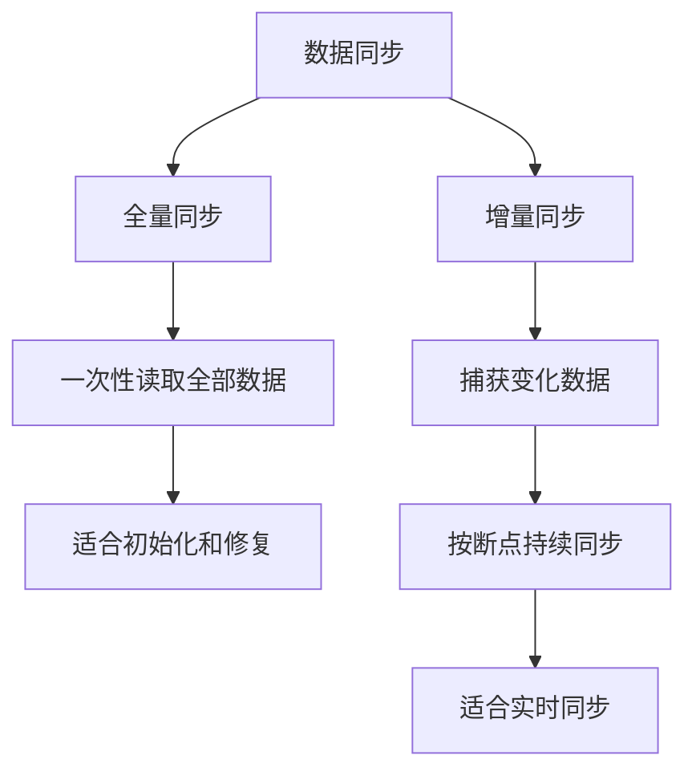

# 什么是数据全量同步和增量同步？它们各有什么优缺点？

日期：2026-07-05
难度：简单
标签：#面试 #八股 #后端 #数据同步 #数据库

## 一句话答案

全量同步是把源端某个时点的全部数据完整同步到目标端；增量同步只同步上次同步后发生变化的数据。全量简单可靠但成本高，增量效率高但依赖变更捕获和一致性控制。

## 面试口语版

全量同步就是从源库把所有数据拉一遍，适合初始化、数据修复和小数据量场景，优点是逻辑简单、容易校验，缺点是耗时长、资源占用大。增量同步只同步新增、修改、删除的数据，常见方式有更新时间戳、递增 ID、binlog/CDC。它适合持续同步，成本低、实时性好，但要处理乱序、重复、删除事件、断点续传和一致性问题。

## 原理拆解

| 类型 | 优点 | 缺点 | 常见场景 |
| --- | --- | --- | --- |
| 全量同步 | 简单、完整、易校验 | 慢、资源重、影响源库 | 初始化、重建索引、数据修复 |
| 增量同步 | 快、成本低、可实时 | 复杂、需处理一致性 | 主从、缓存同步、ES 同步、数仓同步 |

## 关键细节

- 全量和增量经常组合使用：先全量初始化，再增量追平。
- 基于更新时间戳的增量要注意时钟、漏更、同一时间多条记录。
- 基于 binlog/CDC 的增量更可靠，但系统复杂度更高。
- 删除数据也必须同步，否则目标端会出现脏数据。
- 增量同步要保存位点，比如时间戳、最大 ID、binlog file + position 或 GTID。

## 面试官追问

1. 如何做到全量同步期间数据仍然一致？
2. 增量同步如何处理删除事件？
3. 时间戳增量有什么坑？
4. binlog 同步和定时轮询有什么区别？
5. 同步失败如何断点续传？

## 常见错误说法

| 错误说法 | 问题 | 更好的说法 |
| --- | --- | --- |
| 增量同步就是查新数据 | 忽略更新和删除 | 增量包括新增、修改、删除 |
| 全量同步一定不需要增量 | 忽略同步期间变化 | 大多数场景先全量再增量追平 |
| 用更新时间戳一定可靠 | 忽略时钟和精度问题 | 要结合主键游标、重叠窗口或 CDC |

## 学习清单

- 画出“全量初始化 + 增量追平”流程。
- 了解 binlog 位点和 GTID。
- 设计一次 MySQL 到 Elasticsearch 的同步方案。

