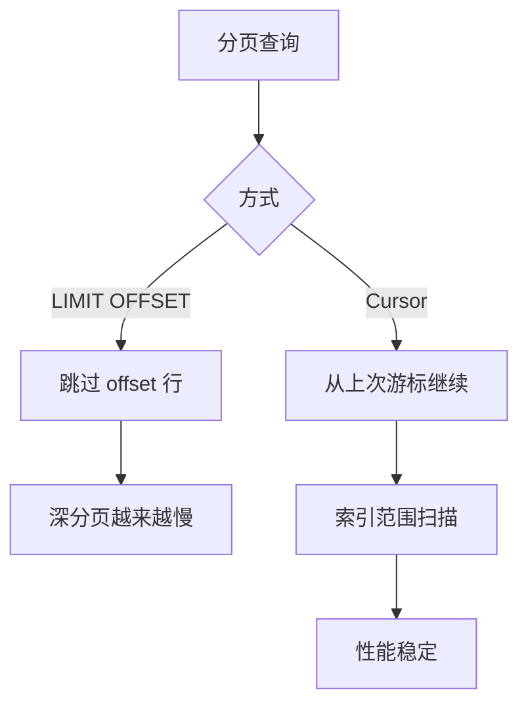

# 什么是游标 Cursor 分页？相比传统 LIMIT OFFSET 分页有什么优势？

日期：2026-07-05
难度：简单
标签：#面试 #八股 #后端 #数据库 #分页

## 一句话答案

Cursor 分页是基于上一页最后一条记录的排序键继续查询下一页，例如 `WHERE id > last_id LIMIT n`；相比 `LIMIT OFFSET`，它避免跳过大量数据，性能更稳定，也更适合实时变化的数据列表。

## 面试口语版

传统分页一般是 `LIMIT 100000, 20`，数据库需要先扫描或跳过前 100000 条，再取 20 条，页码越深越慢。Cursor 分页不按页码跳，而是记录上一页最后一条数据的游标，比如最后一个 `id` 或 `create_time + id`，下一页从这个位置继续查。这样可以利用索引范围扫描，性能更稳定，也能减少新增或删除数据导致的重复、漏读问题。

## 原理拆解

```sql
-- OFFSET 分页
SELECT * FROM orders
ORDER BY id
LIMIT 100000, 20;

-- Cursor 分页
SELECT * FROM orders
WHERE id > 100000
ORDER BY id
LIMIT 20;
```



## 关键细节

- Cursor 字段必须有稳定排序，常用自增 ID、创建时间加 ID。
- 如果按 `create_time` 排序，最好加 `id` 作为唯一 tie-breaker。
- Cursor 分页适合“下一页/上一页”，不适合直接跳到任意页。
- 游标可以是明文 ID，也可以编码成 token 返回给前端。
- 查询条件和排序字段要匹配索引。

## 面试官追问

1. 为什么 `LIMIT 100000, 20` 会慢？
2. Cursor 分页如何支持按时间倒序？
3. Cursor 分页能不能跳到第 100 页？
4. 如果排序字段不唯一怎么办？
5. Cursor 分页如何避免重复和漏读？

## 常见错误说法

| 错误说法 | 问题 | 更好的说法 |
| --- | --- | --- |
| Cursor 分页就是用 id 分页 | 太窄 | 它是基于稳定排序键的 seek 分页 |
| Cursor 分页能完全替代 OFFSET | 过于绝对 | 它不适合任意页码跳转 |
| OFFSET 只返回 20 条所以很快 | 忽略跳过成本 | 数据库需要扫描或跳过 offset 行 |

## 学习清单

- 实现 `id > last_id LIMIT n`。
- 实现 `(create_time, id)` 复合游标分页。
- 对比深分页下 OFFSET 和 Cursor 的执行计划。

