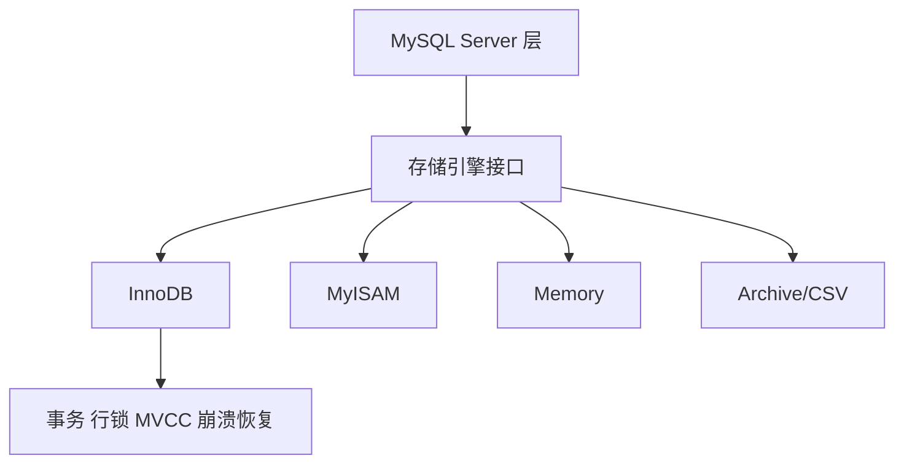

# MySQL 的存储引擎有哪些？它们之间有什么区别？

日期：2026-07-05
难度：中等
标签：#面试 #八股 #MySQL #数据库 #存储引擎 #VIP

## 一句话答案

MySQL 常见存储引擎有 InnoDB、MyISAM、Memory、Archive、CSV 等；实际生产最常用 InnoDB，因为它支持事务、行级锁、崩溃恢复、MVCC 和外键，更适合高并发 OLTP 场景。

## 面试口语版

存储引擎决定了表的数据怎么存、索引怎么组织、是否支持事务和锁。InnoDB 是默认也是最主流的引擎，支持事务、行锁、MVCC、redo/undo，适合绝大多数业务系统。MyISAM 不支持事务，主要是表级锁，崩溃恢复能力弱，现在很少作为核心业务表使用。Memory 把数据放内存里，速度快但重启丢失，适合临时数据。Archive 适合归档写入，CSV 用文件形式存储，更多是特殊场景。

## 原理拆解

| 存储引擎 | 事务 | 锁粒度 | 典型特点 | 适用场景 |
| --- | --- | --- | --- | --- |
| InnoDB | 支持 | 行级锁 | MVCC、崩溃恢复、聚簇索引 | 绝大多数业务表 |
| MyISAM | 不支持 | 表级锁 | 结构简单，读多写少 | 历史系统、非核心只读 |
| Memory | 不支持或能力有限 | 表级锁 | 数据在内存，重启丢失 | 临时表、缓存类数据 |
| Archive | 不支持 | 插入友好 | 高压缩、适合归档 | 日志归档 |
| CSV | 不支持 | 文件存储 | 可直接查看 CSV 文件 | 数据交换、测试 |

## Mermaid 图解

## 关键细节

- MySQL 的插件式存储引擎架构让不同表可以使用不同引擎。
- InnoDB 的事务能力依赖 redo log、undo log、锁和 MVCC。
- MyISAM 不支持事务，写操作表锁会影响并发。
- InnoDB 主键索引是聚簇索引，MyISAM 索引叶子节点存数据文件地址。
- 不要只说“InnoDB 支持事务”，还要能讲行锁、MVCC、崩溃恢复。

## 面试官追问

1. InnoDB 和 MyISAM 有哪些区别？
2. 为什么现在默认用 InnoDB？
3. InnoDB 为什么适合高并发？
4. Memory 引擎适合存业务核心数据吗？
5. 聚簇索引和非聚簇索引与存储引擎有什么关系？

## 常见错误说法

| 错误说法 | 问题 | 更好的说法 |
| --- | --- | --- |
| MySQL 只有 InnoDB | 忽略插件式引擎 | InnoDB 最常用，但还有多种引擎 |
| MyISAM 查询一定比 InnoDB 快 | 过时且绝对 | 性能取决于场景，核心业务优先 InnoDB |
| Memory 数据一定安全 | 错误 | Memory 表数据重启会丢失 |

## 学习清单

- 重点掌握 InnoDB 与 MyISAM 区别。
- 记住 InnoDB 的关键词：事务、行锁、MVCC、redo/undo、聚簇索引。
- 了解 Memory、Archive、CSV 的特殊用途。

