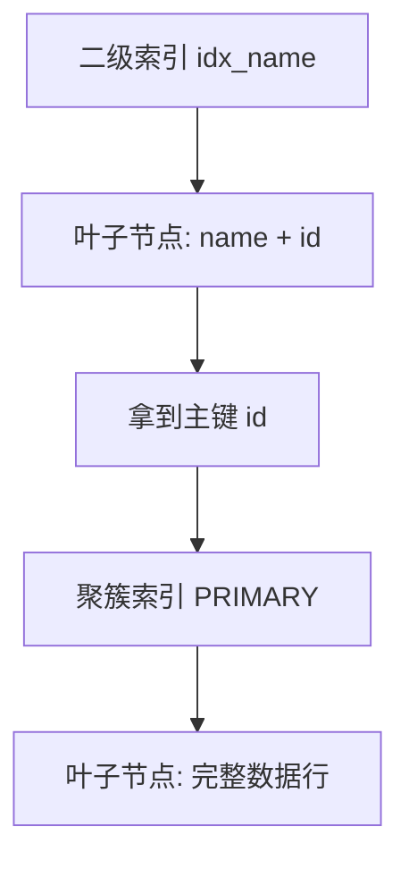

# MySQL InnoDB 引擎中的聚簇索引和非聚簇索引有什么区别？

日期：2026-07-05
难度：中等
标签：#面试 #八股 #MySQL #InnoDB #索引 #VIP

## 一句话答案

InnoDB 的聚簇索引就是主键索引，叶子节点存整行数据；非聚簇索引也叫二级索引，叶子节点存索引列和主键值，查询非索引字段时通常需要再通过主键回表。

## 面试口语版

InnoDB 表的数据本身是按主键聚簇索引组织的，所以主键索引叶子节点就是完整数据行。二级索引的叶子节点不直接存整行，而是存二级索引列加主键值。比如有索引 `idx_name(name)`，用 `name` 查到的是对应主键 ID，如果还要查其他字段，就要再拿主键 ID 到聚簇索引里查整行，这个过程就是回表。

## 原理拆解

| 对比项 | 聚簇索引 | 非聚簇索引/二级索引 |
| --- | --- | --- |
| 叶子节点 | 存完整数据行 | 存索引列 + 主键值 |
| 数量 | 一个表只能有一个 | 可以有多个 |
| 默认选择 | 主键；没有主键则唯一非空索引或隐藏 row_id | 用户创建的普通/唯一二级索引 |
| 查询成本 | 主键查询直接定位行 | 可能需要回表 |

## 关键细节

- InnoDB 表数据和主键索引放在一起，表即索引组织表。
- 主键越大，所有二级索引叶子节点也会变大，因为二级索引保存主键值。
- 推荐使用短、递增、稳定的主键，避免页分裂和二级索引膨胀。
- 覆盖索引可以避免回表，因为二级索引已经包含查询所需字段。

## 面试官追问

1. 为什么 InnoDB 表建议一定要有主键？
2. 二级索引叶子节点为什么存主键值而不是行地址？
3. 什么是回表？如何避免？
4. UUID 做主键有什么问题？
5. MyISAM 的索引和 InnoDB 有什么不同？

## 常见错误说法

| 错误说法 | 问题 | 更好的说法 |
| --- | --- | --- |
| 聚簇索引就是唯一索引 | 概念混淆 | InnoDB 聚簇索引通常是主键索引，叶子节点存整行 |
| 二级索引也存完整行 | 错误 | 二级索引叶子节点存主键值 |
| 一个表可以有多个聚簇索引 | 错误 | 数据只能按一种方式物理组织 |

## 学习清单

- 画出主键索引和二级索引结构。
- 用回表解释二级索引查询整行的成本。
- 复习为什么推荐自增主键。

