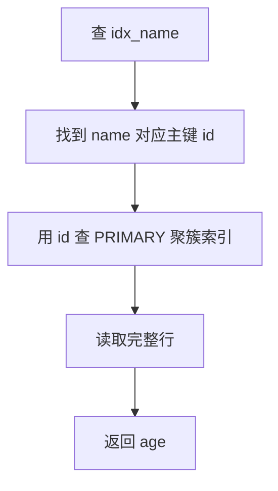

# MySQL 中的回表是什么？

日期：2026-07-05
难度：中等
标签：#面试 #八股 #MySQL #索引 #回表 #VIP

## 一句话答案

回表是指通过二级索引先查到主键值，再拿主键值回到聚簇索引中查询完整数据行的过程。

## 面试口语版

在 InnoDB 里，二级索引叶子节点不保存整行数据，只保存索引列和主键值。如果查询字段不在这个二级索引里，MySQL 就需要先走二级索引找到主键，再用主键去主键索引里查整行，这第二次查询就叫回表。回表次数多会增加随机 IO 和查询成本，所以可以通过覆盖索引、减少查询字段、合理设计联合索引来优化。

## 原理拆解

```sql
CREATE INDEX idx_name ON user(name);

SELECT age FROM user WHERE name = 'Alice';
```

如果 `age` 不在 `idx_name` 中：



如果索引是 `(name, age)`，查询 `age` 可以直接在二级索引中完成，就是覆盖索引，不需要回表。

## 关键细节

- 回表是 InnoDB 二级索引查询整行时的常见现象。
- `SELECT *` 更容易触发回表，因为需要很多索引外字段。
- 覆盖索引可以避免回表，但会增加索引维护成本。
- 回表不是一定慢，少量回表可以接受；大量回表可能很慢。
- 优化器可能因为回表成本太高而放弃某个索引，改走全表扫描。

## 面试官追问

1. 为什么二级索引会产生回表？
2. 覆盖索引如何避免回表？
3. `SELECT *` 对回表有什么影响？
4. 回表次数太多时优化器会怎么选择？
5. 回表和索引下推有什么关系？

## 常见错误说法

| 错误说法 | 问题 | 更好的说法 |
| --- | --- | --- |
| 走索引就一定快 | 忽略回表成本 | 二级索引大量回表可能比全表扫描慢 |
| 回表就是查两张表 | 概念错误 | 回表是在同一张 InnoDB 表的二级索引和聚簇索引之间查两次 |
| 覆盖索引没有代价 | 忽略写成本 | 覆盖索引会增加存储和维护成本 |

## 学习清单

- 记住“二级索引 -> 主键 -> 聚簇索引”。
- 用 `EXPLAIN` 对比覆盖索引和非覆盖索引。
- 避免无脑 `SELECT *`。

