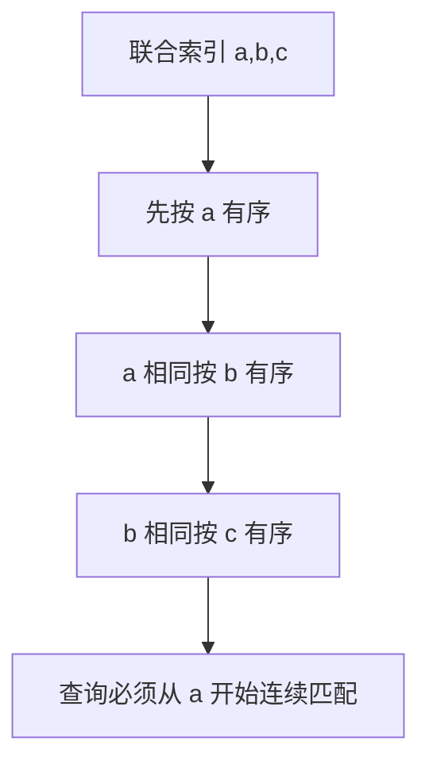

# MySQL 索引的最左前缀匹配原则是什么？

日期：2026-07-05
难度：简单
标签：#面试 #八股 #MySQL #索引 #最左前缀 #VIP

## 一句话答案

最左前缀原则是指联合索引按从左到右的字段顺序组织，查询条件必须从索引最左列开始连续匹配，才能充分利用联合索引。

## 面试口语版

比如有联合索引 `(a,b,c)`，它先按 `a` 排序，`a` 相同再按 `b` 排序，`b` 相同再按 `c` 排序。所以查询 `a`、`a,b`、`a,b,c` 通常可以利用索引；只查 `b` 或 `c` 就不能很好利用这个联合索引。遇到范围查询后，范围列后面的字段通常无法继续用于索引定位，只能用于过滤或其他优化。

## 原理拆解

示例：

| 查询条件 | 是否充分利用 `(a,b,c)` |
| --- | --- |
| `WHERE a = 1` | 是 |
| `WHERE a = 1 AND b = 2` | 是 |
| `WHERE a = 1 AND b = 2 AND c = 3` | 是 |
| `WHERE b = 2` | 通常不能 |
| `WHERE a = 1 AND c = 3` | 只能主要利用 `a` |
| `WHERE a > 1 AND b = 2` | `a` 用范围，`b` 通常不能继续定位 |

## 关键细节

- 最左前缀与 B+ 树联合索引的排序方式有关。
- SQL 条件书写顺序不一定重要，优化器会重排；索引字段定义顺序才重要。
- 范围查询如 `>、<、BETWEEN、LIKE 'abc%'` 后面的列要谨慎判断。
- `ORDER BY` 也受最左前缀和排序方向影响。
- 设计联合索引时要结合等值条件、范围条件、排序和区分度。

## 面试官追问

1. `(a,b,c)` 索引能否支持 `WHERE b=1`？
2. 范围查询为什么可能中断后续字段使用？
3. `LIKE 'abc%'` 能走索引吗？
4. 条件写成 `WHERE b=2 AND a=1` 能走 `(a,b)` 吗？
5. 联合索引字段顺序怎么设计？

## 常见错误说法

| 错误说法 | 问题 | 更好的说法 |
| --- | --- | --- |
| WHERE 条件顺序必须和索引一样 | 误解优化器 | SQL 书写顺序可被优化器调整，索引定义顺序重要 |
| 联合索引任意字段都能走 | 错误 | 要从最左列连续匹配 |
| 范围查询后面字段一定完全无效 | 过于绝对 | 通常不能继续用于定位，但可能用于索引下推或覆盖 |

## 学习清单

- 熟记 `(a,b,c)` 的可用和不可用案例。
- 结合 `EXPLAIN key_len` 观察用了几列。
- 练习联合索引字段顺序设计。

