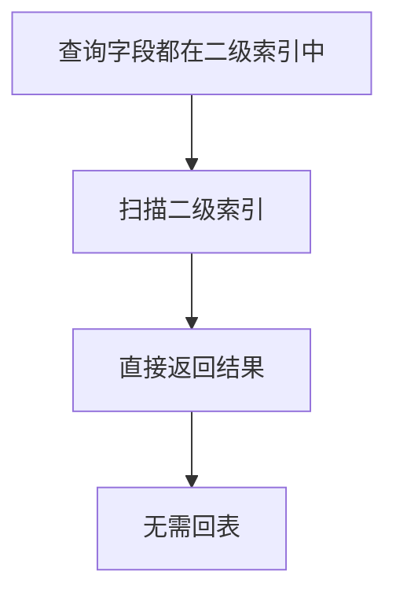

# MySQL 的覆盖索引是什么？

日期：2026-07-05
难度：中等
标签：#面试 #八股 #MySQL #索引 #覆盖索引 #VIP

## 一句话答案

覆盖索引是指查询所需的字段都能从某个索引中直接获取，不需要再回到聚簇索引读取整行数据。

## 面试口语版

在 InnoDB 中，二级索引叶子节点包含索引列和主键值。如果一个查询的过滤字段、排序字段和返回字段都在同一个索引里，MySQL 就可以只扫描这个索引完成查询，不需要回表，这就是覆盖索引。它可以减少随机 IO，提升查询性能，`EXPLAIN` 的 Extra 里常见 `Using index`。

## 原理拆解

```sql
CREATE INDEX idx_user_status_time ON orders(user_id, status, create_time);

SELECT status, create_time
FROM orders
WHERE user_id = 100;
```

这个查询需要的字段都在索引 `(user_id, status, create_time)` 中，可以覆盖。



## 关键细节

- 覆盖索引不是一种新索引类型，而是一种查询命中索引的效果。
- `SELECT *` 通常不利于覆盖索引。
- 覆盖索引可以降低回表成本，但会增加索引大小和写入维护成本。
- 联合索引常用于构造覆盖索引。
- `Using index` 通常表示使用了覆盖索引，但仍要结合执行计划整体判断。

## 面试官追问

1. 覆盖索引为什么能减少回表？
2. `SELECT *` 为什么不利于覆盖索引？
3. 覆盖索引和联合索引是什么关系？
4. 覆盖索引是否越多越好？
5. `Using index` 和 `Using index condition` 有什么区别？

## 常见错误说法

| 错误说法 | 问题 | 更好的说法 |
| --- | --- | --- |
| 覆盖索引是一种特殊索引结构 | 概念错误 | 它是查询字段被索引覆盖的现象 |
| 覆盖索引一定要包含所有表字段 | 过度设计 | 只需包含该查询所需字段 |
| 覆盖索引没有成本 | 忽略写入 | 会增加存储和维护成本 |

## 学习清单

- 用 `EXPLAIN` 观察 `Using index`。
- 对比 `SELECT *` 和只查必要字段。
- 练习为高频查询设计覆盖索引。

