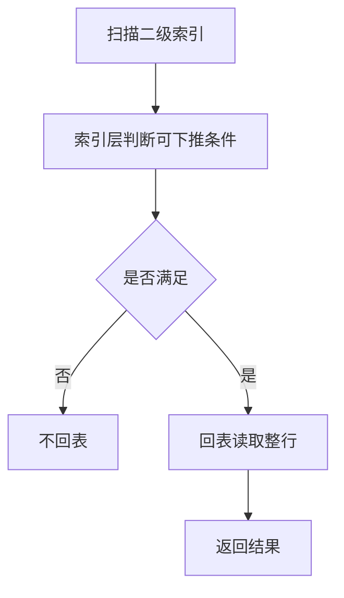

# MySQL 的索引下推是什么？

日期：2026-07-05
难度：中等
标签：#面试 #八股 #MySQL #索引 #ICP #VIP

## 一句话答案

索引下推是 MySQL 在使用二级索引查询时，把部分 `WHERE` 条件下推到存储引擎层先用索引字段过滤，减少回表次数。

## 面试口语版

没有索引下推时，MySQL 可能先通过索引找到一批主键，再逐条回表取整行，然后在 Server 层判断其他条件。有索引下推后，如果这些条件涉及的字段本身在索引里，存储引擎可以先在索引层过滤掉不满足条件的记录，只把更少的数据回表。这样最大的收益就是减少回表。

## 原理拆解

```sql
CREATE INDEX idx_name_age ON user(name, age);

SELECT * FROM user
WHERE name LIKE '张%' AND age = 20;
```

如果 `name LIKE '张%'` 用到索引范围，`age = 20` 可以在索引层进一步过滤，减少回表。



## 关键细节

- `EXPLAIN` 中 `Using index condition` 通常表示使用索引下推。
- 索引下推主要减少回表次数，不是减少索引扫描范围。
- 条件必须涉及索引中已有字段，才有机会下推。
- 覆盖索引是无需回表；索引下推是先过滤再少回表。
- ICP 对二级索引范围扫描场景更常见。

## 面试官追问

1. 索引下推解决什么问题？
2. `Using index` 和 `Using index condition` 有什么区别？
3. 索引下推能减少索引扫描范围吗？
4. 为什么它能减少回表？
5. 什么条件可以被下推？

## 常见错误说法

| 错误说法 | 问题 | 更好的说法 |
| --- | --- | --- |
| 索引下推就是覆盖索引 | 混淆概念 | 覆盖索引不回表，索引下推减少回表 |
| ICP 能让任何条件走索引 | 过于绝对 | 只有索引字段相关条件才可能下推 |
| ICP 一定提升很多 | 忽略选择性 | 过滤效果好时收益明显 |

## 学习清单

- 记住 `Using index condition`。
- 用二级索引范围查询理解回表减少。
- 对比覆盖索引和索引下推。

