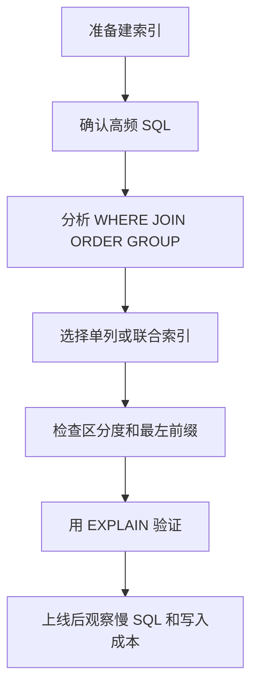

# 在 MySQL 中建索引时需要注意哪些事项？

日期：2026-07-05
难度：简单
标签：#面试 #八股 #MySQL #索引设计 #VIP

## 一句话答案

建索引要围绕高频查询、过滤条件、排序分组和字段区分度设计，同时控制索引数量和宽度，避免低选择性字段、频繁更新字段、过长字段和重复索引带来的写入与存储成本。

## 面试口语版

索引不是越多越好。建索引前要看业务查询，优先给高频 `WHERE`、`JOIN`、`ORDER BY`、`GROUP BY` 字段建合适索引。联合索引要考虑最左前缀，把等值条件、区分度、排序需求结合起来。不要给区分度很低的字段单独建索引，比如性别；也不要无脑给大字段建索引，可以考虑前缀索引。索引会占空间，也会影响插入、更新、删除，所以要定期用慢 SQL、`EXPLAIN` 和线上指标评估。

## 原理拆解

## 关键细节

- 优先服务高频、慢查询、核心链路 SQL。
- 联合索引字段顺序要考虑等值、范围、排序和区分度。
- 避免重复索引，比如已有 `(a,b)` 时通常不需要单独 `(a)`。
- 低区分度字段单独索引价值有限。
- 长字符串可考虑前缀索引，但要评估选择性。
- 频繁更新字段建索引会增加维护成本。
- 不要滥用索引，索引会占磁盘、占内存、拖慢写入。

## 面试官追问

1. 联合索引字段顺序怎么确定？
2. 为什么性别字段不适合单独建索引？
3. 如何发现重复索引？
4. 索引会带来哪些负面影响？
5. 大字段如何建索引？

## 常见错误说法

| 错误说法 | 问题 | 更好的说法 |
| --- | --- | --- |
| where 后的字段都要建索引 | 过于粗暴 | 要看频率、选择性、组合和成本 |
| 索引越多查询越快 | 忽略写成本和优化器选择 | 索引要服务核心 SQL，数量可控 |
| 区分度低也没关系 | 错误 | 区分度低可能过滤效果差 |

## 学习清单

- 针对 5 条典型 SQL 设计索引。
- 学会查重复索引和未使用索引。
- 用 `EXPLAIN` 验证索引是否命中。

