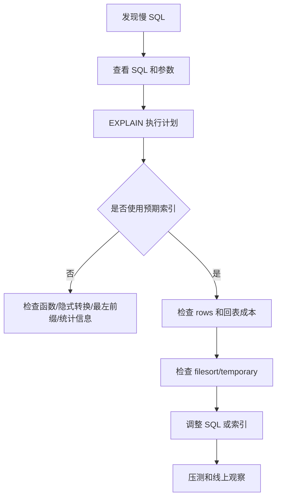

# MySQL 中使用索引一定有效吗？如何排查索引效果？

日期：2026-07-05
难度：中等
标签：#面试 #八股 #MySQL #索引 #性能排查 #VIP #场景题

## 一句话答案

使用索引不一定有效，索引是否生效取决于查询条件、选择性、统计信息、回表成本、排序分组和优化器选择；排查时应结合慢 SQL、`EXPLAIN`、执行耗时、扫描行数和实际业务数据分布分析。

## 面试口语版

索引不是建了就一定会用，也不是用了就一定快。比如条件区分度很低、函数包裹索引列、隐式类型转换、前导模糊匹配、范围太大、大量回表、统计信息不准，都可能导致索引效果差甚至不走索引。排查时我会先定位慢 SQL，再用 `EXPLAIN` 看 `type`、`key`、`rows`、`Extra`，确认是否用了预期索引、扫描行数是否合理、是否 filesort、temporary、回表过多；必要时用 `EXPLAIN ANALYZE` 看实际执行情况。

## 原理拆解

## 关键细节

- `type` 从好到差大致有 `const`、`ref`、`range`、`index`、`ALL`。
- `key` 表示实际选择的索引，不一定是你期望的索引。
- `rows` 是估算扫描行数，不是精确值。
- `Extra` 中关注 `Using filesort`、`Using temporary`、`Using index`、`Using index condition`。
- 索引列上使用函数、表达式或隐式转换可能导致索引失效。
- 优化器可能因回表成本高而选择全表扫描。
- 统计信息过旧时可以考虑 `ANALYZE TABLE`。

## 面试官追问

1. 哪些情况会导致索引失效？
2. `EXPLAIN` 重点看哪些字段？
3. 为什么明明有索引却走全表扫描？
4. `Using index` 和 `Using filesort` 分别说明什么？
5. 如何优化一个慢查询？

## 常见错误说法

| 错误说法 | 问题 | 更好的说法 |
| --- | --- | --- |
| 建索引就一定快 | 错误 | 取决于选择性、回表、扫描范围和执行计划 |
| 没走索引就是 MySQL 有问题 | 片面 | 可能是 SQL 写法、统计信息或成本估算导致 |
| EXPLAIN rows 是真实扫描行数 | 错误 | 通常是优化器估算值 |

## 学习清单

- 熟悉 `EXPLAIN` 常用字段。
- 总结 8 类索引失效场景。
- 用慢 SQL 案例练习从 SQL 到索引的排查过程。

