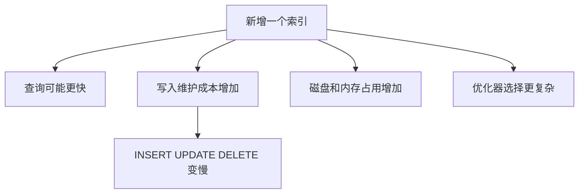

# MySQL 中的索引数量是否越多越好？为什么？

日期：2026-07-05
难度：中等
标签：#面试 #八股 #MySQL #索引 #场景题 #VIP

## 一句话答案

索引不是越多越好；索引能提升查询，但会占用存储和内存，并增加插入、更新、删除的维护成本，还可能让优化器选择空间变复杂。

## 面试口语版

索引本质是一种空间换时间的数据结构。查询时它能减少扫描行数，但写入时每个相关索引都要维护 B+ 树结构，可能产生页分裂、锁竞争和更多 IO。索引多了还会占用 Buffer Pool，降低缓存命中率。实际项目里应该围绕高频查询建必要索引，避免重复索引、低价值索引和长期不用的索引。

## 原理拆解

索引过多的代价：

- 写入时需要同步维护多个索引。
- 更新索引列时要删除旧索引项并插入新索引项。
- 占用磁盘空间和 Buffer Pool。
- 可能出现重复索引和冗余索引。
- 增加 DDL、备份、恢复和导入成本。

## 关键细节

- 已有 `(a,b)` 时，单独 `(a)` 通常可能冗余，但要结合查询和约束判断。
- 低频 SQL 不一定值得单独建索引。
- 高写入表更要控制索引数量。
- 可以通过慢 SQL、性能_SCHEMA、执行计划和线上指标清理无效索引。
- 删除索引前要确认没有业务 SQL、约束或排序依赖。

## 面试官追问

1. 索引对写入有什么影响？
2. 如何识别重复索引？
3. 为什么索引会影响 Buffer Pool？
4. 删除索引前要做哪些确认？
5. 高并发写入表如何设计索引？

## 常见错误说法

| 错误说法 | 问题 | 更好的说法 |
| --- | --- | --- |
| 索引越多查询越快 | 忽略维护成本 | 索引要匹配核心查询，数量可控 |
| 索引只影响查询 | 错误 | 写入、更新、删除都要维护索引 |
| 不用的索引放着没事 | 错误 | 会占空间、占缓存、拖慢写入 |

## 学习清单

- 学会识别重复索引和冗余索引。
- 对比有 1 个索引和 5 个索引时的写入成本。
- 形成“先慢 SQL 后索引”的设计习惯。

