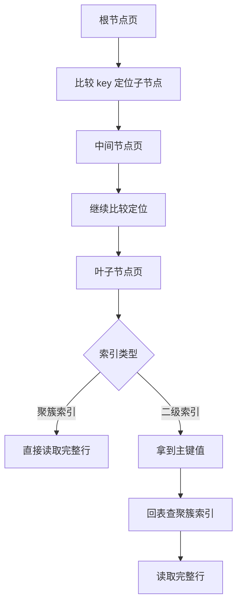

# 请详细描述 MySQL 的 B+ 树中查询数据的全过程

日期：2026-07-05
难度：困难
标签：#面试 #八股 #MySQL #B+树 #索引 #VIP

## 一句话答案

MySQL 使用 B+ 树索引查询时，会从根节点开始按键值比较定位到子节点，逐层向下直到叶子节点；叶子节点中找到目标索引记录后，如果是聚簇索引可直接拿到整行，如果是二级索引通常还要拿主键回表。

## 面试口语版

以 InnoDB 为例，索引页按 B+ 树组织。查询某个 key 时，先从根页开始，在页内通过目录和二分查找找到应该进入的子节点指针，然后读取下一层索引页，重复这个过程，直到叶子节点。聚簇索引叶子节点存完整行，所以主键查询到叶子节点就能拿到数据。二级索引叶子节点存的是索引列和主键值，如果查询字段不被覆盖，就要用主键再到聚簇索引查一次，也就是回表。范围查询则定位到起始叶子节点后，沿着叶子节点的双向链表继续扫描。

## 原理拆解

范围查询：

## 关键细节

- B+ 树非叶子节点只存键值和页指针，叶子节点存真实索引记录。
- InnoDB 页默认大小通常是 16KB，一个页能存很多 key，所以树高通常较低。
- 查询层数越低，磁盘 IO 次数越少。
- 主键查询走聚簇索引，二级索引查询可能回表。
- 范围查询依赖叶子节点有序链表。
- Buffer Pool 命中时不一定发生磁盘 IO。

## 面试官追问

1. B+ 树根节点、中间节点、叶子节点分别存什么？
2. 为什么 B+ 树高度通常很低？
3. 范围查询为什么适合 B+ 树？
4. 二级索引查询为什么可能查两棵 B+ 树？
5. Buffer Pool 对索引查询有什么影响？

## 常见错误说法

| 错误说法 | 问题 | 更好的说法 |
| --- | --- | --- |
| 每次查询都要从磁盘读整棵树 | 忽略缓存 | Buffer Pool 命中时可直接读内存页 |
| 二级索引叶子节点存整行 | 错误 | InnoDB 二级索引叶子节点存主键值 |
| B+ 树只适合等值查询 | 错误 | 叶子节点有序链表很适合范围查询 |

## 学习清单

- 能画出根节点、中间节点、叶子节点。
- 分别复述主键查询和二级索引查询。
- 解释范围查询如何沿叶子链表扫描。

