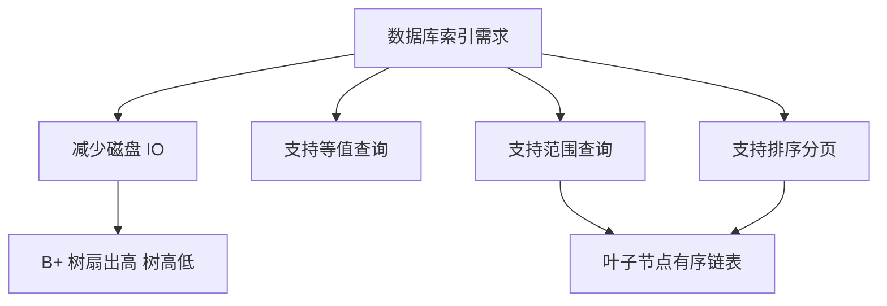

# 为什么 MySQL 选择使用 B+ 树作为索引结构？

日期：2026-07-05
难度：中等
标签：#面试 #八股 #MySQL #B+树 #索引 #VIP

## 一句话答案

MySQL 选择 B+ 树，是因为它扇出高、树高低、磁盘 IO 少，叶子节点有序且链表相连，既适合等值查询，也适合范围查询、排序和分页。

## 面试口语版

数据库索引主要瓶颈是磁盘 IO，所以希望树尽量矮。B+ 树的非叶子节点只存 key 和页指针，不存整行数据，因此一个页能放更多 key，扇出更高，树高更低。数据都在叶子节点，查询路径稳定；叶子节点之间还有有序链表，非常适合范围查询和排序。相比二叉树、红黑树，B+ 树高度低得多；相比哈希索引，B+ 树支持范围查询和顺序扫描；相比 B 树，B+ 树更适合磁盘页和范围扫描。

## 原理拆解

| 结构 | 问题 | B+ 树优势 |
| --- | --- | --- |
| 二叉树/红黑树 | 树高较高，磁盘 IO 多 | 多路平衡，扇出高 |
| Hash | 不支持范围和排序 | B+ 树有序 |
| B 树 | 非叶子节点也存数据，扇出相对小 | B+ 树非叶子节点更轻，范围扫描更友好 |

## 关键细节

- 数据库读取以页为单位，B+ 树节点天然适合页式存储。
- 非叶子节点不存整行，可以存更多索引项，降低树高。
- 所有数据在叶子节点，查询性能相对稳定。
- 叶子节点按 key 有序并通过链表连接，范围查询效率高。
- 哈希索引等值查询快，但无法处理范围和排序。

## 面试官追问

1. B+ 树和 B 树有什么区别？
2. 为什么不用红黑树？
3. 为什么不用 Hash 索引？
4. B+ 树为什么适合磁盘存储？
5. B+ 树如何支持范围查询？

## 常见错误说法

| 错误说法 | 问题 | 更好的说法 |
| --- | --- | --- |
| B+ 树查询时间复杂度最低 | 说法不准确 | 关键是减少磁盘 IO 和支持范围查询 |
| Hash 一定比 B+ 树差 | 过于绝对 | Hash 等值快，但不适合范围和排序 |
| B+ 树所有节点都存整行 | 错误 | InnoDB 聚簇索引整行数据在叶子节点 |

## 学习清单

- 对比 B+ 树、B 树、红黑树、Hash。
- 重点记住：扇出高、树高低、叶子有序链表。
- 用“磁盘 IO”解释为什么数据库不用普通二叉树。

