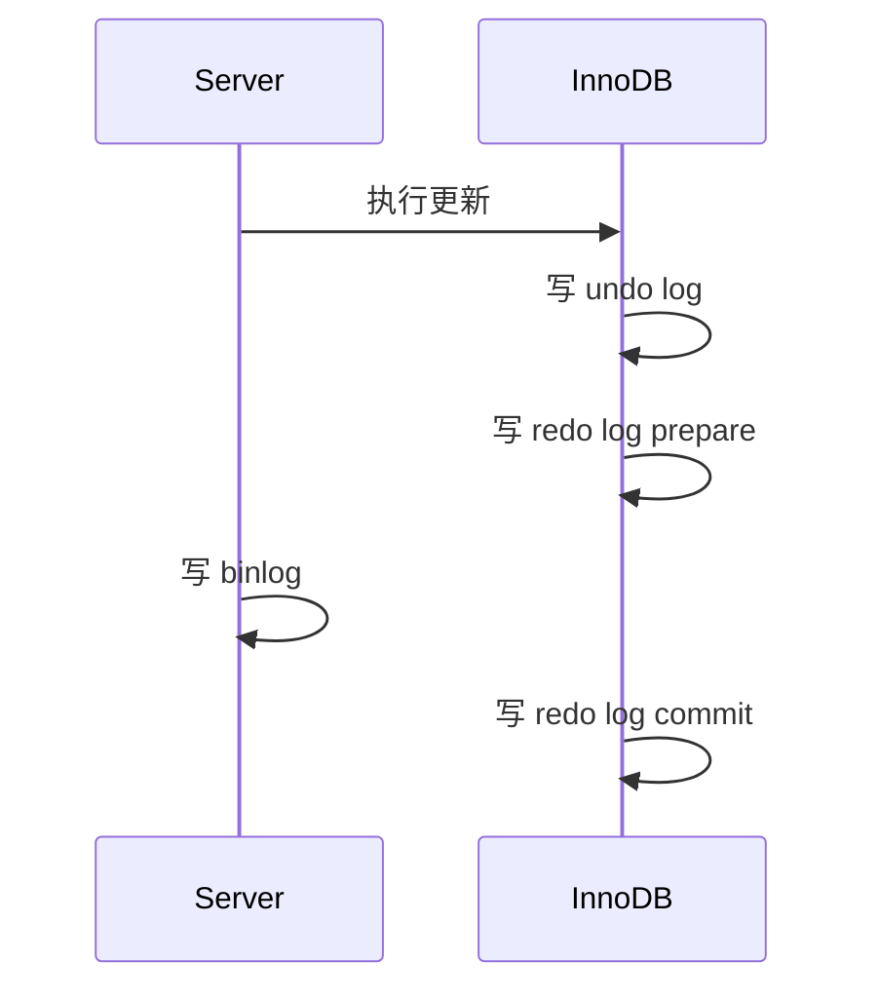

# MySQL 中的日志类型有哪些？binlog、redo log 和 undo log 的作用和区别是什么？

日期：2026-07-05
难度：中等
标签：#面试 #八股 #MySQL #日志 #binlog #redoLog #undoLog #VIP

## 一句话答案

MySQL 常见日志包括 binlog、redo log、undo log、慢查询日志、错误日志、通用查询日志等；其中 binlog 用于归档和复制，redo log 用于崩溃恢复，undo log 用于事务回滚和 MVCC。

## 面试口语版

binlog 是 Server 层日志，记录逻辑变更，主要用于主从复制和基于时间点恢复。redo log 是 InnoDB 的物理日志，记录数据页做了什么修改，用来保证事务提交后即使宕机也能恢复。undo log 记录修改前的旧版本，用于事务回滚，也用于 MVCC 的一致性读。更新语句提交时，redo log 和 binlog 需要两阶段提交，避免出现引擎层和 Server 层日志不一致。

## 原理拆解

| 日志 | 所属层 | 记录内容 | 主要作用 |
| --- | --- | --- | --- |
| binlog | Server 层 | 逻辑变更 | 主从复制、恢复 |
| redo log | InnoDB | 物理页修改 | 崩溃恢复、持久性 |
| undo log | InnoDB | 旧版本数据 | 回滚、MVCC |
| slow log | Server 层 | 慢 SQL | 性能排查 |
| error log | Server 层 | 错误和启动信息 | 运维诊断 |

## 关键细节

- redo log 是循环写，binlog 通常追加写。
- redo log 偏物理，binlog 偏逻辑。
- undo log 不只是回滚，还支撑 MVCC 的历史版本读取。
- 两阶段提交保证 redo log 和 binlog 状态一致。
- 主从复制主要依赖 binlog。
- 崩溃恢复主要依赖 redo log。

## 面试官追问

1. binlog 和 redo log 有什么区别？
2. undo log 如何支持 MVCC？
3. 为什么需要两阶段提交？
4. redo log 为什么可以提升性能？
5. 主从复制依赖哪种日志？

## 常见错误说法

| 错误说法 | 问题 | 更好的说法 |
| --- | --- | --- |
| binlog 和 redo log 都是恢复日志，所以一样 | 混淆层次和用途 | binlog 用于复制/归档，redo 用于崩溃恢复 |
| undo log 只用于回滚 | 不完整 | 还用于 MVCC 一致性读 |
| redo log 记录 SQL | 错误 | redo 记录物理页修改 |

## 学习清单

- 背清楚三类核心日志的所属层和作用。
- 能画出两阶段提交流程。
- 结合事务 ACID 理解 redo 和 undo。

