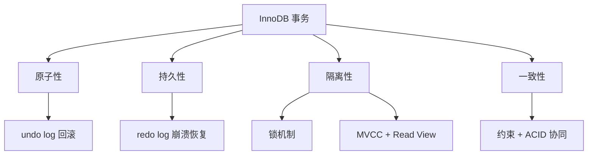
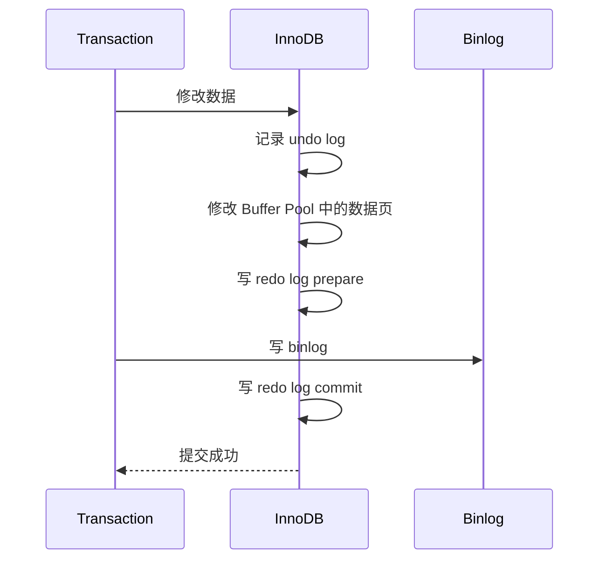

# MySQL 是如何实现事务的？

日期：2026-07-05
难度：困难
标签：#面试 #八股 #MySQL #InnoDB #事务 #MVCC #锁 #VIP

## 一句话答案

MySQL InnoDB 主要通过 redo log 保证持久性，undo log 保证原子性和 MVCC，锁机制保证并发写入隔离，MVCC 保证一致性读，再配合隔离级别和两阶段提交实现事务能力。

## 面试口语版

InnoDB 实现事务可以围绕 ACID 来讲。原子性靠 undo log，事务失败时可以根据 undo 回滚到修改前状态；持久性靠 redo log，事务提交后即使宕机也能恢复；隔离性靠锁和 MVCC，写写冲突用行锁、间隙锁等控制，一致性读通过 Read View 读取历史版本；一致性则由原子性、隔离性、持久性以及数据库约束共同保证。对于更新操作，还会通过 redo log 和 binlog 的两阶段提交保证事务提交和复制日志一致。

## 原理拆解

更新过程简化：

## 关键细节

- **原子性**：undo log 保存旧值，失败时回滚。
- **持久性**：redo log 先顺序写日志，宕机后重放恢复。
- **隔离性**：当前读依赖锁，一致性读依赖 MVCC。
- **MVCC**：通过隐藏字段、undo log 版本链和 Read View 实现快照读。
- **锁**：包括记录锁、间隙锁、临键锁，解决并发修改和幻读问题。
- **隔离级别**：读未提交、读已提交、可重复读、串行化；InnoDB 默认通常是可重复读。
- **两阶段提交**：保证 redo log 和 binlog 一致，避免主从或恢复异常。

## 面试官追问

1. undo log 和 redo log 分别保证 ACID 的哪部分？
2. MVCC 是怎么实现一致性读的？
3. 当前读和快照读有什么区别？
4. InnoDB 如何解决幻读？
5. 为什么需要 redo log 和 binlog 两阶段提交？
6. 可重复读和读已提交下 Read View 有什么区别？

## 常见错误说法

| 错误说法 | 问题 | 更好的说法 |
| --- | --- | --- |
| 事务只靠锁实现 | 不完整 | 事务依赖日志、锁、MVCC、隔离级别等机制 |
| redo log 用于回滚 | 错误 | redo 用于崩溃恢复，undo 用于回滚 |
| MVCC 不需要 undo log | 错误 | 历史版本依赖 undo log 版本链 |
| 可重复读完全不会幻读 | 过于粗糙 | 快照读避免幻读，当前读依赖 next-key lock |

## 学习清单

- 用 ACID 分别对应 undo、redo、锁、MVCC。
- 复习 Read View、版本链、隐藏字段。
- 理解当前读、快照读和 next-key lock。
- 能画出更新语句提交时的日志流程。

