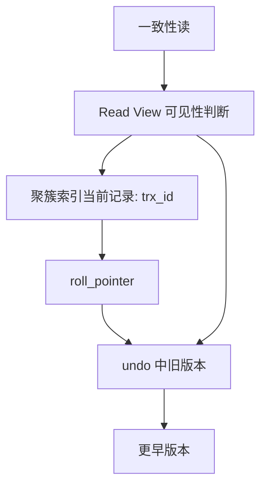

# MySQL 中的 MVCC 是什么？

日期：2026-07-11  
难度：困难  
标签：#面试 #MySQL #InnoDB #MVCC

## 一句话答案

MVCC（多版本并发控制）让 InnoDB 的一致性读通过版本链和 Read View 读取“对自己可见”的历史版本，从而读写多数情况下不互相阻塞。

## 面试口语版

InnoDB 的每条聚簇索引记录有隐藏的事务 ID 和回滚指针；更新时会把旧值写进 undo log，形成版本链。普通 `SELECT` 会生成或使用 Read View，其中包含活跃事务边界。它沿版本链判断每个版本的事务 ID 是否可见，找到符合快照的版本返回。可重复读下，同一事务通常复用首次一致性读创建的 Read View；读已提交下每次一致性读重新创建，所以能看到已提交的新版本。MVCC 解决的是快照读的读写并发，写写冲突和锁定读仍依赖锁。

## 原理拆解

## 关键细节

- 版本链依托 undo log；隐藏字段主要是 `DB_TRX_ID`、`DB_ROLL_PTR`，无显式主键时还可能有 `DB_ROW_ID`。
- 当前读如 `SELECT ... FOR UPDATE`、`UPDATE` 读取最新版本并加锁，不是快照读。
- MVCC 不等于没有锁；唯一性检查、更新、范围锁定仍需锁机制。

## 面试官追问

1. Read View 中的 `m_ids`、`min_trx_id`、`max_trx_id` 如何判断可见性？
2. RC 和 RR 的 Read View 创建时机有何不同？
3. 为什么长事务会阻碍 purge？

## 学习清单

- 画出“当前记录—undo 版本链—Read View”的关系。
- 记住快照读与当前读的边界。
