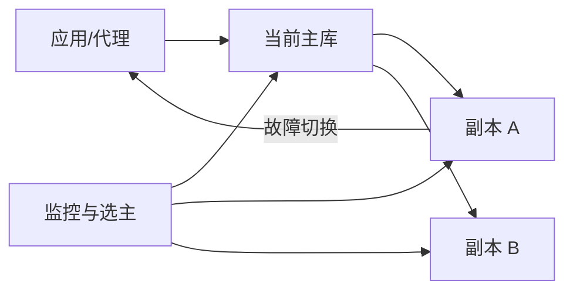

# 如何在 MySQL 中避免单点故障？

日期：2026-07-11  
难度：中等  
标签：#面试 #MySQL #高可用 #场景题

## 一句话答案

用多副本复制、自动故障检测与切换、客户端/代理路由和可演练的备份恢复来消除单实例故障点；高可用不等于零数据丢失，RPO/RTO 必须明确。

## 面试口语版

最基础是一个主库配多个副本，副本跨可用区部署并启用 GTID，读流量可分摊到副本。主库故障时，由 Orchestrator、MGR/InnoDB Cluster 或云托管能力健康检查并提升合适副本，代理层或应用通过稳定入口切到新主；同时要做防脑裂的 fencing，避免旧主恢复后继续写。异步复制可能丢失已返回但尚未复制的数据，所以强 RPO 要考虑半同步、组复制或共识型方案。最后必须有全量备份、binlog/PITR、定期恢复演练和告警，不能只依赖复制。

## 原理拆解

## 关键细节

- 多副本也要避免代理、DNS、存储和单 AZ 成为新单点。
- 切换后校验复制位点、只允许一个写主、处理旧连接与缓存失效。
- 备份解决误删和逻辑损坏，复制通常会把错误同步过去。

## 面试官追问

1. 异步、半同步、组复制的 RPO 有何差异？
2. 如何防止脑裂？
3. 故障切换如何验证数据一致性？

## 学习清单

- 能按 RPO/RTO 说明高可用方案边界。
