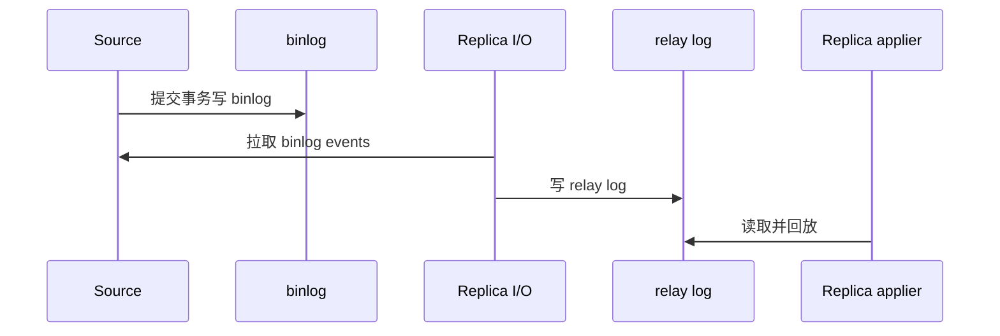

# 什么是 MySQL 的主从同步机制？它是如何实现的？

日期：2026-07-11  
难度：中等  
标签：#面试 #MySQL #复制 #binlog

## 一句话答案

MySQL 复制是源库将已提交事务写入 binlog，副本 I/O 线程拉取并写入 relay log，SQL/applier 线程再回放 relay log；默认异步，因此副本可能落后于源库。

## 面试口语版

主从同步的源头是主库 binlog。副本连接主库后，I/O receiver 线程持续拉取 binlog event 写到本地 relay log，applier 线程读取 relay log 并执行，从而得到相同的数据变化。复制格式有 statement、row、mixed，生产通常偏向 row，因为它记录行变化、确定性更好但日志更大。GTID 用全局事务 ID 标识已执行事务，方便故障切换和自动定位。传统单线程回放可能成为瓶颈，MySQL 还支持多线程副本并行应用。

## 原理拆解

## 关键细节

- 复制的是 binlog 中的已提交事务，回滚事务不会复制。
- 异步、半同步和组复制的确认语义不同。
- 复制不是备份替代品，误操作会被复制。

## 面试官追问

1. binlog 三种格式如何取舍？
2. GTID 有什么收益？
3. relay log 与 binlog 区别？

## 学习清单

- 能按“binlog → I/O → relay log → applier”复述链路。
