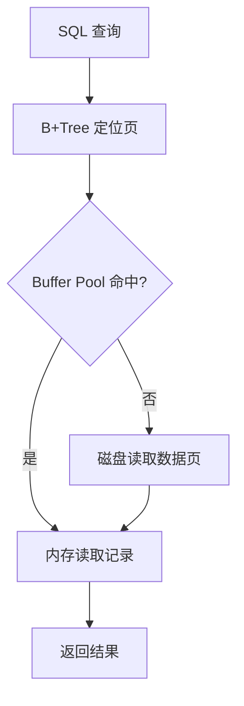

# 从 MySQL 获取数据，是从磁盘读取的吗？（Buffer Pool）

日期：2026-07-11  
难度：中等  
标签：#面试 #MySQL #InnoDB #BufferPool #VIP

## 一句话答案

不一定；InnoDB 先在 Buffer Pool 中按数据页查找，命中就直接从内存读取，未命中才从磁盘把页加载进 Buffer Pool 后返回。

## 面试口语版

InnoDB 的基本 I/O 单位是页，不是单行。查询通过 B+Tree 定位目标页，先检查 Buffer Pool；如果页已经缓存，就在内存中查记录，这是逻辑读。如果没命中，才发生物理读，把磁盘页载入 Buffer Pool，再执行查询。更新也通常先改内存页并标记为脏页，同时写 redo log，后台线程在 checkpoint 等时机把脏页刷盘。因此“查询 MySQL 就一定读磁盘”和“提交事务就把数据页立即刷盘”都不准确。

## 原理拆解

## 关键细节

- Buffer Pool 缓存数据页、索引页及相关控制结构，使用 LRU 变体管理冷热页。
- 可用 `Innodb_buffer_pool_read_requests` 与 `Innodb_buffer_pool_reads` 粗略观察逻辑读和物理读。
- 操作系统页缓存是否参与还受 `innodb_flush_method` 等配置影响。
- Buffer Pool 越大并非总是越好，还要给连接、排序、Performance Schema 和操作系统留内存。

## 面试官追问

1. 脏页什么时候刷盘？
2. Buffer Pool 为什么使用改进的 LRU？
3. 如何判断命中率和磁盘压力？

## 高分补充

命中率很高也可能有性能问题，要结合工作集、随机 I/O、页淘汰、P99 和查询扫描量综合判断。

## 学习清单

- 区分逻辑读、物理读、脏页和刷盘。
