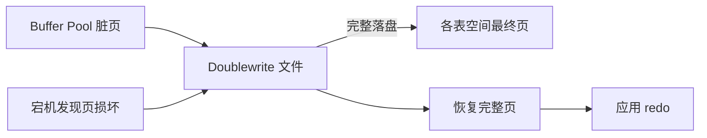

# MySQL 的 Doublewrite Buffer 是什么？它有什么作用？

日期：2026-07-11  
难度：简单  
标签：#面试 #MySQL #InnoDB #Doublewrite #VIP

## 一句话答案

Doublewrite Buffer 是 InnoDB 的页级安全机制：脏页先写入连续的 doublewrite 区域，再写到最终表空间位置，用于宕机后修复只写了一部分的损坏页。

## 面试口语版

InnoDB 默认页通常是 16KB，而底层存储一次原子写可能小于一页。如果写数据页时宕机，页可能只写了一半，称为 partial page write。redo log 记录的是页的逻辑或物理变化，前提是基础页仍可识别；页本身损坏时仅靠 redo 不一定能恢复。Doublewrite 会先把完整页批量写到专用区域并落盘，再分散写到各表空间。恢复时若发现数据页损坏，可以从 doublewrite 的完整副本恢复，再应用 redo。

## 原理拆解

## 关键细节

- Doublewrite 解决页撕裂，不替代 redo log；redo 保证已提交修改可重放。
- 现代 MySQL 使用专用 doublewrite 文件，配置细节随版本变化。
- 不应为了少一次写入就随意关闭，除非底层存储能提供可靠原子页写且经过验证。

## 面试官追问

1. 为什么有 redo log 还需要 Doublewrite？
2. 什么是 partial page write？
3. Doublewrite 会带来多大性能代价？

## 高分补充

它用相对顺序、批量的额外写，换取随机数据页写入过程中的完整性保护。

## 学习清单

- 能说清“先完整副本、后最终位置、恢复时兜底”。
