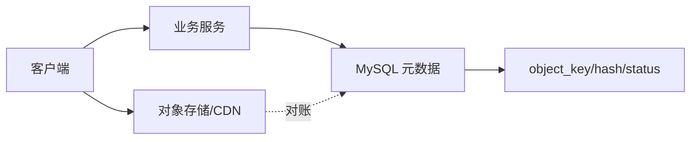

# 为什么不推荐在 MySQL 中直接存储图片、音频、视频等大容量内容？

日期：2026-07-11  
难度：中等  
标签：#面试 #MySQL #BLOB #对象存储 #架构 #VIP

## 一句话答案

大文件写入 MySQL 会放大数据页、Buffer Pool、redo/binlog、复制、备份恢复和网络成本；通常应把内容放对象存储，数据库只保存对象键、元数据、校验值和权限关系。

## 面试口语版

MySQL 能用 BLOB 存二进制，但“能存”不等于“适合存”。图片视频体积大，会快速膨胀表和备份，写入时生成大量 redo 和 binlog，拖慢复制及恢复；读取大字段还会占用连接带宽、应用内存和缓存资源，挤出热点业务数据。对象存储更适合大对象，能提供分片上传、CDN、生命周期和低成本扩容。数据库保存 object key、大小、MIME、哈希、状态和业务归属，并通过上传确认、定时对账和延迟删除解决数据库与对象存储的一致性。

## 原理拆解

## 关键细节

- 不要把本地文件系统绝对路径当稳定标识，应保存对象存储 key 或逻辑 ID。
- 推荐“先上传临时对象—校验成功—提交元数据—异步清理孤儿对象”的流程。
- 很小且强事务绑定、数量有限的内容可以评估放库，但必须有明确容量和访问模式依据。
- 权限不能只靠不可猜 URL，应使用签名 URL 或鉴权代理。

## 面试官追问

1. 对象上传成功但数据库事务失败怎么办？
2. 如何删除孤儿文件？
3. 为什么大 BLOB 会影响复制？
4. 什么情况下可以存数据库？

## 高分补充

把一致性设计成状态机：UPLOADING、READY、DELETING，并配合幂等回调、哈希校验和定期对账。

## 学习清单

- 能讲清元数据表字段、上传状态机和失败补偿。
