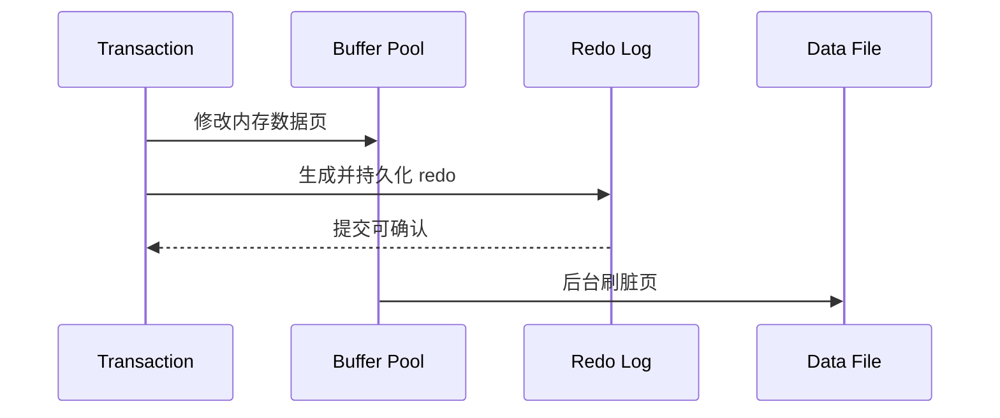

# 什么是 Write-Ahead Logging（WAL）技术？它的优点是什么？MySQL 中是否用到了 WAL？

日期：2026-07-11  
难度：中等  
标签：#面试 #MySQL #WAL #RedoLog #InnoDB #VIP

## 一句话答案

WAL 要求修改的数据页落盘前，描述该修改的日志必须先持久化；InnoDB 的 redo log 使用了 WAL，使提交无需同步随机刷所有脏页，并能在宕机后重放恢复。

## 面试口语版

数据库更新通常先改 Buffer Pool 中的数据页并产生 redo 记录。按照 WAL，脏页真正写回表空间之前，对应 redo 必须先写入稳定存储；事务提交时重点保证日志持久，而数据页可以由后台批量刷盘。这样随机数据页写被转化为更顺序的日志写，提高吞吐；宕机后再从 checkpoint 开始重放 redo，恢复已提交但尚未刷盘的修改。MySQL Server 的 binlog 用于复制和时间点恢复，而 InnoDB redo 才是其崩溃恢复 WAL 的核心，两者职责不同。

## 原理拆解

## 关键细节

- WAL 的关键次序是“日志先于相关数据页”，不代表每生成一条日志都立即 fsync。
- redo log 是循环使用的物理/页级恢复日志，binlog 是 Server 层归档日志。
- checkpoint 推进后，早期 redo 空间才能复用。

## 面试官追问

1. 为什么提交时不直接刷所有数据页？
2. redo log 和 binlog 有什么区别？
3. checkpoint 的作用是什么？

## 高分补充

WAL 用顺序日志 I/O 换取随机数据页 I/O 的延后与合并，同时建立可恢复性边界。

## 学习清单

- 能复述“改内存页—先落 redo—后刷数据页—宕机重放”。
