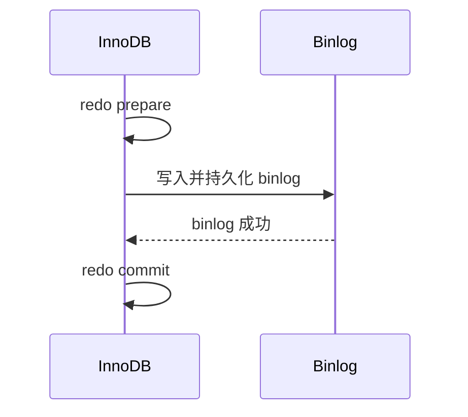

# MySQL 事务的二阶段提交是什么？

日期：2026-07-11  
难度：中等  
标签：#面试 #MySQL #二阶段提交 #RedoLog #Binlog #VIP

## 一句话答案

MySQL 内部二阶段提交让 InnoDB redo log 先进入 prepare，再持久化 Server 层 binlog，最后把 redo 标记为 commit，从而保证崩溃恢复与复制日志对同一事务的提交判断一致。

## 面试口语版

更新事务同时涉及 InnoDB redo 和 Server 层 binlog。如果两个日志各自独立提交，中途宕机可能出现数据已恢复但 binlog 没有，或 binlog 有但 InnoDB 数据没提交，导致主从和 PITR 不一致。MySQL 因此把 InnoDB 作为事务参与者：先写 redo prepare，再写并刷 binlog，最后写 redo commit。恢复时遇到 prepare 状态，会检查对应事务的 binlog 是否完整；完整则提交，否则回滚。真正的持久性还取决于 `innodb_flush_log_at_trx_commit`、`sync_binlog` 和存储可靠性。

## 原理拆解

## 关键细节

- “两阶段”是 prepare 与 commit 两个协议阶段，中间持久化 binlog，不是说只有两次磁盘写。
- redo 服务于崩溃恢复，binlog 服务于复制和归档恢复。
- 组提交会批量协调多个事务的日志刷盘以提高吞吐。

## 面试官追问

1. redo prepare 后、binlog 前宕机会怎样？
2. binlog 完成后、redo commit 前宕机会怎样？
3. 为什么不能只保留一种日志？

## 高分补充

二阶段提交保证两个日志的事务提交语义一致，但参数若关闭每次提交刷盘，断电场景仍可能丢失最近事务。

## 学习清单

- 能按三个宕机点推演恢复结果。
