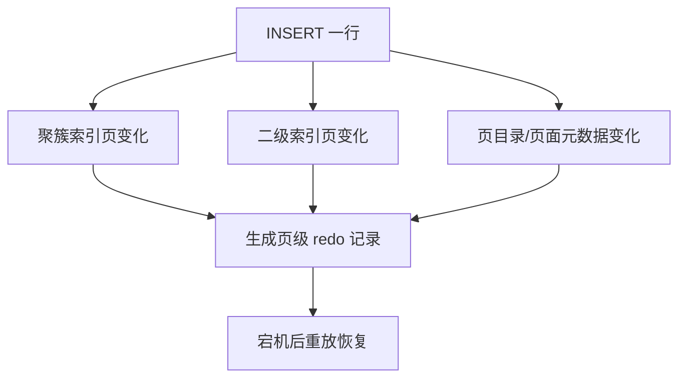

# MySQL 插入一条 SQL 语句，redo log 记录的是什么？

日期：2026-07-11  
难度：中等  
标签：#面试 #MySQL #RedoLog #InnoDB #VIP

## 一句话答案

redo log 不记录原始 INSERT SQL，也不只是保存一份完整新行；它记录 InnoDB 对相关数据页和索引页所做的可重放页级变化及必要事务信息。

## 面试口语版

执行 INSERT 时，InnoDB 会修改 Buffer Pool 中的聚簇索引页，可能还要修改多个二级索引页、页目录和相关元数据。redo 采用面向页的生理日志，记录“哪个表空间、哪个页、在页内做了什么变化”等足以幂等重放的信息；具体记录类型属于内部实现。它用于宕机后把尚未刷盘的页面变化恢复出来。回滚依赖 undo log，复制和按事务归档依赖 binlog，所以不能把 redo、undo 和 binlog 混为一谈。

## 原理拆解

## 关键细节

- redo 是 InnoDB 层日志，通常包含表空间 ID、页号和操作类型等页级信息。
- 页分裂或新页分配会生成更多 redo，插入一行不等于只有一条 redo 记录。
- redo 先进入 Log Buffer，再按 WAL 规则写入 redo 文件。

## 面试官追问

1. redo 为什么不直接记录 SQL？
2. 插入和更新的 undo 有什么区别？
3. 页分裂会如何影响 redo 量？

## 高分补充

面试回答到“页级可重放变化”即可，不应虚构固定记录格式；内部 redo 类型会随版本和具体页操作变化。

## 学习清单

- 区分 redo 恢复、undo 回滚/MVCC、binlog 复制/PITR。
