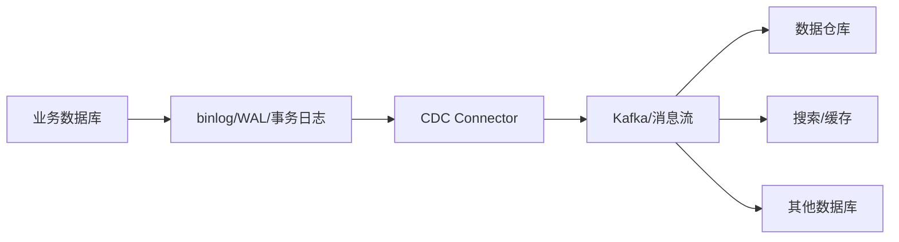

# 什么是 CDC（Change Data Capture）？常见的 CDC 工具有哪些？

日期：2026-07-11  
难度：简单  
标签：#面试 #数据库 #CDC #数据同步 #VIP

## 一句话答案

CDC 是持续捕获数据库 INSERT、UPDATE、DELETE 等增量变化并投递给下游的技术；生产通常优先使用事务日志型 CDC，常见工具有 Debezium、Flink CDC、Canal、Kafka Connect 生态及云厂商 DMS/DTS。

## 面试口语版

CDC 的目标不是反复全表扫描，而是把数据库中的增量变化变成事件流，同步到 Kafka、数仓、搜索、缓存或其他数据库。实现方式有按更新时间轮询、触发器和解析事务日志，其中日志型 CDC 最常见：MySQL 读取 binlog，PostgreSQL 读取 WAL/逻辑复制流。它对业务表侵入小，延迟低，还能捕获删除和事务位点。工具方面，跨数据库和 Kafka 生态常用 Debezium；需要全量加增量一体化、流计算和 Exactly-once 能力时常用 Flink CDC；MySQL binlog 订阅场景常见 Canal；也可以使用 Kafka Connect 的各种 Source/Sink Connector，或者 AWS DMS、阿里云 DTS 等托管服务。

## 原理拆解

| 工具/方案 | 典型定位 | 适用场景 |
| --- | --- | --- |
| Debezium | 多数据库日志型 CDC，常运行于 Kafka Connect | 数据库变更进入 Kafka 事件流 |
| Flink CDC | 全量与增量一体化、流式处理 | 实时数仓、ETL、复杂转换 |
| Canal | 解析 MySQL binlog | MySQL 增量订阅与同步 |
| Kafka Connect | Connector 运行与管理框架 | Source/Sink 标准化集成 |
| 云 DMS/DTS | 托管迁移与同步服务 | 希望减少自建运维的云环境 |

## 关键细节

- 全量快照与增量日志必须在一致位点衔接，否则会丢失或重复数据。
- CDC 常见交付语义是至少一次，下游必须用主键、版本或事件 ID 做幂等。
- 顺序通常只能在同一分区键内保证；分区键应与业务更新顺序要求一致。
- 必须处理 DELETE、DDL/Schema Evolution、时区、字符集、断点位点和日志保留时间。
- CDC 捕获数据库已发生的变化，不天然等价于可靠发布业务领域事件；跨资源一致性可考虑 Outbox Pattern。

## 面试官追问

1. 日志型 CDC 相比轮询有什么优势？
2. 全量同步如何无缝切换到增量同步？
3. CDC 如何保证不丢数据？
4. CDC 与消息队列、Outbox 有什么关系？
5. 数据库发生 DDL 时如何处理？

## 高分补充

工具选型要看源端支持、端到端延迟、全量能力、事务顺序、Schema Evolution、交付语义、目标端写入模式和团队运维能力，而不只是看吞吐量。

## 常见错误说法

| 错误说法 | 问题 | 更好的说法 |
| --- | --- | --- |
| CDC 就是定时查更新时间 | 只是一种低成本实现，可能漏删、延迟高 | 日志型 CDC 是生产中的主流方案之一 |
| 使用 CDC 就是 Exactly-once | 捕获、传输和落库任一环都可能重试 | 端到端需要 checkpoint、事务 sink 或幂等共同保证 |
| Kafka Connect 就是 CDC 工具 | 它主要是 Connector 运行框架 | Debezium 等 Source Connector 才负责捕获变化 |

## 学习清单

- 记住轮询、触发器、事务日志三种 CDC 实现。
- 能画出 MySQL binlog 到 Kafka 再到数仓的链路。
- 复习全量与增量衔接、幂等、顺序和 DDL 处理。
