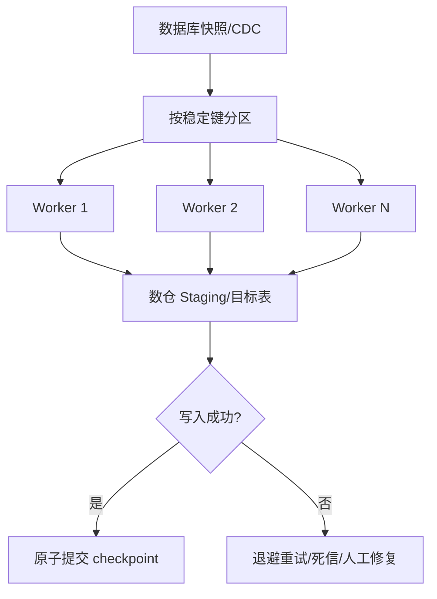

# 多线程并发同步数据时（数据库的数据同步到数仓中）需要注意什么问题？

日期：2026-07-11  
难度：简单  
标签：#面试 #数据库 #数据同步 #多线程 #并发 #数仓 #VIP

## 一句话答案

并发同步不能只追求速度，必须同时保证合理分片、同一业务键有序、写入幂等、事务边界完整、位点原子提交、失败可重试、源库限流以及最终数据可校验。

## 面试口语版

我会先确定并发单位，通常按主键范围、时间分区、表或业务键拆任务，避免多个线程写同一行。对同一主键的变更要落到同一分区并按 binlog 位点或版本顺序处理，否则旧 UPDATE 可能覆盖新值。同步链路一般按至少一次设计，因此目标端使用主键 UPSERT、事件版本或去重表保证幂等；只有数据成功落库后才能提交 checkpoint，且数据和位点最好原子绑定。还要保持源端事务的提交边界，正确处理 DELETE 和 DDL。工程上需要限制并发，避免全量扫描拖垮线上库，并监控延迟、积压、失败率、吞吐、脏数据和源库负载，最后通过行数、校验和及业务指标持续对账。

## 原理拆解

| 风险 | 典型问题 | 处理方式 |
| --- | --- | --- |
| 乱序 | 旧值覆盖新值 | 同 key 同分区，携带版本/位点 |
| 重复 | 重试导致重复行 | 主键 UPSERT、事件 ID 去重 |
| 丢失 | 先提交位点后写入失败 | 写成功后提交，checkpoint 原子化 |
| 事务拆散 | 下游看到半个事务 | 保留事务标识与提交边界 |
| 热点/倾斜 | 单分区积压 | 选择均匀分片键，隔离热点 |
| 源库过载 | IO、连接、复制延迟上升 | 限速、分页、走副本、错峰 |
| Schema 变化 | 字段错位或任务失败 | Schema Registry、兼容策略、灰度 DDL |
| 小文件 | 数仓查询和元数据压力 | 批量写入、Compaction |

## 关键细节

- 全量并发扫描应使用稳定边界，例如主键区间；不要用会随写入漂移的 OFFSET 分页。
- `max(id)` 划分区间不代表数据均匀，要采样分布或动态切分任务。
- 同一个数据库事务可能更新多张表；若下游要求事务一致，需要事务元数据、缓冲和原子提交设计。
- “线程安全”不仅是代码没有数据竞争，还包括共享 offset、连接池、批次状态和失败重试不会互相覆盖。
- 数仓常偏向批量追加和分区覆盖；直接逐条 UPDATE 可能产生大量小文件，应先写 staging 再 MERGE/COMPACT。
- 水位线或位点必须单调推进，不能因为后完成的快分片越过仍未完成的慢分片。

## 面试官追问

1. 如何保证同一主键的更新有序？
2. 为什么应先写数据再提交 offset？
3. 全量同步中如何划分并发任务？
4. 至少一次消费如何做到最终不重复？
5. 某个线程永久失败时 checkpoint 如何推进？
6. 如何证明源库和数仓最终一致？

## 高分补充

可以把正确性定义为：每个源端提交事务最终至少被处理一次、同一业务键按版本收敛、checkpoint 之前的数据全部可见，并通过可重复执行的对账任务验证。这比笼统说“加锁保证线程安全”更完整。

## 常见错误说法

| 错误说法 | 问题 | 更好的说法 |
| --- | --- | --- |
| 线程越多同步越快 | 会受源库、网络、目标写入和热点限制 | 通过压测寻找安全并发度并支持背压 |
| 每个线程记自己的进度就不会丢 | 全局水位可能越过未完成分片 | checkpoint 应表示所有前置任务都已成功 |
| 加 synchronized 就能保证数据一致 | 只解决进程内互斥 | 还需幂等、顺序、位点、事务和故障恢复 |
| Exactly-once 就绝不会重复 | 外部系统事务边界可能不一致 | 端到端仍要设计幂等和对账 |

## 学习清单

- 能从分片、顺序、幂等、位点、事务、限流、校验七个方面回答。
- 设计一套“主键范围全量 + binlog 增量”的并发同步方案。
- 准备至少一次消费下 UPSERT 去重和失败恢复的例子。
