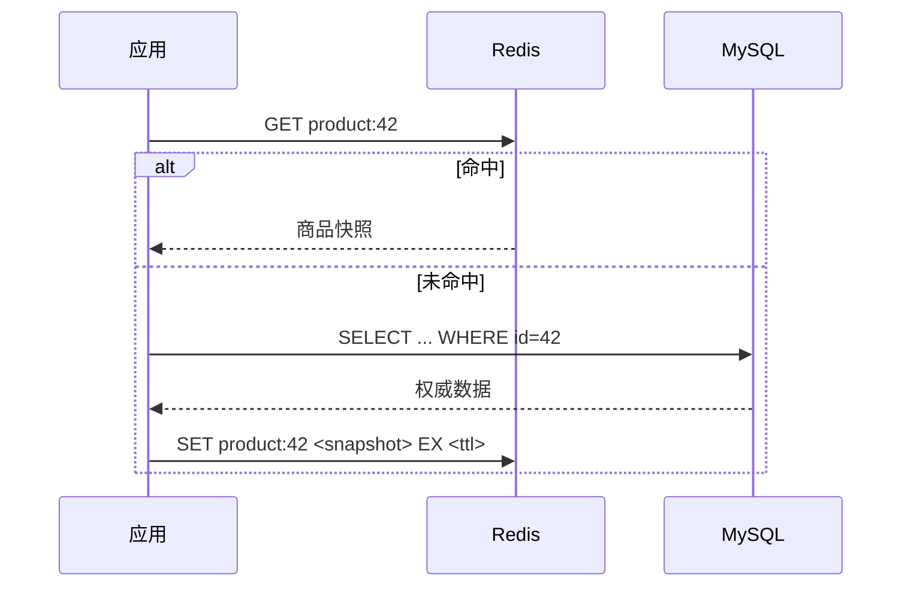

# MySQL缓存机制是怎样的？与Redis缓存有什么区别？如何设计缓存架构？

日期：2026-09-27  
标签：#面试 #MySQL #数据库  
难度：中等  
来源：[牛面 MySQL 题库](https://niumianoffer.com/nm_practice/questions?bank_id=50e19cbb-21c2-4330-b45f-5748ae5d8672&activeIndex=0)  
答案说明：独立整理（站内题目标记为 VIP，未读取会员答案）

## 一句话答案

InnoDB Buffer Pool缓存数据页以减少磁盘读取；Redis是应用侧可独立访问的数据缓存，两者位于不同层次。

## 面试口语版（约 60 秒）

在 MySQL 8.4 中，InnoDB Buffer Pool 缓存数据页和索引页，由引擎自动管理；它不是缓存 SQL 查询结果。Redis 则是应用显式读取和维护的独立键值存储，可缓存对象、会话或预计算结果。设计时先定义数据库为权威源还是 Redis 为权威源，再定失效、TTL、并发回源和故障降级。旧版 MySQL Query Cache 已在 8.0 移除，不能把它当作当前 MySQL 的缓存机制。

## 原理拆解与场景

写入商品时可先提交 MySQL，再删除 Redis 键；读路径承担短暂过期窗口，需要按业务设置 TTL、重试、热点键保护和对账。

## 关键边界与工程取舍

“先写库再删缓存”只是一种常见策略，并不能保证任何并发时序都强一致。支付余额等强一致读取宜走数据库事务或专门一致性协议；缓存空值和布隆过滤器用于不同类型的穿透问题。Buffer Pool 命中率高也不能保证 SQL 快，索引路径和锁等待仍需看。

## 面试官递进追问

### 1. Buffer Pool 缓存的粒度是什么？

**参考答案：** Buffer Pool 主要以 InnoDB 页为粒度缓存表数据和索引，默认页大小为 16 KiB；一个页通常包含多条记录，查询某行可能带入整页，并不是每条 SQL 保存一份结果。对页的修改先体现在缓冲池中，成为脏页，之后由刷盘机制写回。命中缓冲池减少的是磁盘读取，执行器仍要做索引遍历、可见性判断、过滤或连接，所以命中率高也不能证明 SQL 高效。[InnoDB 页大小](https://dev.mysql.com/doc/refman/8.4/en/innodb-parameters.html#sysvar_innodb_page_size)

### 2. MySQL 8.4 还有 Query Cache 吗？

**参考答案：** 没有。旧的 Query Cache 在 MySQL 8.0 已被移除，因此 8.4 不能再靠 query_cache_size 等参数缓存 SELECT 结果。它与仍存在的 InnoDB Buffer Pool 是不同机制：前者曾缓存查询结果，后者缓存数据和索引页。若业务需要对象或计算结果缓存，应在应用或适合的代理层设计，同时承担失效、一致性与容量管理责任。排查 8.4 性能时，不应照搬开启 Query Cache 的旧版调优建议。

### 3. 并发读写时删除缓存策略的竞态如何缓解？

**参考答案：** 典型竞态是读请求先读到旧值，写请求提交新值并删除缓存，随后旧读才把旧值回填；删除成功仍可能留下脏缓存。先保证数据库提交后再失效，并用持久化事件和重试覆盖“删失败”；设置 TTL 限制普通陈旧窗口，热点回源合并减少并发竞争。进一步可对同一键协调更新与回填，或维护独立的版本水位、让过期读在原子检查时被拒绝；只在缓存值上带版本、删除后允许任意 SET 仍挡不住旧值回填。延迟双删只能降低部分时序的概率，不能证明强一致；严格要求最新状态的读取应绕开这类异步缓存。

## 自测

- 合上笔记，用 60 秒复述一句话结论、一个例子和一个边界。
- 完成第 3 个追问，写出你会核对的 SQL、指标或故障证据。

## 延伸阅读

- [045-buffer-pool-read-path.md](/posts/MySQL/045-buffer-pool-read-path/)

## 参考资料

以 MySQL 8.4 为版本基准；官方资料核对日期：2026-09-27。

- [InnoDB Buffer Pool](https://dev.mysql.com/doc/refman/8.4/en/innodb-buffer-pool.html)
- [MySQL 8.0 移除 Query Cache](https://dev.mysql.com/doc/refman/8.0/en/mysql-nutshell.html)
