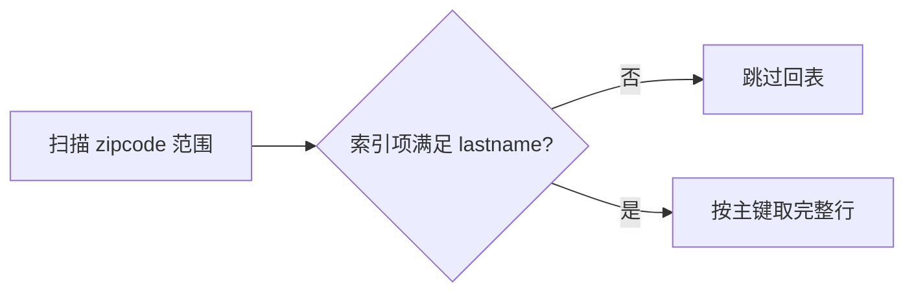

# 什么是覆盖索引？索引下推如何优化查询？

日期：2026-09-27  
标签：#面试 #MySQL #数据库  
难度：中等  
来源：[牛面 MySQL 题库](https://niumianoffer.com/nm_practice/questions?bank_id=50e19cbb-21c2-4330-b45f-5748ae5d8672&activeIndex=0)  
答案说明：独立整理（站内题目标记为 VIP，未读取会员答案）

## 一句话答案

覆盖索引使查询所需列都可从索引取得；ICP 则在扫描索引时先判断可由索引项计算的条件，减少不必要的基表读取，两者不是同一优化。

## 30–90 秒口语版

对 InnoDB 二级索引，若 `SELECT`、过滤和排序要用的列都能从该索引项取得，就是覆盖读取，通常可免去按主键回表，`EXPLAIN Extra` 常见 `Using index`。ICP 适合“用一部分索引列定位后，其他索引列还能过滤，但查询仍需取完整行”的情况：存储引擎先判断后续条件，不满足就不回表，`Extra` 为 `Using index condition`。它不一定减少需扫描的索引项，也不能替代更好的联合索引。索引列越多越宽，写入和空间成本也越高。

## SQL 示例

```sql
CREATE INDEX idx_zip_last ON people(zipcode, lastname);
-- zipcode 定位，lastname 条件可由索引项判断，address 仍需读完整行
SELECT address FROM people
WHERE zipcode = '95054' AND lastname LIKE '%son%';
-- 只取索引中的列，可形成覆盖读取；InnoDB 二级索引还含主键值
SELECT id, zipcode, lastname FROM people
WHERE zipcode = '95054';
```



## 关键边界与取舍

- ICP 的官方适用条件包括 `range`、`ref`、`eq_ref`、`ref_or_null` 等访问路径；InnoDB 上用于二级索引，不能简单说“所有索引查询都有下推”。
- 覆盖是针对具体查询而言：`SELECT *` 只有在列确实全部可由索引项提供时才覆盖；`Using index condition` 也不意味着覆盖。
- 先看查询频率、回表次数和索引宽度，再决定是否增加列；二级索引附带主键，长主键会放大成本。

## 递进追问

### 1. `Using index` 和 `Using index condition` 分别说明什么？

**参考答案：** `Using index` 表示本次查询需要的列能从所选索引获得，即覆盖读取；它不代表扫描量很小，覆盖索引也可能被全量扫描。`Using index condition` 表示启用了 ICP：引擎先用二级索引项判断下推条件，符合后仍可能回表取其他列。两者分别解决“是否还需要完整行”和“哪些候选行值得回表”，不能把出现 `index` 都解释成不回表或高性能。

### 2. ICP 会减少索引扫描行数吗，主要节约哪一步？

**参考答案：** ICP 本身不会把原来的索引访问区间缩短。例如 `(zipcode,lastname)` 上用邮编等值定位，再判断 `lastname LIKE '%son%'`，仍需遍历该邮编区间中的索引项；不匹配姓氏的项会在回表前被淘汰。主要节省聚簇索引查找、完整行读取和引擎与服务端之间的交互。若要从源头减少索引项扫描，通常还需改进可定位的谓词或索引列序；不能把 ICP 过滤后的输出行数当成实际扫描过的全部索引项。

### 3. 在高写入表上，何时不值得做覆盖索引？

**参考答案：** 当查询低频、原本回表很少，或者为了覆盖必须加入长字符串、大量展示列和频繁更新列时，收益可能抵不过成本。宽索引会增加磁盘和缓存占用，插入及相关列更新也要维护更多索引数据；前缀索引又不能完整覆盖被截短的列。我会先测查询的回表与延迟收益，再看写入吞吐、尾延迟和索引体积。高写入场景可优先保留紧凑的过滤排序索引，接受每页少量回表，而不是一味覆盖 `SELECT *`。

## 延伸阅读

- [015-covering-index.md](/posts/MySQL/015-covering-index/)
- [016-index-condition-pushdown.md](/posts/MySQL/016-index-condition-pushdown/)

## 官方依据

以下均为 MySQL 8.4 官方手册，核对日期：2026-09-27。

- [Index Condition Pushdown Optimization](https://dev.mysql.com/doc/refman/8.4/en/index-condition-pushdown-optimization.html)
- [Clustered and Secondary Indexes](https://dev.mysql.com/doc/refman/8.4/en/innodb-index-types.html)

## 自测

- 不看笔记，用 60 秒回答：什么是覆盖索引？索引下推如何优化查询？
- 用示例 SQL 解释访问路径、边界与取舍，并回答上面的递进追问。
