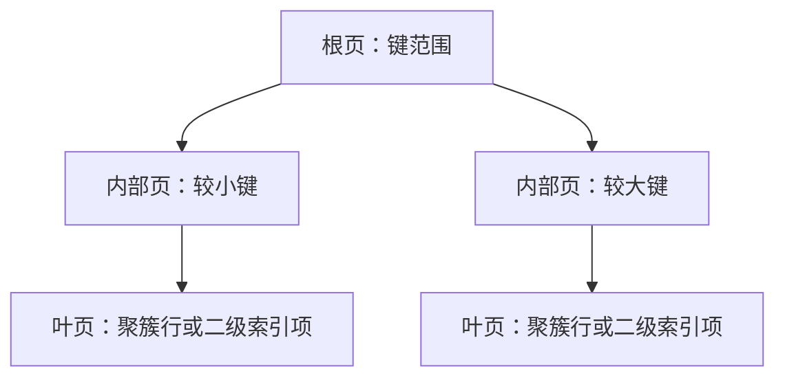

# 什么是索引？为什么B+树是MySQL的主流选择？索引如何提升查询性能？

日期：2026-09-27  
标签：#面试 #MySQL #数据库  
难度：中等  
来源：[牛面 MySQL 题库](https://niumianoffer.com/nm_practice/questions?bank_id=50e19cbb-21c2-4330-b45f-5748ae5d8672&activeIndex=0)  
答案说明：独立整理（站内题目标记为 VIP，未读取会员答案）

## 一句话答案

索引是按键值组织的访问路径；InnoDB 以 B-tree 索引支持等值、范围和有序遍历，减少不必要的数据页访问。

## 30–90 秒口语版

面试里常称 InnoDB 的树形索引为 B+ 树；官方文档使用 B-tree 一词。核心是多路、按键有序的页结构，查找可逐层缩小范围，范围查询可顺序遍历相关索引项。InnoDB 的聚簇索引存放行数据，定义主键时通常由主键承担；二级索引保存键值及对应主键值，非覆盖查询再用主键找行。索引也有代价：占空间、写入时维护，过多索引可能拖慢 DML。真实收益取决于选择性、缓存、扫描行数和是否回表。

## 结构示意

例如 `PRIMARY KEY(id)`、`INDEX idx_status_time(status,created_at)`：`WHERE status=1 AND created_at>=...` 可尝试范围定位；若选出 `amount` 而索引不含它，需要读取聚簇记录。这里不把“所有叶页都存完整行”套用于二级索引。

## 关键边界与取舍

- B-tree 适合比较与区间条件；前导通配符、复杂表达式不一定能做范围定位。全文和空间索引是不同路线。
- 树高不是固定数字；页大小、键长、数据量和填充状态都会影响，缓存命中常比抽象层数更影响延迟。
- 无显式主键时 InnoDB 会选择合适唯一非空键或生成隐藏聚簇键；建表时仍应主动设计稳定、短的主键。

## 递进追问

### 1. 聚簇索引和二级索引的记录内容有何不同？

**参考答案：** InnoDB 聚簇索引的叶子记录保存行数据，显式主键通常就是聚簇键；较大的变长列还可能使用页外存储，不能理解成所有字节都挤在同一叶页。普通二级索引的记录保存索引列值及对应的聚簇键值，供进一步找行，通常不含全部业务列。没有显式主键时，会选择第一个所有列均非空的唯一索引，否则生成隐藏聚簇键。

### 2. 二级索引查 `SELECT *` 为什么可能要回表？

**参考答案：** 二级索引通常只有索引列和主键值，`SELECT *` 还需要其中没有的列，因此先找到二级索引项，再按主键访问聚簇索引取行，这一步就是回表。若查询所需列恰好全部在索引中，则可能覆盖读取，不必为缺失列回表；直接走聚簇索引也没有这一额外查找。回表次数多时会增加访问成本，但缓存命中、行分布和执行策略会影响实际 I/O，不能简单等同于每行一次磁盘随机读。

### 3. 主键很长会怎样影响多个二级索引？

**参考答案：** 每条二级索引记录都携带聚簇键，因此长主键会把额外字节放大到每个二级索引中。相同页大小下可容纳的索引项变少，磁盘占用、缓存压力及维护时的数据量增加，数据量足够大时还可能增加树高。主键有多个列时同样如此。设计时通常优先稳定、较短的键；若把长业务标识改为代理主键，还要保留必要的业务唯一约束，并计算新增唯一索引的成本，不能只比较主键自身大小。

## 延伸阅读

- [020-bplus-tree-query-process.md](/posts/MySQL/020-bplus-tree-query-process/)
- [021-why-bplus-tree-index.md](/posts/MySQL/021-why-bplus-tree-index/)

## 官方依据

以下均为 MySQL 8.4 官方手册，核对日期：2026-09-27。

- [Clustered and Secondary Indexes](https://dev.mysql.com/doc/refman/8.4/en/innodb-index-types.html)
- [Column Indexes](https://dev.mysql.com/doc/refman/8.4/en/column-indexes.html)

## 自测

- 不看笔记，用 60 秒回答：什么是索引？为什么B+树是MySQL的主流选择？索引如何提升查询性能？
- 用示例 SQL 解释访问路径、边界与取舍，并回答上面的递进追问。
