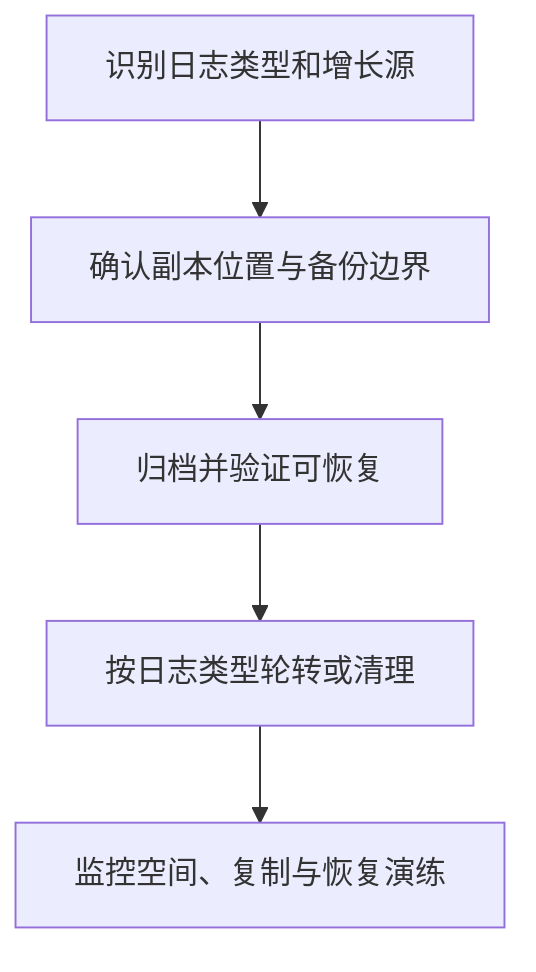

# 日志文件过大如何处理？日志清理和归档策略是什么？

日期：2026-09-27  
标签：#面试 #MySQL #数据库  
难度：困难  
来源：[牛面 MySQL 题库](https://niumianoffer.com/nm_practice/questions?bank_id=50e19cbb-21c2-4330-b45f-5748ae5d8672&activeIndex=0)  
答案说明：独立整理（站内题目标记为 VIP，未读取会员答案）

## 一句话答案

先分清 binlog、慢日志、错误日志、redo 与 undo，再按照复制追赶、备份恢复和审计窗口处理；只通过各自受支持的机制轮转、归档或清理。

## 30–90 秒口语版

磁盘报警时我先定位增长文件、当前配置和增长速率，避免直接 `rm`。对 binlog，先确认所有副本读取位置、备份时间点和 PITR 所需的最早日志，归档验证后再设置 `binlog_expire_logs_seconds` 或用 `PURGE BINARY LOGS` 删除安全边界以前的文件。慢日志、错误日志走重命名、`FLUSH ... LOGS` 后压缩归档；同时分析慢 SQL，避免只是转移增长。redo 容量由 `innodb_redo_log_capacity` 管，undo 空间受长事务和 purge 进度影响，不能手工删除活动文件。最后做恢复演练并监控剩余空间与副本延迟。

## 操作顺序示意



```sql
SHOW VARIABLES LIKE 'binlog_expire_logs_seconds';
SHOW BINARY LOGS;
SHOW REPLICA STATUS; -- 在每个副本执行，核对各自仍需读取的源端日志
-- 仅在核对安全边界后，才在源端执行形如：
-- PURGE BINARY LOGS TO 'mysql-bin.000123'; -- 不删除目标文件本身
```

## 关键边界与取舍

- MySQL 8.4 默认 binlog 保留期为 30 天，但业务所需窗口可能更长；自动过期也要覆盖最大可能副本延迟与恢复链。
- 不要直接删除 binlog：会破坏索引文件与复制/恢复链；手动 `PURGE` 前核对每个副本，备份待删文件更稳妥。
- redo 循环复用且有检查点约束；undo 历史清理依赖 MVCC，不可把它们当文本日志压缩、截断。

## 递进追问

### 1. 为什么 binlog 清理要看最慢副本读取位置？

**参考答案：** 副本接收线程需要从源端 binlog 继续读取尚未取得的事件；若对应文件已被清理，重连后就可能断链，需补日志或重建副本。因此先在所有副本核对 `Source_Log_File`、`Read_Source_Log_Pos` 等接收进度，取仍需保留的最早文件，并保留余量。这里要区分“已接收”与“已执行”：可靠保留在 relay log 的事件可以稍后应用，但还要考虑 relay log 丢失后的重新拉取。断连副本也必须纳入，不能只靠当前连接的保护。

### 2. 已做全量备份，为什么还可能需要更早的 binlog？

**参考答案：** 先区分备份的完成时间与一致性位点：备份耗时一小时，其恢复起点可能在开始时，期间产生的 binlog 仍需保留。另外，恢复保留窗口内的较早时间点，可能必须选择更早的全量备份并保留之后的连续日志；最新备份已包含误删时，也需要这种旧基线。落后副本或 CDC 消费者还可能依赖更早事件。反过来，如果只从已验证的新备份向后恢复，且无其他消费者，就不必仅为这份备份保留其一致性位点之前的日志。清理边界要由所有有效恢复链和消费位点共同决定。[时间点恢复](https://dev.mysql.com/doc/refman/8.4/en/point-in-time-recovery.html)。

### 3. 磁盘满且副本落后时如何制定安全的临时处置顺序？

**参考答案：** 先确认占满空间的文件类型和增长速率，对非必要写入限流，为数据库留出恢复和继续写日志的空间。优先扩容，或按受支持的轮转方式释放无恢复依赖的旧文本日志、已验证归档文件；不要手删活动 redo、undo 或 binlog。随后核对所有副本接收位点、备份链和消费者，把仍需要的关闭 binlog 文件复制到外部并校验，再仅用 `PURGE BINARY LOGS` 清理确认安全的部分。如果没有安全可删范围，就需保留日志并扩容，或明确接受重建落后副本的代价；同时保全 PITR 所需归档，恢复后修正保留期和容量告警。

## 延伸阅读

- [022-mysql-logs-binlog-redo-undo.md](/posts/MySQL/022-mysql-logs-binlog-redo-undo/)

## 官方依据

以下均为 MySQL 8.4 官方手册，核对日期：2026-09-27。

- [PURGE BINARY LOGS Statement](https://dev.mysql.com/doc/refman/8.4/en/purge-binary-logs.html)
- [Binary Logging Options and Variables](https://dev.mysql.com/doc/refman/8.4/en/replication-options-binary-log.html)
- [FLUSH Statement](https://dev.mysql.com/doc/refman/8.4/en/flush.html)
- [Redo Log](https://dev.mysql.com/doc/refman/8.4/en/innodb-redo-log.html)

## 自测

- 不看笔记，用 60 秒回答：日志文件过大如何处理？日志清理和归档策略是什么？
- 用示例 SQL 或故障时间线解释边界与取舍，并回答上面的递进追问。
