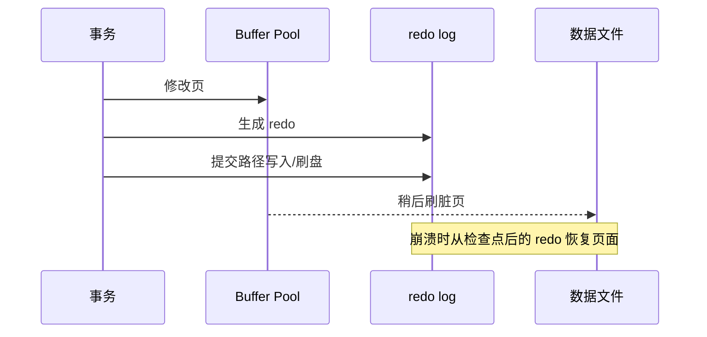

# 什么是redo log？redo log如何保证事务的持久性？

日期：2026-09-27  
标签：#面试 #MySQL #数据库  
难度：中等  
来源：[牛面 MySQL 题库](https://niumianoffer.com/nm_practice/questions?bank_id=50e19cbb-21c2-4330-b45f-5748ae5d8672&activeIndex=0)  
答案说明：独立整理（站内题目标记为 VIP，未读取会员答案）

## 一句话答案

redo log 是 InnoDB 的预写式重做日志：提交时先确保持久化所需日志，脏数据页可稍后落盘；崩溃时从检查点后重放并配合事务状态恢复。

## 30–90 秒口语版

一次更新先改内存中的页，同时生成 redo 记录；若每次提交都同步整个数据页，随机 I/O 成本很高。WAL 让提交以较顺序的日志写入为主，后台再刷脏页。宕机后，InnoDB 从检查点相关位置读取 redo，把尚未落到数据文件的变更重放；未提交事务还要借助 undo 回滚。因此 redo 不是“只记录已提交 SQL”，也不是备份或复制用的 binlog。持久性要看 `innodb_flush_log_at_trx_commit`、`sync_binlog`（启用 binlog 时）以及实际存储是否可靠执行刷盘。

## 时间线示意



```sql
SHOW VARIABLES LIKE 'innodb_flush_log_at_trx_commit';
SHOW VARIABLES LIKE 'innodb_redo_log_capacity';
SHOW STATUS LIKE 'Innodb_redo_log_flushed_to_disk_lsn';
```

## 关键边界与取舍

- `innodb_flush_log_at_trx_commit=1` 默认每次提交写入并刷盘；0/2 放宽策略可能丢失最近事务，不能笼统称“永远只丢 1 秒”。
- redo 会随检查点推进而复用；容量不足可能迫使更频繁刷脏页，8.4 由 `innodb_redo_log_capacity` 管理。
- 恢复并非只“重放已提交记录”：先恢复页的一致状态，还需根据提交状态处理未完成事务。

## 递进追问

### 1. 为什么提交不必同步写完所有数据页？

**参考答案：** 因为 WAL 把持久性建立在先持久化重做日志上：事务提交所需日志可靠落盘后，即使部分脏页还在 Buffer Pool，崩溃时也可重放 redo 恢复。数据页真正写盘前，覆盖其修改的 redo 同样必须先持久化，避免出现无法恢复的页状态。后台可以合并多次修改后分批刷页，减少提交路径上的随机 I/O。启用 binlog 时还需提交协调和对应同步策略；放宽刷盘配置后，不能再把成功响应理解为同等强度的持久性保证。

### 2. checkpoint 与 redo 容量如何影响写入压力和恢复？

**参考答案：** checkpoint 表示此前必要的页修改已有可靠落盘基础，相关旧 redo 空间可逐步复用；它不是“每次把全部脏页一次刷完”。当 redo 生成很快、检查点推进跟不上时，可用空间缩小，会加大刷脏页压力，甚至使前台写入等待。增加 `innodb_redo_log_capacity` 能缓冲写入峰值、减少急促刷盘，但不能解决持续 I/O 吞吐不足，也不会改变提交刷盘语义。恢复工作量主要由崩溃时检查点之后需要扫描和重放的日志决定，因此容量更大不等于每次恢复必然更慢。[检查点机制](https://dev.mysql.com/doc/refman/8.4/en/innodb-checkpoints.html)。

### 3. redo 已持久化但事务未提交时，崩溃后怎样处理？

**参考答案：** redo 中可能包含尚未提交事务的页修改，落盘本身不代表事务已提交。崩溃恢复会先利用 redo 恢复页状态，再根据事务状态处理；普通未提交事务通常借助 undo 回滚。若事务已进入内部两阶段提交的 prepared 状态，还要查看 binlog 是否包含完整有效的对应 XID：有则可完成提交，没有则回滚。显式 XA 的未决事务还有专门的恢复处理，不能把所有 prepared 状态都机械地视为失败。[binlog 与事务恢复](https://dev.mysql.com/doc/refman/8.4/en/binary-log.html)。

## 延伸阅读

- [022-mysql-logs-binlog-redo-undo.md](/posts/MySQL/022-mysql-logs-binlog-redo-undo/)
- [064-write-ahead-logging.md](/posts/MySQL/064-write-ahead-logging/)

## 官方依据

以下均为 MySQL 8.4 官方手册，核对日期：2026-09-27。

- [Redo Log](https://dev.mysql.com/doc/refman/8.4/en/innodb-redo-log.html)
- [InnoDB Startup Options and System Variables](https://dev.mysql.com/doc/refman/8.4/en/innodb-parameters.html)
- [Optimizing InnoDB Redo Logging](https://dev.mysql.com/doc/refman/8.4/en/optimizing-innodb-logging.html)

## 自测

- 不看笔记，用 60 秒回答：什么是redo log？redo log如何保证事务的持久性？
- 用日志时间线或故障场景解释边界与取舍，并回答上面的递进追问。
