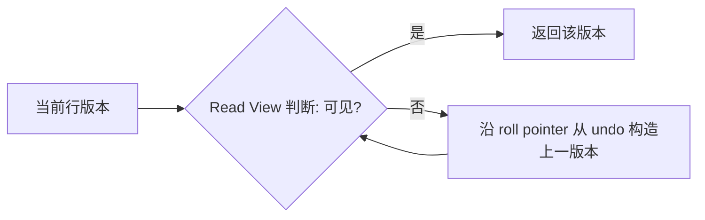

# 什么是undo log？undo log如何实现事务回滚和MVCC？

日期：2026-09-27  
标签：#面试 #MySQL #数据库  
难度：中等  
来源：[牛面 MySQL 题库](https://niumianoffer.com/nm_practice/questions?bank_id=50e19cbb-21c2-4330-b45f-5748ae5d8672&activeIndex=0)  
答案说明：独立整理（站内题目标记为 VIP，未读取会员答案）

## 一句话答案

undo log 保存撤销修改所需的信息；事务回滚用它还原，MVCC 一致性读用它构造可见的旧版本。

## 30–90 秒口语版

InnoDB 更新行时会保留 undo 记录，行内的事务 ID 和回滚指针帮助定位历史版本。事务失败时沿撤销记录回滚；一致性读则结合 Read View 判断当前版本是否可见，不可见时沿历史记录构造较早版本。插入 undo 在事务提交后通常不再被其他一致性读需要；更新 undo 可能要等所有依赖旧快照的事务结束后才能 purge。长事务因此会拖住历史清理，`History list length` 增长、undo 表空间承压。需要注意普通一致性读与 `SELECT ... FOR UPDATE` 这类锁定读的语义不同。

## 版本链示意



```sql
SHOW ENGINE INNODB STATUS; -- 看 TRANSACTIONS 下 History list length
SELECT * FROM information_schema.innodb_trx; -- 查长事务
```

## 关键边界与取舍

- undo 是“撤销所需信息”，并非每条 SQL 都保存完整旧行副本；具体记录由操作类型决定。
- MVCC 旧版本不能无限保留：需要等待不再有 Read View 依赖，后台 purge 才能清理。
- 不能手删活动 undo 表空间；先排查长事务、慢查询、备份期间的一致性快照，再评估清理进度。

## 递进追问

### 1. 为什么 `UPDATE` 的 undo 比 `INSERT` 的 undo 可能存活更久？

**参考答案：** 插入前这行不存在，insert undo 主要用于撤销本事务的插入；事务提交后，旧快照只需判断新行不可见，通常不需要靠它重建更老的一行，因此可丢弃。更新则要让旧快照看见修改前的内容，update undo 除了支持回滚，还承担历史版本重建，必须等没有 Read View 需要这些信息后才能被 purge。删除相关的历史也有类似保留需求，所以提交并不意味着所有 undo 立即清理。

### 2. Read View 判断当前版本不可见时如何得到旧版本？

**参考答案：** InnoDB 先结合 Read View 与记录的事务 ID 判断可见性；当前版本不可见时，通过回滚指针找到 undo，用其中的撤销信息重建上一版本，再检查该版本的事务 ID。如此沿版本链继续，直到找到可见版本；若追溯到该行在快照时尚不存在，就不返回它。旧版本通常是按需构造，不是为每次修改存一份完整行。判断也不能仅用“事务 ID 小于我的 ID”，还要考虑创建快照时的活跃事务集合及本事务自身修改。

### 3. 长事务会怎样影响 `History list length`、磁盘与查询性能？

**参考答案：** 长期持有旧 Read View 的事务会阻止 purge 清理仍可能需要的历史，持续更新时 `History list length` 和 undo 空间可能增长，删除标记的记录也可能滞留。历史链更长会增加部分一致性读重建旧版本的开销，并带来缓存与 I/O 压力；如果事务还持锁，又会额外阻塞写入。应结合事务开始时间、SQL、purge 进度与空间增长排查，区分旧快照阻塞和清理吞吐不足。并非仅执行 `BEGIN` 就必然持有旧快照，结束长事务后 purge 与文件空间回收也不会瞬间完成。

## 延伸阅读

- [022-mysql-logs-binlog-redo-undo.md](/posts/MySQL/022-mysql-logs-binlog-redo-undo/)
- [025-mvcc.md](/posts/MySQL/025-mvcc/)

## 官方依据

以下均为 MySQL 8.4 官方手册，核对日期：2026-09-27。

- [Undo Logs](https://dev.mysql.com/doc/refman/8.4/en/innodb-undo-logs.html)
- [InnoDB Multi-Versioning](https://dev.mysql.com/doc/refman/8.4/en/innodb-multi-versioning.html)
- [Purge Configuration](https://dev.mysql.com/doc/refman/8.4/en/innodb-purge-configuration.html)

## 自测

- 不看笔记，用 60 秒回答：什么是undo log？undo log如何实现事务回滚和MVCC？
- 用日志时间线或故障场景解释边界与取舍，并回答上面的递进追问。
