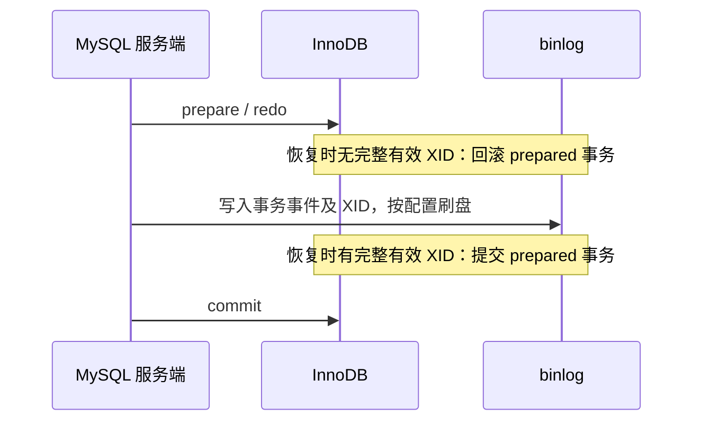

# binlog与redo log有什么区别？两阶段提交如何保证一致性？

日期：2026-09-27  
标签：#面试 #MySQL #数据库  
难度：中等  
来源：[牛面 MySQL 题库](https://niumianoffer.com/nm_practice/questions?bank_id=50e19cbb-21c2-4330-b45f-5748ae5d8672&activeIndex=0)  
答案说明：独立整理（站内题目标记为 VIP，未读取会员答案）

## 一句话答案

redo 服务 InnoDB 崩溃恢复，binlog 服务复制和时间点恢复；内部提交协调使崩溃时可根据 binlog 中的事务标识决定已准备事务的最终状态。

## 30–90 秒口语版

可以把 InnoDB 与 binlog 看作两个需协调提交结果的参与方。典型内部流程是 InnoDB 先把事务置于 prepared 状态并记录 redo，服务端再写 binlog，最后通知 InnoDB 提交。若此间崩溃，恢复会检查 binlog 是否存在该事务完整、有效的 XID：找不到就回滚 prepared 事务，找得到就完成提交。判断依据是恢复时有效的 binlog 内容，不能机械地等同于“崩溃前是否执行过一次同步调用”。要把保证落到断电故障层面，还需 `innodb_flush_log_at_trx_commit=1` 与 `sync_binlog=1`，并要求硬件真实执行 flush。

## 崩溃点时间线

| 对比 | redo log | binlog |
| --- | --- | --- |
| 归属 | InnoDB 存储引擎 | MySQL 服务端 |
| 核心用途 | 页变更恢复、事务持久性 | 复制、备份后时间点恢复 |
| 清理方式 | 随检查点推进复用 | 保留窗口后由 MySQL 管理清理 |

## 关键边界与取舍

- 这是 MySQL 内部对 InnoDB 与 binlog 的提交协调，不等于跨业务服务的分布式事务自动一致。
- “先写 redo 再写 binlog”省略了 prepare、同步、commit 和恢复判断，不足以解释崩溃窗口。
- `sync_binlog>1` 或 redo 放宽刷盘会削弱主机故障下的持久性保证；进程崩溃与整机断电的风险不同。

## 递进追问

### 1. binlog 与 redo 分别解决什么恢复问题？

**参考答案：** redo 解决“数据页未全部写盘时，实例如何从崩溃中恢复”的问题，恢复时还要结合 undo 和事务提交状态。binlog 解决“如何把已记录变更传给副本，以及如何从备份推进到指定时间点”的问题，它不是 InnoDB 页恢复日志。数据文件仍在时通常依赖 redo 做实例崩溃恢复；数据文件丢失或要撤回误操作时，常需备份加 binlog。两个日志保留和回收机制不同，不能因其中一个存在就省掉另一个。

### 2. 崩溃在 binlog 已持久化、InnoDB 尚未 commit 时怎么判定？

**参考答案：** 假设事务已在 InnoDB 中完成 prepare，恢复时会检查 binlog 中对应事务的完整性及有效 XID；如果完整事务已持久化，就完成该 prepared 事务的提交，使引擎状态与日志一致。若只写了部分事件、缺少有效提交记录，则不能据此提交。客户端可能在崩溃前尚未收到成功响应，因此“客户端超时”也不等于事务失败；重试应使用业务唯一键或幂等标识确认结果。这里讨论内部协调，不是自动解决跨服务分布式事务。[binlog 崩溃恢复](https://dev.mysql.com/doc/refman/8.4/en/binary-log.html)。

### 3. 两个刷盘参数都取 1 是否保证任何硬件故障下绝不丢数据？

**参考答案：** 不能。这两个参数都为 1，目标是在操作系统和存储正确履行同步写入语义时，保障正常提交路径上的 redo 与 binlog 持久性。若磁盘或控制器错误报告已刷盘、易失写缓存没有掉电保护，或者存储介质损坏、整机丢失，参数本身无能为力。还要核对存储持久性承诺、故障域、备份及复制策略，并做恢复演练；异步副本也可能尚未收到最新事务，主库本地刷盘成功不代表任意副本提升后都零丢失。

## 延伸阅读

- [072-innodb-binlog-two-phase-commit.md](/posts/MySQL/072-innodb-binlog-two-phase-commit/)
- [022-mysql-logs-binlog-redo-undo.md](/posts/MySQL/022-mysql-logs-binlog-redo-undo/)

## 官方依据

以下均为 MySQL 8.4 官方手册，核对日期：2026-09-27。

- [The Binary Log](https://dev.mysql.com/doc/refman/8.4/en/binary-log.html)
- [Binary Logging Options and Variables](https://dev.mysql.com/doc/refman/8.4/en/replication-options-binary-log.html)
- [InnoDB Startup Options and System Variables](https://dev.mysql.com/doc/refman/8.4/en/innodb-parameters.html)

## 自测

- 不看笔记，用 60 秒回答：binlog与redo log有什么区别？两阶段提交如何保证一致性？
- 用日志时间线或故障场景解释边界与取舍，并回答上面的递进追问。
