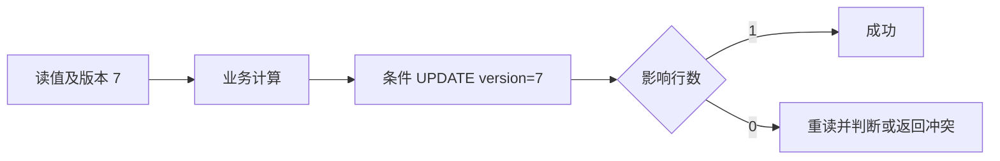

# 乐观锁和悲观锁有什么区别？在什么场景下使用？

日期：2026-09-27  
标签：#面试 #MySQL #数据库  
难度：中等  
来源：[牛面 MySQL 题库](https://niumianoffer.com/nm_practice/questions?bank_id=50e19cbb-21c2-4330-b45f-5748ae5d8672&activeIndex=0)  
答案说明：独立整理（站内题目标记为 VIP，未读取会员答案）

## 一句话答案

悲观锁先取得数据库锁再操作；乐观锁在提交更新时用版本或条件校验冲突，两者分别适合高冲突短事务与低冲突、可处理失败的场景。

## 面试口语版（约 60 秒）

“在 InnoDB 里，悲观锁通常是把读改写成 `SELECT ... FOR UPDATE`，在事务内锁住要修改的索引记录，然后更新并尽快提交。它让竞争者等待，适合库存热点、余额扣减等冲突高且事务短的场景。乐观锁先正常读取数据及版本号，更新时 `WHERE id=? AND version=?`，只在影响行数为 1 时算成功；冲突就重新读取、有限次重试或向用户提示。它适合低冲突、用户编辑这类不宜长时间占锁的流程。两者都不是万能的：乐观锁的版本号必须随所有相关写入一起更新；悲观锁要关注索引范围、死锁和事务时长。单条条件更新如 `stock = stock - 1 WHERE stock >= 1`，本身就是可用的原子扣减方案，不一定要先查后锁。”

## 原理与 SQL

假设 `item(id, stock, version)`，以下方案均需检查语句结果，并在同一业务约束下选择。

**乐观锁：**

```sql
-- 先读到 stock=10、version=7；随后在短事务中提交变更
UPDATE item
SET stock = stock - 1, version = version + 1
WHERE id = 42 AND version = 7 AND stock >= 1;
-- ROW_COUNT() = 1 才成功；= 0 可能是版本冲突、库存不足或记录不存在
```

两个请求都读到版本 7，只有先更新者会成功；后者不能盲目“重试原 SQL”，需要重读业务状态，再判断是否仍可扣减。实际代码可用数据库驱动返回的影响行数。`version` 的校验与业务写入必须在**同一条原子 UPDATE** 中；先 `SELECT version` 再无条件 `UPDATE` 会丢失更新。

**悲观锁：**

```sql
START TRANSACTION;
SELECT stock FROM item WHERE id = 42 FOR UPDATE;
-- 在应用中判断库存并计算；随后更新
UPDATE item SET stock = stock - 1 WHERE id = 42 AND stock >= 1;
COMMIT;
```

`FOR UPDATE` 是锁定读，竞争更新会等待本事务释放锁。应使用合适索引定位行；范围查询可能锁住更多索引记录与间隙。`autocommit=1` 且没有显式事务时，锁定读语句结束便提交，不能保护后续另一条 SQL。普通 `SELECT` 在 RC/RR 下通常是一致性读，不提供“查后改”的互斥保护。



## 边界与取舍

- **冲突成本**：乐观锁减少等待，但热点行反复重试会浪费 CPU 和连接；悲观锁以等待换取少量失败，但长事务会放大锁等待与死锁。
- **库存与金额**：可以优先考虑单条条件更新；跨多行、需要先读取后检查复杂约束时，再选锁定读或更完整的事务设计。
- **版本作用域**：版本号只检测覆盖到的记录及写入路径。若另一段代码不更新版本，冲突会漏检；多行不变量也不能靠单行版本号自动保证。
- **与分布式锁区别**：版本校验保护的是这条数据库记录的条件写入，不等于外部资源操作所需的 fencing token。成功写库后调用外部系统，还须单独考虑重复调用、超时与幂等。
- **失败处理**：锁等待超时与死锁需要按完整事务重试；乐观冲突需区分用户编辑覆盖与可自动重算的扣减，限制重试次数并加退避。

## 递进追问

### 1. 两个事务都读到 `version=7`，为什么最终只有一个能更新成功？

**参考答案：** 版本比较和版本递增在同一条 `UPDATE` 中完成，InnoDB 又会对被修改记录加排他锁。A 先把版本从 7 改成 8 并提交，B 等待后按当前记录重新判断，`version=7` 已不成立，影响行数就是 0，即使 B 的普通快照读仍能看到旧版本。若 A 回滚，B 仍可能成功。因此“只能成功一个”指使用同一旧版本的已提交更新，前提是所有相关写入都正确递增版本。

### 2. 为什么 `SELECT ... FOR UPDATE` 必须放在事务里？没有索引会怎样影响锁范围？

**参考答案：** 目的是让读时取得的锁一直保护到后续修改完成。应显式开启事务或关闭自动提交，并在同一连接中执行锁定读、校验、更新和提交；自动提交下单独一条 `FOR UPDATE` 不能保护下一条 SQL。没有合适索引时，需要扫描大量索引记录，RR 下可能连同间隙锁住接近全表的范围，阻塞无关更新和插入；这不等于 InnoDB 把行锁自动升级成表锁。RC 的锁保留规则又不同，判断范围时要一起看隔离级别和执行计划。

### 3. 如果成功扣库存后发送 MQ 失败，版本号能否保证消息与数据库一致？应如何设计？

**参考答案：** 不能，版本号只约束数据库内的条件更新，不会使 MQ 加入这个事务。可在同一本地事务中扣库存并插入带唯一事件 ID 的 Outbox 记录，任一步失败都回滚；提交后由发布器或 CDC 投递，失败持续重试并监控积压。

发布成功但确认或发送标记写入失败时仍可能重复投递，所以消费者应把事件去重记录与业务变更放在自己的同一个事务里。它保证业务状态与“待发送意图”一起落库，最终送达还依赖可靠发布、重试和故障恢复，不能直接宣称跨系统恰好一次。[AWS：Transactional outbox](https://docs.aws.amazon.com/prescriptive-guidance/latest/cloud-design-patterns/transactional-outbox.html)

## 自测

- 用 60 秒分别说清两种方案的加锁或校验时机、冲突表现、适用场景。
- 写一条不会把库存扣成负数的 SQL，并解释为什么要检查影响行数。
- 画出乐观锁冲突后的重读与有限重试流程。

## 延伸阅读

- [032-optimistic-pessimistic-lock.md](/posts/MySQL/032-optimistic-pessimistic-lock/)

## 官方参考（核对日期：2026-09-27）

- [MySQL 8.4：Locking Reads](https://dev.mysql.com/doc/refman/8.4/en/innodb-locking-reads.html)
- [MySQL 8.4：InnoDB Locking](https://dev.mysql.com/doc/refman/8.4/en/innodb-locking.html)
- [MySQL 8.4：Consistent Nonlocking Reads](https://dev.mysql.com/doc/refman/8.4/en/innodb-consistent-read.html)
