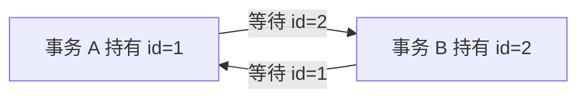

# 什么是死锁？如何检测和预防死锁？

日期：2026-09-27  
标签：#面试 #MySQL #数据库  
难度：中等  
来源：[牛面 MySQL 题库](https://niumianoffer.com/nm_practice/questions?bank_id=50e19cbb-21c2-4330-b45f-5748ae5d8672&activeIndex=0)  
答案说明：独立整理（站内题目标记为 VIP，未读取会员答案）

## 一句话答案

死锁是多个事务形成环形锁等待；InnoDB 通常检测后回滚一个事务，应用应重试整个事务，并通过一致加锁顺序、短事务和合适索引降低发生率。

## 面试口语版（约 60 秒）

“典型例子是事务 A 先锁记录 1 再锁 2，事务 B 先锁 2 再锁 1。两边各持有对方需要的锁，就形成死锁。InnoDB 默认启用死锁检测，会选择一个事务回滚，让另一个继续；被回滚的一方会收到死锁错误，应用要重新执行完整事务，而不是只补发失败的那条 SQL。排查先看 `SHOW ENGINE INNODB STATUS` 中最近一次死锁的事务、SQL、已持锁与等待锁；高频时可临时启用 `innodb_print_all_deadlocks` 留日志。预防重点是多表多行按固定顺序加锁、事务尽量短、谓词有合适索引，并避免网络调用占着锁。即便设计良好也不能保证绝无死锁，所以重试与幂等仍是必要的。”

## 最小复现场景

建表：`account(id PRIMARY KEY, balance)`，已有 id 1 和 2。分别在两个连接执行，按箭头交错：

| 时序 | 连接 A | 连接 B |
| --- | --- | --- |
| 1 | `START TRANSACTION; UPDATE account SET balance=balance+1 WHERE id=1;` | `START TRANSACTION; UPDATE account SET balance=balance+1 WHERE id=2;` |
| 2 | `UPDATE account SET balance=balance+1 WHERE id=2;` → 等待 B |  |
| 3 |  | `UPDATE account SET balance=balance+1 WHERE id=1;` → 构成环；其中一方报错回滚 |



可按以下顺序排查：记录错误码 `1213` 与 SQLSTATE `40001`；执行 `SHOW ENGINE INNODB STATUS\G` 看 `LATEST DETECTED DEADLOCK`；结合事务 ID、索引名、SQL 和应用链路还原真实加锁顺序。`performance_schema.data_locks` 与 `data_lock_waits` 可看当前锁及等待；已结束的死锁要看历史日志。若关闭 `innodb_deadlock_detect`，一般依赖锁等待超时来打破等待，不能再说“数据库会立即检测”。

## 修复与重试伪代码

```text
for attempt in 1..MAX_ATTEMPTS:
    begin transaction
    try:
        按 id 升序锁定涉及的账户
        校验余额并执行所有更新
        commit
        return 成功
    catch deadlock_or_retryable_lock_error:
        rollback 整个事务
        若超过次数则返回可重试错误
        随机退避后重新读取最新数据并重算
    catch other_error:
        rollback
        throw
```

重试之前要评估事务内是否已有外部副作用。不要在数据库事务尚未成功前直接发不可撤销的通知；请求唯一键和业务幂等约束可以防止客户端重试造成重复转账。锁等待超时与死锁的回滚范围可能不同，应用最稳妥的做法是显式回滚当前事务，再从头执行。

## 边界与取舍

- 索引不足会放大扫描及锁定范围，但“加索引”也需结合执行计划、选择度和写入成本，不能保证完全消除死锁。
- 死锁不只发生在“显式锁”；更新二级索引、外键检查、插入唯一键冲突等也涉及多个锁。
- 高频热点可能导致死锁检测成本升高；是否关闭检测要依据指标与故障恢复策略评估，不能作为常规第一步。

## 递进追问

### 1. 死锁与普通锁等待的区别是什么？数据库为何只回滚其中一个事务？

**参考答案：** 普通锁等待是 A 等 B，B 仍能继续执行并释放锁；死锁则存在等待环，环中的事务都依赖别人先释放资源，单纯继续等待无法推进。启用死锁检测时，InnoDB 回滚一个牺牲事务以释放锁、打破环，保留其他事务已完成的工作，不必把所有参与者都回滚。死锁会撤销整个牺牲事务，应用需从头重试；普通锁等待超时默认只撤销当前语句，不能混为一谈。[MySQL 8.4：错误处理](https://dev.mysql.com/doc/refman/8.4/en/innodb-error-handling.html)

### 2. 明明两条 SQL 都按主键更新，为什么仍可能因为顺序相反而死锁？

**参考答案：** 按主键查询只能缩小每次加锁的范围，不能统一多条语句的加锁顺序。例如 A 更新 `id=1` 后再更新 `id=2`，B 更新 `id=2` 后再更新 `id=1`：两者都先持有一个排他锁，再等待对方的锁，仍会成环。应让相关写入路径按相同顺序逐条锁定记录，例如都先锁较小 ID，再锁较大 ID，并缩短事务；二级索引与外键还可能引入其他锁，因此仍需保留整笔事务重试能力。

### 3. 一个带外部支付请求的事务被选为牺牲者，如何避免重试导致重复支付？

**参考答案：** 数据库回滚无法撤销已经成功的外部支付，不能把“重新执行事务”直接等同于“重新发起一次支付”。应以稳定的业务支付号作为幂等键，先用短事务持久化待支付状态及任务，再在事务外调用支持幂等的支付接口，最后用另一短事务记录结果；重试必须沿用同一业务号。

超时只表示结果未知，要查询原支付单、接收回调并对账，不能换新业务号再次扣款。数据库死锁只重试相应本地步骤。若对方不提供可用的幂等或结果查询能力，就无法仅靠本地数据库保证不重复，应保留待核对状态并进入补偿或人工处理。[Azure：Saga 模式](https://learn.microsoft.com/en-us/azure/architecture/patterns/saga)

## 自测

- 用两条记录、两个事务写出死锁交错顺序。
- 在死锁日志里指出“已持有锁”“等待锁”“牺牲者”各在哪里。
- 解释为何重试整笔事务，且应设置次数、退避和幂等条件。

## 延伸阅读

- [033-deadlock-handling.md](/posts/MySQL/033-deadlock-handling/)

## 官方参考（核对日期：2026-09-27）

- [MySQL 8.4：Deadlocks in InnoDB](https://dev.mysql.com/doc/refman/8.4/en/innodb-deadlocks.html)
- [MySQL 8.4：How to Minimize and Handle Deadlocks](https://dev.mysql.com/doc/refman/8.4/en/innodb-deadlocks-handling.html)
- [MySQL 8.4：InnoDB Standard Monitor Output](https://dev.mysql.com/doc/refman/8.4/en/innodb-standard-monitor.html)
