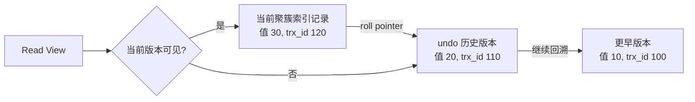

# 什么是MVCC？MVCC如何实现事务的隔离性？

日期：2026-09-27  
标签：#面试 #MySQL #数据库  
难度：中等  
来源：[牛面 MySQL 题库](https://niumianoffer.com/nm_practice/questions?bank_id=50e19cbb-21c2-4330-b45f-5748ae5d8672&activeIndex=0)  
答案说明：独立整理（站内题目标记为 VIP，未读取会员答案）

## 一句话答案

MVCC 利用行的历史版本和事务可见性规则提供一致性读，让普通查询能读取合适版本而不必等待并发写入。

## 面试口语版（约 60 秒）

“InnoDB 更新行时保留可供回溯的 undo 信息，聚簇索引记录带有最近修改事务 ID 和指向 undo 的指针。普通 `SELECT` 在读已提交或可重复读下，结合 Read View 判断当前版本是否可见；不可见就沿 undo 还原较旧版本。这就是 MVCC 支持的一致性非锁定读。读已提交每条一致性读建立新快照，所以同一事务两次查询可能不同；可重复读通常由第一次一致性读确定快照，所以后续普通查询视图稳定，还能看到本事务自己的写入。不过 `SELECT ... FOR UPDATE`、`UPDATE` 和 `DELETE` 走锁定或写入路径，关注较新的已提交状态与锁，不应说所有读都走同一快照。MVCC 让读写少互相阻塞，但不自动保证查后改的业务约束，也不表示完全没有锁。”

## 版本链与可见性

此图只表达“依据可见性回溯版本”的思路，不把 `trx_id` 大小简单等同于提交时间。实际判定需要 Read View 中的活跃事务信息、创建者与事务 ID 边界；同一事务自己的修改可见。InnoDB 的 `DB_TRX_ID`、`DB_ROLL_PTR` 是内部隐藏字段，`undo` 既用于回滚，也用于构造一致性读所需的旧版本。旧版本不能无限保留，长事务占着旧快照会妨碍 purge 清理。

## 两个会话的区别示例

假设 `t(id PRIMARY KEY, v)` 的 `id=1, v=10`。会话 A 先 `START TRANSACTION`，首次普通 `SELECT v FROM t WHERE id=1` 读到 10；B 更新为 20 并提交。

| A 接下来的操作 | `READ COMMITTED` | `REPEATABLE READ` |
| --- | --- | --- |
| 再做普通 `SELECT` | 新快照，通常读到 20 | 沿原快照，仍读到 10 |
| `SELECT ... FOR UPDATE` | 锁定读，读较新可锁定版本 | 锁定读，读较新可锁定版本，必要时等待 |

若 A 自己把值改为 30，它随后普通查询可看到自己的写入；这也是“RR 下同一事务永远只见事务开始时数据”不准确的原因。`START TRANSACTION` 本身不等于普通 RR 的 Read View 一定此刻生成；通常在第一次一致性读时建立，`WITH CONSISTENT SNAPSHOT` 是显式开启一致性快照的方式。

## 边界与取舍

- **不要混用两种读的结论**：普通 `SELECT` 的旧快照不能证明紧接着 `UPDATE` 的当前状态，特别是先查再改、多条 SQL 维持跨行约束时。
- **幻读措辞**：同一 RR 事务中重复的普通范围 `SELECT` 通常看同一快照，所以结果不会因他人新提交插入而变化；需要锁住范围阻止并发插入时，要分析锁定读、索引和 next-key/gap 锁。不能说“MVCC 一种机制杜绝所有幻读”。
- **性能成本**：旧版本需要 undo 空间与 purge；长事务会使历史链增长，增加读取及清理压力。
- **二级索引细节**：二级索引记录不含聚簇记录的隐藏事务字段；某些情况下必须回聚簇索引判断可见版本，不能把“覆盖索引”说成所有 MVCC 读都无需回表。

## 递进追问

### 1. undo 与 Read View 各解决什么问题？普通 `SELECT` 会给读到的行加排他锁吗？

**参考答案：** undo 解决“旧版本如何还原”：记录更新前的信息，让当前记录可以回溯到历史状态；Read View 解决“哪个版本对本次读取可见”：结合事务 ID、活跃事务等信息筛选版本。两者共同实现一致性读，但 undo 还承担事务回滚。RC/RR 下普通 `SELECT` 通常不对读到的行加排他锁，也不因此阻塞其他事务更新；它仍会涉及 MDL 等机制，所以不能把一致性非锁定读理解为完全不使用任何锁。

### 2. RC 与 RR 下，Read View 生成时机有什么区别？本事务自己的更新能否看到？

**参考答案：** RC 每条一致性读建立新 Read View，因此同一事务后一次查询能看到此前新提交的数据；RR 通常在第一次一致性读时建立 Read View，后续普通一致性读复用它。仅执行 `START TRANSACTION` 并不意味着快照已经创建，RR 可用 `WITH CONSISTENT SNAPSHOT` 显式建立快照。两个级别都能看到本事务自己此前的修改，这些修改不受原快照时间点限制；锁定读和写入则不能套用上述普通读规则。

### 3. RR 事务先普通查询查不到记录，另一个事务插入并提交后，本事务执行 `UPDATE`，为什么可能影响那条新记录？

**参考答案：** RR 的旧快照只限定普通一致性读，`UPDATE` 需要对当前可更新记录加锁并判断条件，不把此前 SELECT 的结果当作更新名单。例如 A 的快照查不到 `id=42`，B 随后插入这行并提交，A 再执行 `UPDATE t SET v=v+1 WHERE id=42`，就可能更新它；若存在冲突锁，还可能先等待。

更新后 A 的普通查询能看到这行自己的修改，但这不代表整个 Read View 被刷新：其他未被 A 修改的行仍按旧快照判断。若业务要保证“查不到就创建”，应使用唯一约束及冲突处理，或明确的锁定方案，不能依赖旧快照中的不存在。

## 自测

- 用“当前行—undo—Read View”三步解释一条旧记录是如何被读出来的。
- 按上面的两个会话，分别预测 RC 和 RR 的第二次普通查询结果。
- 说清普通一致性读、`FOR UPDATE`、`UPDATE` 的读版本与加锁差别。

## 延伸阅读

- [025-mvcc.md](/posts/MySQL/025-mvcc/)

## 官方参考（核对日期：2026-09-27）

- [MySQL 8.4：InnoDB Multi-Versioning](https://dev.mysql.com/doc/refman/8.4/en/innodb-multi-versioning.html)
- [MySQL 8.4：Consistent Nonlocking Reads](https://dev.mysql.com/doc/refman/8.4/en/innodb-consistent-read.html)
- [MySQL 8.4：Locking Reads](https://dev.mysql.com/doc/refman/8.4/en/innodb-locking-reads.html)
