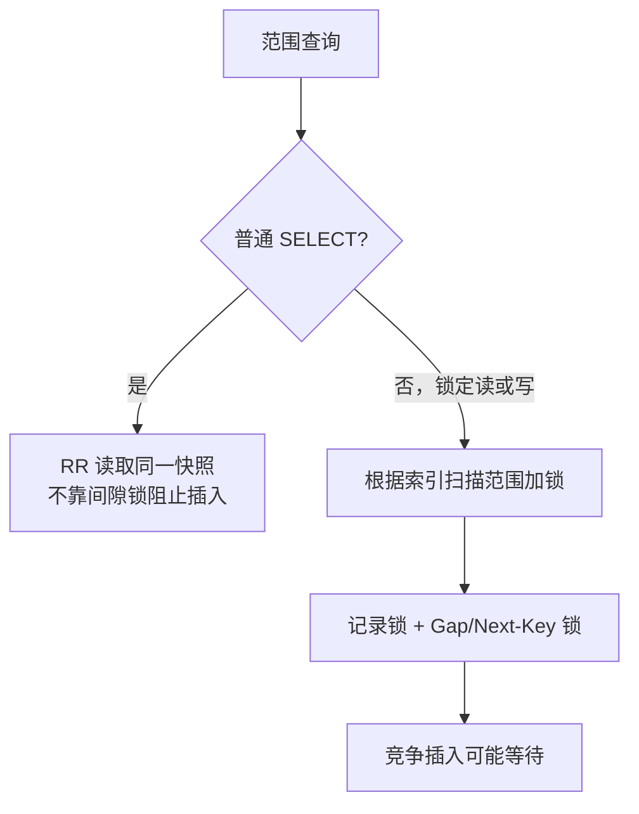

# Gap锁和Next-Key锁的作用是什么？如何解决幻读问题？

日期：2026-09-27  
标签：#面试 #MySQL #数据库  
难度：中等  
来源：[牛面 MySQL 题库](https://niumianoffer.com/nm_practice/questions?bank_id=50e19cbb-21c2-4330-b45f-5748ae5d8672&activeIndex=0)  
答案说明：独立整理（站内题目标记为 VIP，未读取会员答案）

## 一句话答案

Gap 锁限制索引间隙的新插入，Next-Key 锁是记录锁加其前方 Gap 锁；在 InnoDB RR 的范围锁定读或更新中，它们阻止其他事务往被锁范围插入“幻影行”。

## 面试口语版（约 60 秒）

“幻读指一个事务按同一条件再次查询时，发现有别的事务新增了符合条件的行。要分两类读：RR 下普通 `SELECT` 使用同一快照，重复查询结果通常稳定，并没有用 Gap 锁把插入挡住；`FOR UPDATE`、`FOR SHARE`、`UPDATE`、`DELETE` 是锁定或写入操作，范围访问通常通过索引记录锁及 Gap/Next-Key 锁保护扫描范围，防止他人在该区间插入。Gap 锁只管间隙，不锁现有记录；Next-Key 锁覆盖前方间隙加当前索引记录。加锁范围取决于实际使用的索引与执行计划：唯一索引的等值命中通常只锁记录，而范围条件可能锁到邻近区间。RC 下普通范围锁定操作通常不保留这种 Gap 锁，但外键和重复键检查仍有例外。”

## 用索引区间记住三种锁

设索引键为 `10, 20, 30`：

```text
Record lock(20)       锁现有索引记录 20
Gap lock(10, 20)      限制在 10 与 20 之间插入，端点记录不是 Gap 锁本身的对象
Next-Key lock(10,20]  Gap(10,20) + Record(20)
```

`(30, +∞)` 也可能通过 supremum 伪记录对应的区间受保护。Gap 锁的目的在于限制插入；不同事务的 Gap 锁彼此可以兼容，所以不要简单套用普通 S/X 行锁的冲突矩阵。插入前的 insert intention lock 也要与已有区间锁一起分析。

## 两会话示例

建表 `CREATE TABLE orders(id BIGINT PRIMARY KEY, amount INT, INDEX idx_amount(amount)) ENGINE=InnoDB;`，已有金额 10、30 的两条记录。在 RR 下：

```sql
-- 会话 A
START TRANSACTION;
SELECT id FROM orders WHERE amount BETWEEN 15 AND 25 FOR UPDATE;
-- 即使结果为空，也可能锁住搜索的索引间隙；A 保持事务未提交

-- 会话 B
INSERT INTO orders(id, amount) VALUES (3, 20);
-- 可能等待 A 提交或回滚；具体锁区间以索引访问和执行计划为准
```

如果 A 用的是普通 `SELECT`，B 插入并提交一般不被 A 这个快照读阻塞；A 在同一 RR 事务内再次普通读通常仍看不到新行。若改成 RC，每次普通读建立新快照，第二次可能看到它。故“RR 防幻读”要说明是**重复快照结果稳定**，还是**锁定范围排斥插入**，两者不是同一个机制。



## 边界与排查

- 唯一索引加唯一等值条件且命中记录时，InnoDB RR 通常只需记录锁；复合唯一索引只按部分列查询不满足这个优化前提。
- “锁住 where 条件”并非准确描述：锁发生在实际扫描到的索引记录与间隙上。缺索引或选错索引可能锁定大量范围。用 `EXPLAIN` 核查访问路径，必要时查看 `performance_schema.data_locks`。
- RC 对锁定读、更新和删除通常只锁索引记录，不锁前面的 Gap；外键检查和重复键检查依然可能用 Gap 锁。
- Gap/Next-Key 锁降低某些幻读，但并非跨表业务唯一性的替代品；可表达为唯一键的约束应交给唯一索引。

## 递进追问

### 1. Gap 锁、记录锁与 Next-Key 锁的区间各是什么？

**参考答案：** 以相邻索引键 10、20 为例，记录锁只锁键 20 对应的记录；Gap 锁覆盖开区间 `(10,20)`，限制在其中插入，不包含两端已有记录；Next-Key 锁覆盖 `(10,20]`，即前方间隙加记录 20。最小键之前、最大键之后也有间隙，后者可用 supremum 伪记录表示。纯 Gap 锁以阻止插入为目的，不同事务的 Gap 锁可以共存，不能照搬记录锁 S/X 的互斥关系。

### 2. RR 下两次普通 `SELECT` 不见新行，是否意味着另一个事务被禁止插入？

**参考答案：** 不意味着。RR 下普通一致性读通常复用首次查询的快照，新行在快照之后提交，对这个快照不可见；查询本身没有为了保护范围而加 Gap 锁，另一事务通常仍能插入并提交。只有执行范围锁定读或写入时，才需要分析相应的记录锁与间隙锁是否阻止插入。若本事务随后改用 `FOR UPDATE`，就可能看到新行，因此“快照结果不变”和“别人不能插入”是两种不同的保证。

### 3. 为什么给 `amount` 建索引或把条件改为唯一键等值查询，会改变锁范围及等待情况？

**参考答案：** InnoDB 按实际访问的索引记录和间隙加锁，不是直接把 SQL 的 WHERE 文本变成锁。没有可用的 `amount` 索引时，范围查询可能扫描大量聚簇索引记录；建索引且被优化器采用后，扫描和锁定通常集中到相关金额区间，等待也随之变化。

RR 下完整唯一键等值命中已有记录时，通常只需记录锁，邻近间隙可继续插入；但非唯一等值、仅使用复合唯一键的部分列、唯一键查询未命中等情形，仍可能涉及间隙。锁区间也可能超过字面条件边界，应结合 `EXPLAIN` 和 `data_locks` 核对，不能承诺建索引后必定只锁一行。

## 自测

- 手画索引 `10,20,30`，标出 `(10,20]` 所含记录与间隙。
- 解释“RR 下普通范围 SELECT”和“RR 下范围 FOR UPDATE”的防幻读方式。
- 给出一个“加了合适索引仍需检查执行计划”的理由。

## 延伸阅读

- [031-lock-types.md](/posts/MySQL/031-lock-types/)
- [030-dirty-nonrepeatable-phantom-read.md](/posts/MySQL/030-dirty-nonrepeatable-phantom-read/)

## 官方参考（核对日期：2026-09-27）

- [MySQL 8.4：InnoDB Locking](https://dev.mysql.com/doc/refman/8.4/en/innodb-locking.html)
- [MySQL 8.4：Transaction Isolation Levels](https://dev.mysql.com/doc/refman/8.4/en/innodb-transaction-isolation-levels.html)
- [MySQL 8.4：Phantom Rows](https://dev.mysql.com/doc/refman/8.4/en/innodb-next-key-locking.html)
