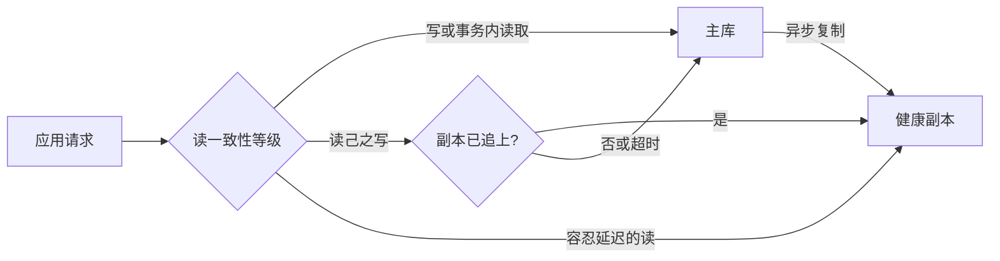

# 读写分离如何实现？有什么注意事项？

日期：2026-09-27  
标签：#面试 #MySQL #数据库  
难度：中等  
来源：[牛面 MySQL 题库](https://niumianoffer.com/nm_practice/questions?bank_id=50e19cbb-21c2-4330-b45f-5748ae5d8672&activeIndex=0)  
答案说明：独立整理（站内题目标记为 VIP，未读取会员答案）

## 一句话答案

读写分离通过应用或代理将写入路由到主库、可容忍延迟的读取路由到副本；核心难点是复制延迟下的读一致性、事务路由和故障切换。

## 面试口语版（约 60 秒）

“典型方案是一主多从：写请求只到主库，binlog 复制到副本，读请求由应用数据源路由或代理分发到健康副本。它主要扩展读容量，并不能自动扩展单主写能力。因为 MySQL 复制默认异步，主库提交成功后副本可能还没应用，所以用户刚下单马上查订单可能查不到。我的做法是按一致性需求分级：事务中的读写固定到主库；要求读己之写的请求在一段窗口内读主库，或者拿提交位点/GTID 等副本追上后再读；报表和列表可走副本但标明容忍的延迟。运维上监控复制接收与回放状态、延迟、错误、连接池和副本负载；副本落后或切主时停止发关键读，并保证旧主不会继续接写。”

## 路由流程



```text
route(query, context):
    if query.is_write or context.in_transaction or context.requires_fresh_read:
        return PRIMARY
    replica = choose_healthy_replica()
    if replica is absent or replica.lag > allowed_lag:
        return PRIMARY or return degraded_error  # 依容量和业务策略
    return replica
```

**事务路由要固定连接**：同一事务中的 `INSERT` 与随后 `SELECT` 应走同一主库连接，不能逐条 SQL 随机选择数据源。读己之写的简单策略是提交后短时间读主库；它容易实施，但时间窗口不是严格保证，且用户换设备/请求跨服务时须传递一致性上下文。更严格的方式是在写入后记录已提交 GTID，读副本前等待其执行到相应位置，设置超时并回退主库；还要考虑多源复制、切主及位点传递成本。

## 故障例子与指标

1. `INSERT order(id=7)` 在主库提交并返回成功。
2. 复制接收或回放尚未完成；读请求被路由到副本，`SELECT ... WHERE id=7` 返回空。
3. 若前端据此再次下单，可能出现业务重复。防重应以主库唯一约束/请求幂等键保证，不只靠改读路由。

排查先执行 `SHOW REPLICA STATUS\G`，看接收线程、应用线程是否运行及错误；`Seconds_Behind_Source` 可作参考，但不宜作为唯一保证“所有副本都追上”的判定。MySQL 8.4 文档给出使用事务时间戳和 Performance Schema 观察复制延迟的方式。还应观察主库/副本 QPS、CPU、IO、连接数、复制队列和业务“提交后查询缺失”比率。

## 边界与取舍

- 写入压力仍集中在主库；副本读也可能因为重查询抢占回放资源，令延迟继续增加。
- 读主库的降级策略会在副本故障时突然放大主库流量，应有容量预留、限流或故障返回方案。
- 切主必须配合写入隔离/旧主 fencing 与路由刷新；只把域名指向新主，无法排除双主写入风险。
- 跨多个副本的分页请求可能看到不同时间的快照，若需要稳定浏览，设计一致的排序键、游标及会话固定策略。

## 递进追问

### 1. 主库已 COMMIT，为什么副本仍可能查不到新订单？

**参考答案：** 异步复制下，主库提交成功只说明主库完成该事务，副本还需要接收 binlog、写入 relay log，再由应用线程执行并提交，任一阶段落后都可能查不到订单。即使开启半同步复制，确认通常代表至少一个副本已接收并持久化日志，不代表查询所选副本已经应用。还要排除查询使用了旧 RR 快照。需要读己之写时，应读主库的新视图，或等待目标副本执行到对应 GTID 后再开始读取。[MySQL 8.4：半同步复制](https://dev.mysql.com/doc/refman/8.4/en/replication-semisync.html)

### 2. 一个请求事务内先写后读，路由层应怎样处理？GTID 等待与固定读主库各有什么成本？

**参考答案：** 事务内的读写应绑定同一主库连接，直到提交或回滚；未提交写入不能靠副本等待来读取。提交后固定读主库实现简单，但占用主库容量；仅固定几秒再切回副本只是经验窗口，不能保证追平。

GTID 方案传递本次已提交写入对应的 GTID，在选定副本调用 `WAIT_FOR_EXECUTED_GTID_SET(gtid_set, timeout)`，返回 0 才继续，1 表示超时。随后必须仍读该副本，并在等待成功后建立新快照，已有 RR 旧快照不会自动刷新。它增加位点传递、等待延迟及连接占用，还需复制过滤正确、超时回退策略；其保证限于目标事务已应用，不等于所有读取都线性一致。[MySQL 8.4：GTID 等待函数](https://dev.mysql.com/doc/refman/8.4/en/gtid-functions.html)

### 3. 副本全故障时把所有读取切回主库，会引出什么容量和一致性风险？

**参考答案：** 多个副本的总读流量突然集中到主库，会争抢 CPU、IO、缓存和连接，拖慢写入并放大超时重试，形成连锁故障。因此应按业务优先级回退：关键详情可读主库，报表和重查询限流或暂停，允许陈旧的内容使用缓存，并限制重试和连接数量。

一致性也不能只靠“切主库”三个字：已有 RR 事务可能仍读旧快照，若同时发生故障切主，新主还可能缺少旧主已确认但未复制的事务。路由需确认当前权威主库、隔离旧主，并按事务边界重建连接或重试，不能在事务中途随意换库。

## 自测

- 按“写主库—binlog—副本接收—副本回放—可读”画时间线。
- 给“订单详情、商品列表、报表”分别设定一致性与读路由策略。
- 解释 `Seconds_Behind_Source=0` 为什么不等于对所有写操作有线性一致读保证。

## 延伸阅读

- [040-read-write-splitting.md](/posts/MySQL/040-read-write-splitting/)

## 官方参考（核对日期：2026-09-27）

- [MySQL 8.4：Replication](https://dev.mysql.com/doc/refman/8.4/en/replication.html)
- [MySQL 8.4：SHOW REPLICA STATUS](https://dev.mysql.com/doc/refman/8.4/en/show-replica-status.html)
- [MySQL 8.4：Delayed Replication and Measuring Lag](https://dev.mysql.com/doc/refman/8.4/en/replication-delayed.html)
