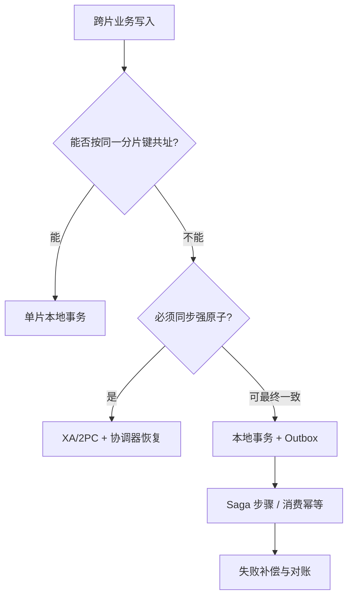

# 分库分表后会产生哪些问题？如何解决跨库查询和分布式事务？

日期：2026-09-27  
标签：#面试 #MySQL #数据库  
难度：困难  
来源：[牛面 MySQL 题库](https://niumianoffer.com/nm_practice/questions?bank_id=50e19cbb-21c2-4330-b45f-5748ae5d8672&activeIndex=0)  
答案说明：独立整理（站内题目标记为 VIP，未读取会员答案）

## 一句话答案

分片能分散数据和写负载，却把单库的查询、约束和事务边界拆开；先用分片键让高频操作落在同一片，再为跨片查询和写入分别选择汇总索引、XA 或业务补偿方案。

## 面试口语版（约 80 秒）

“分库分表后最大的变化是‘全局’操作不再免费：不带分片键的查询要扫描多片，跨片 JOIN、排序分页和聚合要合并结果；主键和唯一性不能只靠各分片本地自增；扩容要迁移路由与数据；跨片写入也没有天然的单库事务。我会先按核心查询选分片键，比如订单按用户 ID，把订单与其明细按同一键路由，尽量让常见事务留在一个分片。跨片读低频可并发 scatter-gather，但设置片数、超时与结果上限；高频搜索/排行则建立独立读模型或搜索索引，允许并定义同步延迟。跨片写入如果必须强原子，评估 XA/2PC 及协调器恢复成本；若业务允许最终一致，用 Saga 的本地事务和补偿步骤。Outbox 可以保证单个分片的状态和待发消息一起提交，支撑可靠事件传递，但它本身不使多个分片原子提交。最终还要做幂等、对账、补偿失败告警和迁移校验。”

## 分片键决定大部分后续代价

以 `orders(user_id, order_id, amount)` 为例，用 `user_id` 路由订单与明细，用户订单列表可单片完成；按 `order_id` 单独查订单若没有 `order_id→user_id/分片` 映射，就会散播到所有分片。若改按 `order_id` 分片，订单详情容易了，但用户订单列表成了跨片查询。选键时看高频访问、写热点、基数与未来迁移，不要只看数据分布是否平均。商户大客户或热点用户需要额外拆热点、限流或单独路由。

| 后遗症 | 典型表现 | 常见处理及代价 |
| --- | --- | --- |
| 全局 ID/唯一性 | 每片 `AUTO_INCREMENT` 可能产生同值；邮箱全局唯一无法仅靠各片唯一索引保证 | 雪花类/号段 ID 或全局登记服务；全局唯一约束需集中索引或路由规则，并处理服务可用性。 |
| 跨片 JOIN/查询 | 无分片键需访问多片 | 冗余少量字段、同键共址、建立读模型；scatter-gather 只适合有界请求。 |
| 全局排序分页 | 每片局部第 20 页不能直接拼成全局第 20 页 | 各片按相同键取候选再归并；深分页代价高，改游标与确定性排序。 |
| 聚合统计 | `COUNT/SUM` 要合并，`AVG` 不能直接平均各片均值 | 各片返回 `SUM` 和 `COUNT` 再合并；高频统计用异步预聚合并标明延迟。 |
| 扩容迁移 | 路由版本、双写/回放、漏数与重复 | 分阶段复制、增量同步、校验、切流和回滚预案；迁移期保证单一写入权。 |
| 跨片事务 | A 片提交、B 片失败 | 强原子评估 XA；最终一致使用 Saga + Outbox + 幂等与对账。 |

## 跨片查询：控制散播半径

```text
queryOrders(userId, cursor, limit):
    shard = route(userId)             # 有路由键，优先单片
    return shard.queryByUser(cursor, limit)

queryGlobalTopK(K):
    results = parallelQueryAllShards(each returns top K, with timeout and limit)
    return mergeSort(results).take(K)  # 必须有稳定的全局排序键与并列值规则
```

全局 Top K 每片取 K 个候选再归并可以得到正确前 K，前提是各片排序规则相同且没有额外过滤在汇总层才执行；若做 `OFFSET N LIMIT K`，可能每片都得取至少 `N+K` 个候选，深页成本迅速增加。跨片聚合与 JOIN 的正确性要考虑副本延迟、分页过程中的并发写入和部分分片超时：要么失败返回，要么清楚标记不完整结果。

## 跨片写入：三种一致性选择



- **同片本地事务**优先：例如订单主表与明细表按同一个 `user_id` 路由；注意跨片账户转账仍不在一个事务内。
- **XA/2PC**：协调器让多个 MySQL 资源先 `PREPARE`，再统一 `COMMIT/ROLLBACK`。它提供跨资源原子提交能力，但参与者在准备阶段保留资源、协调器故障要恢复决议，延迟与运维复杂度较高；还需确认驱动、中间件和 MySQL XA 限制。
- **Saga**：把转账拆成多个可记录状态的本地事务，每步失败时执行补偿或重试；补偿是新的业务操作，并不等于数据库 `ROLLBACK`，也可能失败。设计唯一业务键、幂等执行、超时与人工对账。
- **Transactional Outbox**：在某**一个分片**的本地事务中同时写业务表和 outbox 事件；提交后后台发布。它避免“业务已提交但事件从未入库”的双写空隙；发布可能重复，消费者要按事件 ID 幂等。Outbox 与 Saga 可组合，但 Outbox **不单独提供跨片原子性**。

## 故障推演

用户账户在片 A 扣 100 成功，商家账户在片 B 加 100 失败。若用 Saga，必须把 A 的扣款状态、B 的失败状态持久记录，重试 B 的入账或发起 A 的退回补偿；超时未知结果要先查询业务流水，再决定重试。没有幂等键时，网络超时后的重放可能重复扣款。若这种中间状态业务无法接受，就应评估 XA 或重新调整数据模型与账户归属。

## 边界与取舍

- 分片不是容量问题的第一步；先量化瓶颈，评估索引、归档、读副本、缓存与单库硬件扩展。分片后运维和开发复杂度会长期增加。
- 全局唯一 ID 不自动保证“手机号唯一”这类业务唯一约束；后者要有单一判定点或与分片键一致的约束设计。
- 读模型和搜索索引一般异步更新，必须定义延迟、重建、对账与不可用时的降级。

## 递进追问

### 1. 订单按 `user_id` 分片后，按 `order_id` 查详情怎样避免全片扫描？

**参考答案：** 可以维护按 `order_id` 可定位的全局映射，先查出 `user_id` 或逻辑分片，再访问对应分片；若请求天然携带可信的 `user_id`，也可直接路由并验证订单归属。另一种设计是在订单号中编码稳定路由信息，但需给扩容迁移保留逻辑分片映射，不能把永久物理位置写死。映射本身也是数据：若异步生成，会有订单已提交但映射查不到的窗口，需要定义返回“处理中”、回源等策略，并处理重复、修复与迁移一致性。

### 2. 跨 8 片做 `ORDER BY created_at DESC LIMIT 20 OFFSET 10000` 为什么昂贵？如何调整接口？

**参考答案：** 全局第 10001–10020 条可能来自任意分片，不能让每片各自跳过 10000 条再拼接。朴素方案要每片取前 10020 条，8 片最多产生 80160 条候选，再做网络传输与归并；只按 `created_at` 排序还会因时间相同而不稳定。

可把接口改为基于 `(created_at, order_id)` 的游标分页，其中 `order_id` 需全局唯一，两列共同构成确定性的全局顺序，各片按同一游标边界取前 20 条，再归并得到下一页。需配套索引，并说明通常不支持任意跳页；排序键变化、并发写入及副本延迟仍会影响连续浏览，严格稳定结果需固定快照或查询版本。

### 3. Outbox 已保证消息可靠入库，为什么仍不能保证两个分片同时提交？Saga 补偿失败时怎么办？

**参考答案：** Outbox 只把某一分片的业务状态和事件放进同一本地事务，另一个分片要在收到事件后独立提交；两者之间仍可能出现 A 已成功、B 未成功的中间状态，也没有共同的提交决议。需要跨片原子提交应评估 XA/2PC，接受最终一致才能使用 Saga 协调后续步骤。

补偿本身也是可失败的新业务操作，应持久化每步进度、原操作号及补偿号，区分暂时错误和业务拒绝，以幂等方式退避重试。结果未知先查流水，超过时限告警并进入对账或人工处理，不能把补偿任务标成成功后丢弃；恢复时从失败步骤继续。[Azure：补偿事务模式](https://learn.microsoft.com/en-us/azure/architecture/patterns/compensating-transaction)

## 自测

- 为“用户订单列表”和“订单号查详情”画出分片路由，指出至少一个需要的映射索引。
- 说明全局 `AVG` 为什么要合并各片 `SUM/COUNT`，不能平均各片平均值。
- 分别用两句话描述 XA、Saga、Outbox 能保证什么，以及各自不能保证什么。

## 延伸阅读

- [044-sharding-problems.md](/posts/MySQL/044-sharding-problems/)

## 参考社区项目与官方资料（核对日期：2026-09-27）

- [Vitess：查询路由与 scatter 查询](https://vitess.io/docs/faq/advanced-configuration/vtgate/how-does-vtgate-know-which-shard-to-route-a-query/)：理解有分片键与无分片键的执行差别。
- [Apache ShardingSphere：Sharding](https://shardingsphere.apache.org/document/current/en/features/sharding/)：查看分片中间件支持的查询与约束边界。
- [Debezium：Outbox Event Router](https://debezium.io/documentation/reference/transformations/outbox-event-router.html)：参考基于变更捕获发布 Outbox 事件的实现。
- [MySQL 8.4：XA Transactions](https://dev.mysql.com/doc/refman/8.4/en/xa.html)：核对 MySQL 的 2PC 与 XA 使用限制。
- [Microsoft Azure：Saga Pattern](https://learn.microsoft.com/en-us/azure/architecture/patterns/saga)：参考补偿事务、幂等与故障恢复设计。
